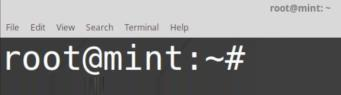
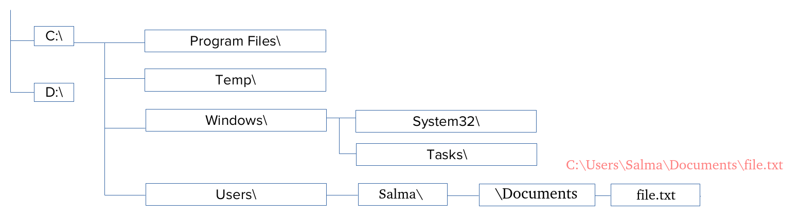
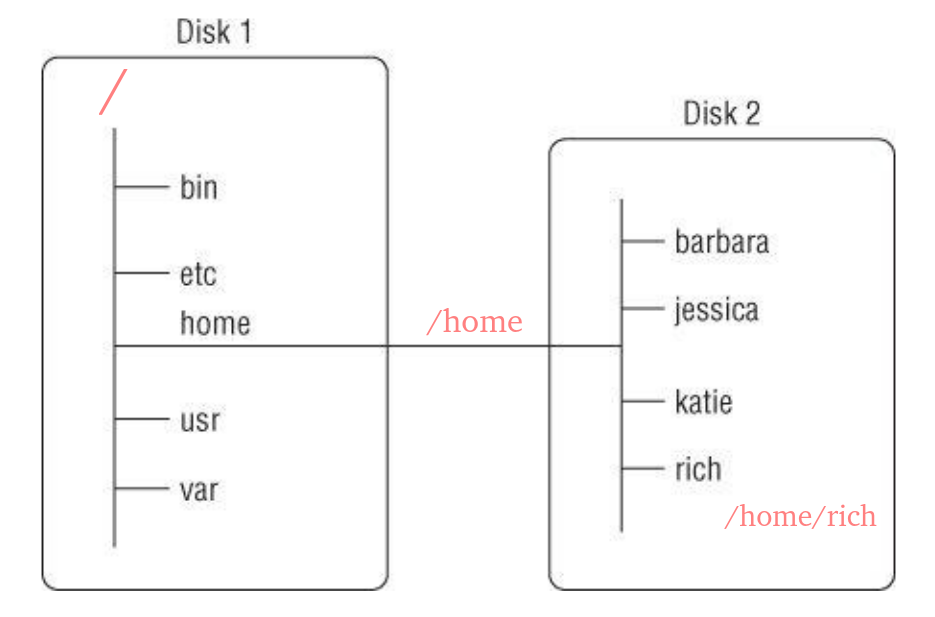
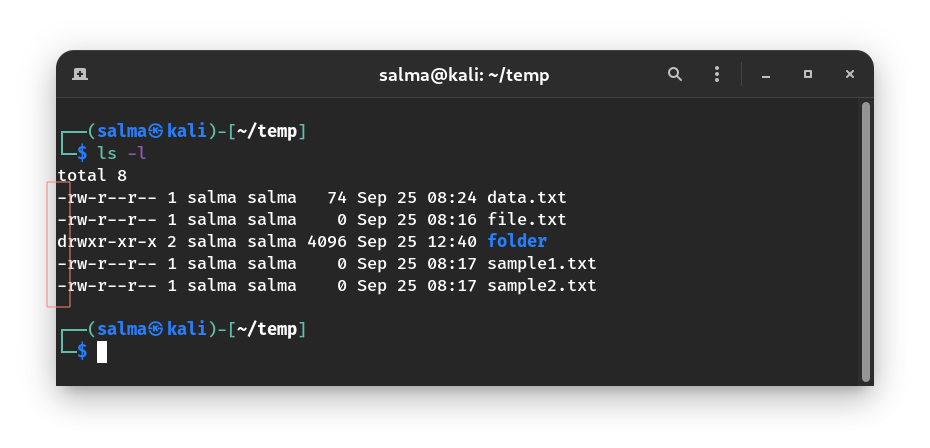
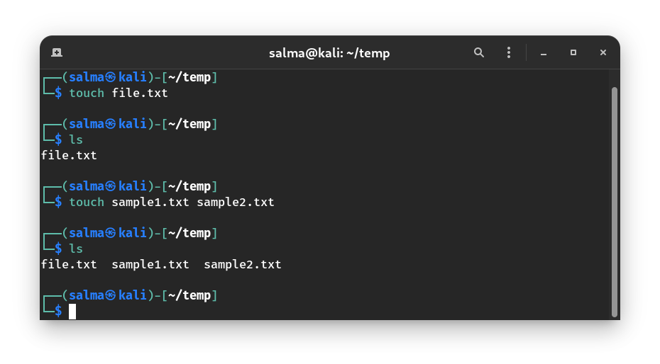

# The Shell

Look at the following diagram:


### GUI

Graphical User Interface, used to allow the user to interact with the system by using a graphical interface.

### Shell

It's a program that takes commands from the keyboard and gives them to the operating system to perform. (interprets and executes CL)

Different Types of Shells in Linux : **sh**, **zsh**, **csh**, **ksh**, **fish** and **bash**

**The shell is the first user-friendly layer that a user can use to interact with the operating system.**

### Kernel

The core of the OS, responsible for memory management, and communication with the hardware.

-----------------------------------------------------

# Terminal vs Shell vs Prompt

### Terminal

In the early days of computing, terminals where physical devices connected to a central computer in Universities and Research facilities. 

Here's a sample "dumb" terminal. Internally it does not have a microprocessor, it's connected to a master computer.


Nowadays, personal computers and laptops are cheap and accessible. The lead to the extinction of Terminals. Instead, the Terminal Emulators gave rose and replaced the functionalities of the old physical terminals. 

A terminal emulator is a program that emulates a real terminal connected to your machine. In other words, it provides you with the Shell.

In your Linux machine, search for "Terminal" and open it to view a terminal.

It should look something like this:


### Shell

We have already discussed what a shell is. Shells run inside terminal emulators which means that the terminal won't be useful without a shell running in it.

The terminal sample shown above is running the **bash** shell.

It looks something like this:


> Note: you can run Bash without opening up a terminal emulator. More on that later.

### Prompt

When you open the terminal you’ll see something like this:

 


It is prompting you to enter a command, let’s break it down:

```osc/root``` : The username of the current logged-in user.

```@```: Defines that you are connected to the machine that has the name after it

```mint```: The name of the computer running (Name of the host)

```~```: The working directory, the directory that the terminal is working in right now.

```$```: States that you are logged in as a regular user.

```#```: States that you are logged in as the system administrator (root).

So we can basically summarize it to the following:

```Username@Hostname:Working_Directory($/#)```

----------------------------------------------------

# The Command Line Syntax

When ordering the computer to do something, **i.e giving it a command**, you have to take care of the syntax.

Just like programming languages, the Linux shell has specific syntax that you have to use. Just so that it could be understood by the shell.

The syntax goes as follows:


**The Command:** Intuitively, this is the command that you give to the system, i.e. delete, move, copy, list, etc..

**The Option:** Modifies the action of the command.

**Example:** List “ALL” files, delete “recursively”, show the first “40” lines of a file, delete the file “by force”

**The Arguments:** What you’re going to apply the command to. i.e. Delete (command) a certain file (argument). We can say in short that the options modify the command’s effect on the argument.

#### Let’s take the ls command as an example:

```ls``` – lists the content of a directory(folder).

Running the command ls does the following:


But that format isn’t really good if you want a detailed view, so we add the ```-l``` option which makes it list the content but in a “long” form:


Much better! Everything is cleaner and organized in a list.

How about we take a look at the hidden files too?

The ```-a``` option lists “all files”, this command can be shortened down to ```ls -la``` or ```ls -al```

**Note:** Hidden files and directories in Linux start their name with a dot `.`.


----------------------------------------------------

# File Systems

A file system is the way that the files are stored on a storage device (i.e. Hard Drive, USB Flash Drive, etc.). 

Each operating system uses a certain file system. Each of these file system types uses its own metadata structures to define how the data is stored and accessed. 


- Linux supports almost 100 types of filesystems, including some very old ones as well as some of the newest.

- Linux supports NTFS and FAT32, but Windows doesn’t support EXT4 or XFS, that’s why you can’t see the Linux partitions on Windows.

- **If we have an unsupported file format in our file system, we can download software to deal with it.**

[Determine the File System Type](https://www.tecmint.com/find-linux-filesystem-type/)

# Windows Directory Structure

A directory structure is the way an operating system's files are arranged displayed to the user. 

Windows, like every operating system, has a specific directory structure for its NTFS file system. Each disk is assigned a letter, and you browse your files based on that.

For example, in Windows you may be used to seeing the file paths such as: `c:\Users\Rich\Documents\test.doc` The Windows file path tells you exactly which physical disk partition contains the file named `test.doc`. For example, if you saved `test.doc` on a flash drive, designated by the `J` drive, the file path would be `J:∖test.doc`. This path indicates that the file is located at the root of the drive assigned the letter `J`.



> Note: C:\ and D:\ could be 2 separate physical hard drives.

# Linux File System Hierarchy

If you’re new to the Linux system, you may be confused by how it references files and directories. Before exploring the Linux system, it helps to have an understanding of how it’s laid out. 

Linux stores files within a **single directory structure**, called a **virtual directory**. The virtual directory contains file paths from **all the storage devices installed on the computer**, merged into a **single directory** structure. The Linux virtual directory structure contains a single base directory, called the **root**. Directories and files beneath the root directory are listed based on the directory path used to get to them.

In Linux, you will see file paths similar to the following: `/home/Rich/Documents/test.doc`

This indicates the file `test.doc` is in the directory Documents, under the directory rich, which is contained in the directory home. Notice that the path doesn’t provide any information as to which physical disk the file is stored on. 

The tricky part about the Linux virtual directory is how it incorporates each storage device. The first hard drive installed in a Linux system is called the root drive (`/`). The root drive contains the virtual directory core. Everything else builds from there. On the root drive, **Linux can use special directories as mount points**. Mount points are directories in the virtual directory where you can **assign additional storage devices**. Linux causes files and directories to appear within these mount point directories, even though they are physically stored on a different drive. 

Often system files are physically stored on the root drive. User files are typically stored on a separate drive or drives, as shown below.



The figure shows two hard drives on the computer. One hard drive is associated with the root of the virtual directory (indicated by a single forward slash). Other hard drives can be mounted anywhere in the virtual directory structure. 

In this example, the second hard drive is mounted at the location `/home`, which is where the user directories are located.  

## The root `/` Directory

The `/` directory or the “root” directory is where everything begins on Linux.

No matter what you want to access, where it is, it will somehow connect to the root directory.

Here’s a demonstration of the Linux Filesystem Hierarchy:

-------------------------------------------------------------------------------------------

# Linux Virtual Top-Level Directories 

The Linux file system structure originally evolved from the **Unix file structure**.

**Some of the more common Linux virtual top-level directory names and their contents :**


|Directory|Content / Description|
|---------|---------------------|
| `/    ` | The root of the virtual directory. It is the **starting point** for the file system hierarchy                 |
| `/boot` | Boot directory, where **boot files** are stored (e.g, Linux kernel and other static files of the boot loader).|
| `/dev ` | Device directory, where Linux creates **device nodes**.                                                       |
|`/media` | Media directory, a common place for mount points used for **removable media**.                                |
|`/mnt `  | Mount directory, another common place for mount points used for **removable media**.                          |
| `/etc ` | **System configuration** files directory.                                                                     |
|`/proc`  | Process directory, where **current hardware and system processes information** are stored.                    |
|`/sys `  | System directory, where **system hardware information files** are stored (e.g, devices, drivers, and some kernel features). |
| `/lib ` | Library directory, where **system and application library files** are stored.                                 |
|`/run `  | Run directory, where **volatile runtime data** is held during system operation.                               |
|`/srv `  | Service directory, where **local services** (services provided by this system) store their files.             |
|`/opt `  | Optional directory, often used to store **third-party software packages** and data files.                     |
| `/bin ` | Binary directory, where many **essential user command binaries** are stored.                                  |
| `/sbin` | System binary directory, where many **system administration binaries** are stored.                            |
|`/usr `  |User binary directory, where the **applications and files used by users** are stored(/usr/ is the second major section of the filesystem (secondary hierarchy).  |
|`/tmp `  |Temporary directory, where **temporary work files** can be created and destroyed (these temporary files are generally deleted when the system is restarted). |
|`/var `  |Variable directory, for **files that change frequently** which handled by services, such as logs, queues, caches, and spools. |
| `/home` | Home directory, where Linux creates **normal user** directories (non-root users).                             |
|`/root`  | The home directory for the **root user**.                                                                     |


**From the previous, we can see that: “Everything in Linux is a file”. Even devices and processes, everything is a file under the ‘/’ directory somehow.**

**Let’s test it out!**  

If we list the content of the root directory using the `ls` command, we will find the directories in the previous table.


Now we know what a filesystem, directory, and file are. Let’s talk about how we can access them.

-------------------------------------------------------------------------------------

# Navigating through the Filesystem

You opened a terminal, now what?

The first thing you want to do is to know where the terminal is working:

`pwd`: Print Working Directory, tells you the directory your terminal is working in.


Now that you know where you are in the system, you should see the content of the directory using the `ls` command.


What if we wanted to enter the Pictures directory?

`cd`: Change Directory, changes the working directory to the specified argument.


Now the working directory is Pictures, notice how the text before **$** also changed to **~/Pictures** which is the same as **/home/osc/Pictures**, which is the working directory.

What if I wanted to go back to the home directory?

There are 5 ways:
- `cd /home/osc`: Tells the shell to change the working directory to `/home/osc`.
- `cd ~`: This basically means `cd /home/osc` since `~` means the home directory of the current user.
- `cd`: Running the `cd` command without an argument takes you to the home directory by default.
- `cd -`: This will take you to the previous directory you were just at.
- `cd ..`: `..` refers to the parent directory. It takes you to the directory above your current.


# The `.` and `..` Links

Each directory has 2 hidden files (links) in it, ```.``` and ```..```.

The ```.``` link refers to the directory itself.

The ```..``` link refers to the directory before it (parent directory).

**Example:** If the working directory is `/home/osc/Pictures/`, then:

```‘.’ = /home/osc/Pictures/``` and ```‘..’ = /home/osc/``` which is the directory before it.

To verify:


This can be a little confusing at first, so practice with yourself and maybe try drawing it on a piece of paper to visualize how things really work.


# Relative and Absolute Paths

Let’s simplify this by taking a guy called “Jack” as an example, Jack goes to FCIS ASU every day, this is the path he takes daily:


Jack’s route to college daily is **Home->Bus Stop->Abbassia->FCIS ASU.**

If he met someone at Abbassia and asked him: “Where are you going?”, Jack’s response will be **“FCIS ASU”** only, because that’s the next step.
If someone asked Jack “What’s your full route to college?”, Jack’s response would be **“ Home->Bus Stop->Abbassia->FCIS ASU”.**

**Note that his route from Abbassia is shorter because it is relative to Abbassia.**

The same thing applies in Linux for directories and files.

**Absolute Path:** The total path leading to the directory.

**Relative Path:** The path relative to the working directory.

**Example:**
In the diagram, let the working directory be /home/User1


The relative path for “Videos” would be: Videos

The absolute path would be: /home/User1/Videos

### Test Yourself(Solution at the end)

In the same diagram, let the working directory be `/home/User1` and the user you’re logged in as called User1.

1. Which directory does ‘.’ refer to?
2. Which directory does ‘..’ refer to?
3. What would be the working directory if you run ```cd ..```?
4. What would be the working directory if you run ```cd .```?
5. What would be the working directory if you run ```cd``` Videos?
6. What would happen if you run ```cd ../User2/```?
7. What would happen if you run ```cd```?
8. What would happen if you run ```cd User2```?
9. What would happen if you run ```cd /home/User2```?

### Solution

1. The directory itself (`User1`).
2. The parent directory (the directory before it: `home`).
3. The working directory would be `home`.
4. The shell will change the directory to the current working directory, so nothing will change.
5. The shell will change the working directory to `/home/User1/Videos`.
6. The shell will change the working directory to `/home/User2` (This is the relative path)
7. The shell will change the working directory to `/home/User1` as you are logged in as User1, so nothing will change because the working directory is already `/home/User1` 
8. Error, there isn’t a directory called “User2” under the directory “User1”.
9. The shell will change the working directory to `/home/User2` (This is the absolute path)

----------------------------------------

# File Extensions in Linux

Unlike Windows, Linux does not care about the extension of your files. It looks into the file contents and will figure it out by its own. 

**For example,** imagine you have a PDF file named `tutorial.pdf`, you can find its type by typing `file tutorial.pdf` on the terminal. When I changed it to `Tutorial.txt`, its type is still PDF document. So, by changing a file extension, you can not fool the OS. It still knows what file type it is.

You might argue that extensions are important to Linux. The answer is extensions are not important to Linux, but they are important to **Gnome**, which is your **desktop environment**. Desktop environments have their own mechanisms that rely on file extensions to determine which applications to call to open a file. 

**For example,** if you have a text file named `book.txt` and change its extension to `book.pdf`, its icon changes because your system has assigned files with `.pdf` extensions to your PDF reader application for your convenience. But if you try to open the file with PDF reader, you will get an error message.

Although Linux is extension agnostic, it does not mean extensions are useless. They are quite useful conveying information about the file type. Linux doesn’t care, but you as a user might care to learn what file does without looking at its content. For example, the moment you see `setup.sh` and `setup.txt`, you can quickly distinguish which one is executable and which one is just a guide.

# Types of Files

- Linux file naming convention is **case sensitive**. Thus, `sample` and `SAMPLE` are 2 different files in Linux/Unix operating system.

- In Linux and UNIX, everything is a file. Directories are files, files are files, and devices like Printer, mouse, keyboard etc.. are files.

- By default, Linux has 3 types of files. If you issue `ls -l`, you will see the character (First char) that indicates the file type.

### Example





### 1. Regular (General) Files `-`

Ordinary files. They can contain image, video, program or simply text. They can be in ASCII or a Binary format. These are the most commonly used files by Linux Users.

   - Readable file (.txt, .cpp)
   - Binary file (.exe)
   - Image file (.png, .jpg)
   - Archive or Compressed file (.zip, .rar)

### 2. Directory Files `d`

A folder containing files or folders.

### 3. Special Files

#### Character File `c`

Character device files are for devices that can only handle data one character at a time.

#### Block File `b`

Hardware files (Like some files under `/dev/`).

In MS Windows, devices like Printers, CD-ROM, and hard drives are represented as drive letters like G: H:. In Linux, there are represented as files. For example, if the first SATA hard drive had three primary partitions, they would be named and numbered as `/dev/sda1`, `/dev/sda2` and `/dev/sda3`.

#### Soft "Symbolic" link file `l`

File pointing to another file (shortcut).

**All the above file types (including devices) have permissions (e.g, `rwx rw- rw-`), which allow a user to read, edit or execute (run) them. This is a powerful Linux/Unix feature. Access restrictions can be applied for different kinds of users, by changing permissions. We will discuss that later**

------------------------------------------------


# Creating Directories
  
| Command                                    | Description                               |
|--------------------------------------------|-------------------------------------------|
| `mkdir [name]`                             | Creates a directory.                      |
| `mkdir -p Directory1/Directory2/Directory3`| To create subdirectories at the same time.|


> Note: We use double quotes ``“ ”`` if the name of the directory has more than one word. This is to avoid making the shell interpret the 2 words as 2 separate arguments.

If you want to create more than one directory at a time you can do the following:


Let's check:


# Creating Files 

You can use ``touch`` to create a file, like`` mkdir`` you can pass as many arguments to it, and it’ll create the files for you.

If you want to create 2 files:``touch file1 file2``

**Example :**




# Copying Files & Directories

To copy files you can use:``cp``

| Command | Description |
|---------|-------------|
| `cp [source file] [destination file]` | To copy files.|
| `cp -r [source directory] [destination directory]` | This will recursively copy the files and directories within a directory.|

**Example:**


# Renaming and Moving Files 

To rename a file use: ``mv``

**Example:**

Create a file that is called file1 and rename it to `textfile`.


To move “cut” a file use`` mv``

**Example:**

Moving `textfile` from `~/one` to `~/two`


| Command | Description |
|---------|-------------|
|`mv [file] [destination directory]`       | To move file.|
|`mv file_1 file_2 [destination directory]`| To move more than one file.|
|`mv oldFile newFile`                      | To rename a file or directory.|

# Deleting Files and Directories

You can delete a file or a directory using the ```rm``` command.

|     Command            | Description |
|------------------------|-------------|
|`rm filename`           | Removes a file.|
| `rm -i filename`       | Deletes a file but ask for confirm before.|
| `rm -f filename`       | Deletes by force and don't prompt the user.|
| `rm -d directory_name` | Deletes an empty directory.|
| `rm -r directory_name` | Deletes a non-empty directory. |
|`rmdir directory_name`  | Removes a directory|


----------------------------------------
----------------------------------------


# Resources

- Linux Command Line and Shell Scripting Bible (Richard Blum, Christine Bresnahan)
- https://medium.com/@smohajer85/file-extensions-in-linux-c619690941c4
