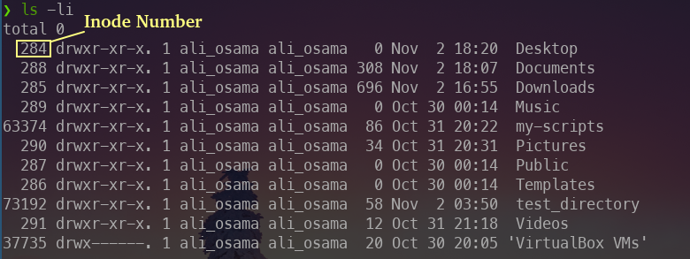
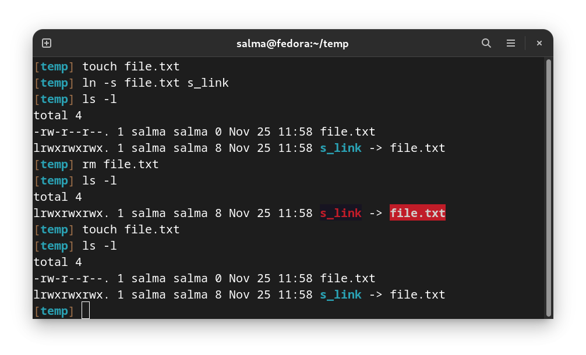

# Managing Links Between Files

# Inode

Inode is the abbreviation for **“index node”**.

An inode is a data structure that keeps track of all the files and directories within a Linux or UNIX-based filesystem. So, every file and directory in a filesystem is allocated an inode, which is identified by an integer known as “inode number”. 

These unique identifiers **store metadata** about each file and directory like : file type, owner, group, access permissions, timestamps ...etc., but it doesn't store filename and the file itself.

To view the inodes of the files use `ls -li`.  

`-i` prints the index number of each file.

 


# Inode Table

There is a **Database** that contains all the Inodes which is created when file system is created.

-----------------------------------------------------------------------------------------

# What are Links?

A link in Linux is a file that points to another file/directory. Creating links is similar to creating shortcuts. A file can have multiple links linked to it. But a link can only be linked to (pointed to) one file.

There are two types of links:
  1. Soft or Symbolic links.
  2. Hard links.

_These links behave differently when the source of the link (what is being linked to) is moved or removed._

> You can think of links like pointers in programming languages, if you’re familiar with them.


# Creating Hard Links

Every file starts with a single hard link, from its initial name to the data on the file system. When you create a new hard link to a file, you create another name that points to that same data. The new hard link acts exactly like the original file name. 

A hard link is similar to creating a copy that is always synced with the original file. 

If the original file is deleted or moved, the hard link will still work. 

> _A hard link can’t link to a directory._

You can find out if a file has multiple hard links with the `ls -l` command. One of the things it reports is each file's link count, the number of hard links the file has.


### Example

Make a hard link using the ``ln`` command.


In this example you can see that H_Link is treated as a normal file, it is just linked to File.txt. After editing File.txt, H_Link was edited too.

It is exactly like a synced copy of the file.


If the files are on the same file system and their inode numbers are the same, the files are hard links pointing to the same data.

All hard links that reference the same file will have the same link count, access permissions, user and group ownerships, time stamps, and file content. If any of that information is changed using one hard link, all other hard links pointing to the same file will show the new information as well. This is because each hard link points to the same data on the storage device.


### Limitations of Hard Links

Hard links have some limitations:

- **Firstly**, hard links can only be used with regular files. You cannot use `ln` to create a hard link to a directory or special file.

- **Secondly,** hard links can only be used if both files are on the same file system. The file-system hierarchy can be made up of multiple storage devices. Depending on the configuration of your system, when you change into a new directory, that directory and its contents may be stored on a different file system.


You can use the `df` command to list the directories that are on different file systems. For example, you might see output like the following:


Files in two different "Mounted on" directories and their subdirectories are on different file systems. (The most specific match wins.) So, the system in this example, you can create a hard link between `/var/tmp/link1` and `/home/user/file` because they are both subdirectories of `/` but not any other directory on the list. But you cannot create a hard link between `/boot/test/badlink` and `/home/user/file` because the first file is in a subdirectory of` /boot` (on the "Mounted on" list) and the second file is not.

----------------------------------------------------------

# Creating Soft (Symbolic) Links

A soft link is similar to the file **shortcut** feature which is used in Windows operating systems.

_Soft links contain the path for original file but not the content._

The `ln -s` command creates a soft link, which is also called a **"symbolic link."** A soft link is not a regular file, but a special type of file that points to an existing file or directory. 

Soft links have some advantages over hard links:
  - They can link two files on different file systems, although if the original file is deleted or moved, the soft link will not work correctly and is referred to as a **“hanging link”**.
  - They can point to a directory or special file, not just a regular file.


### Example:

`ln -s [file path] [link path]`

The option ``-s`` makes the link a soft link and not a hard one.


You can see that indeed, S_Link is pointing to File.txt

In the preceding example, the first character of the long listing for s_Link is `l` instead of `-`. This indicates that the file is a soft link and not a regular file. 


> Note that in **soft links** the inode value **changed** but in **hard links** the inodes are the **same**.

----------------------------------------------------------

# Deleting Links 

To delete a link you can use ``unlink`` or ``rm``

**Example:**


And since a link is a file after all, you can also delete it with ```rm```.

**Example:**


### Dangling Soft Link

One side-effect of the dangling soft link is that if you later create a new file with the same name as the deleted file (/home/user/newfile-link2.txt), the soft link will no longer be "dangling" and will point to the new file.



----------------------------------------------------------