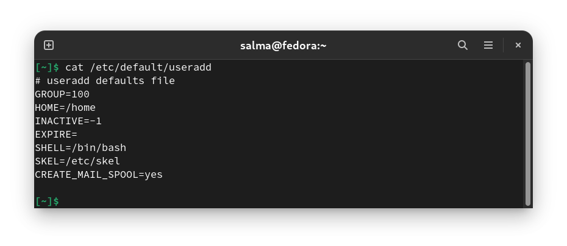
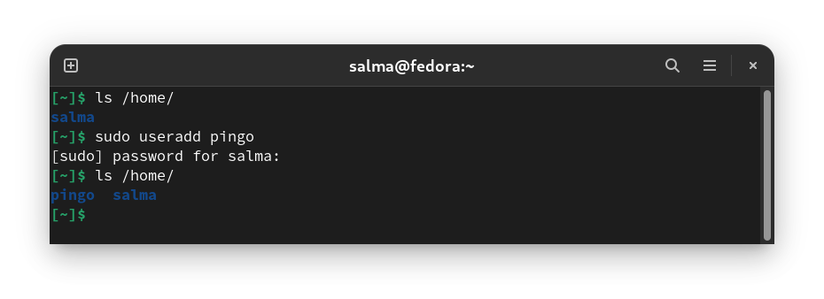
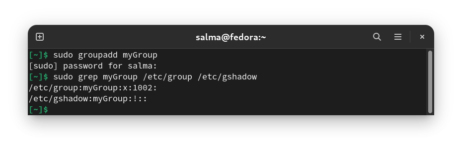
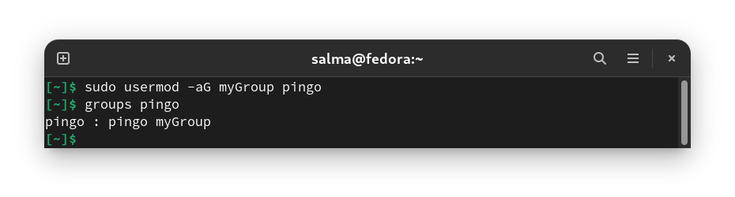
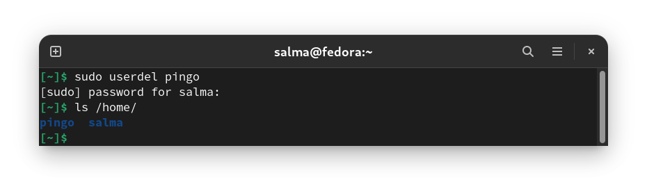
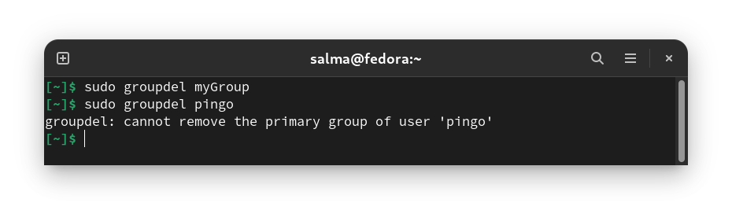

# Creating Users/Groups, Removing Users/Groups & Changing Passwords

Linux is a multi-user system, which means that more than one person can interact with the same system at the same time. As a system administrator, you have the responsibility to manage the system’s users and groups by creating and removing users and assign them to different groups.

### Why Not Just Use One Account?

If you use a single user account on your computer, everyone will share the same application settings, files, and system permissions.

- **Application Settings:** When you use a single user account, everyone using the computer will use the same browser. This allows other people to use your online accounts if you stay logged in, view your browser history, dig through your bookmarks, and more. If you use multiple user accounts, everyone will have their own browser, which they can log into without worry. The same is true for other applications, like email clients. Most programs will use different settings for each user account.

- **Files:** With multiple people sharing a single user account, no one really has any private files. Anyone using the same user account can view your files. If you use multiple user accounts, the other users won’t be able to view files stored in your user folder. You won’t be able to view their files, either. This provides additional privacy if the other users are standard user accounts. Note that administrator users have full system permissions and can view all files on the computer.

- **System Permissions:** Other user accounts can be either standard or administrator accounts. If they’re standard accounts, you can give them limited permissions, so they can’t view your files, install software, or make other changes to your computer. This can be particularly useful if you want to lock down a computer so less-experienced users won’t install malware.

--------------------------------------------------

## Creating Users `useradd` 

Only the root or a user with sudo privileges can create new user accounts.

**Syntax :** `useradd [OPTIONS] USERNAME`

When invoked, `useradd` creates a new user account according to the **options** specified on the command line and the default values set in the `/etc/default/useradd` file. When executed without any option, `useradd` creates a new user account using the default settings specified in the `/etc/default/useradd` file. The variables defined in this file differ from distribution to distribution, which causes the `useradd` command to produce different results on different systems.

`useradd` also reads the content of the `/etc/login.defs` file. This file contains configuration for the **shadow password suite** such as password expiration policy, ranges of user IDs used when creating system and regular users, and more.

- Create new user called **pingo**:

The command adds an entry to the `/etc/passwd`, `/etc/shadow`, `/etc/group` and `/etc/gshadow` files.

## Setting/Changing Passwords `passwd`

**To be able to log in** as the newly created user, you need to set the user password. To do that run the `passwd` command followed by the username :

----------------------------------------------

## Creating Groups `groupadd`

**Syntax :** `groupadd [OPTIONS] Group_name`

Only the root or a user with sudo privileges can create new groups.

When invoked, `groupadd` creates a new group using the options specified on the command line plus the default values specified in the `/etc/login.defs` file.

The command adds an entry for the new group to the `/etc/group` and `/etc/gshadow` files.

Once the group is created, you can start adding users to the group.

----------------------------------------------

## Add an Existing User Account to a Group `usermod`

**Syntax :** `usermod -a -G group username`

`usermod` (modify a user account) command is used to add an existing user account to a group on your system.

-------------------------------------------------

## Removing Users `userdel`

The command removes a user's attributes without removing the user's home directory by default.  If the `-r` flag is specified, the `userdel` command also removes the user's home directory.

## Removing Groups `groupdel`

`groupdel` is used to delete a group.

**Syntax :** `groupdel group_name`

If the group to be deleted is the **initial group** of one of the users, you can not delete the group.

----------------------------------------------
----------------------------------------------

## Resources

- https://www.howtogeek.com/142434/htg-explains-why-every-user-on-your-computer-should-have-their-own-user-account/
- https://linuxize.com/post/how-to-create-users-in-linux-using-the-useradd-command/