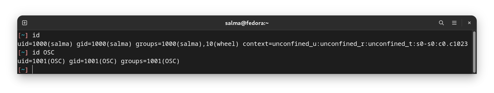
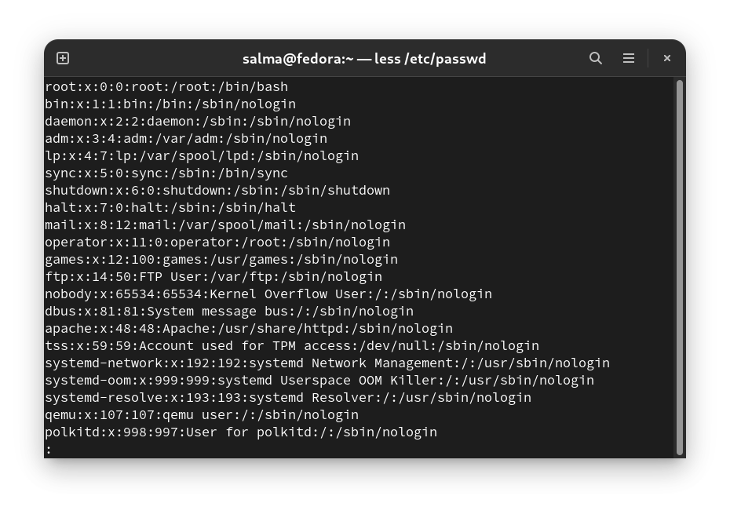
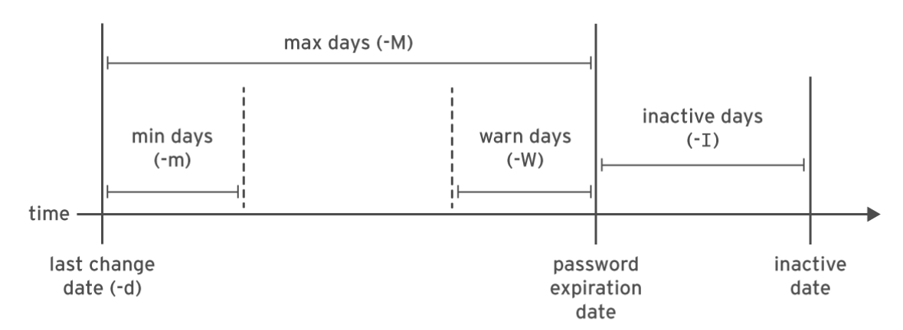
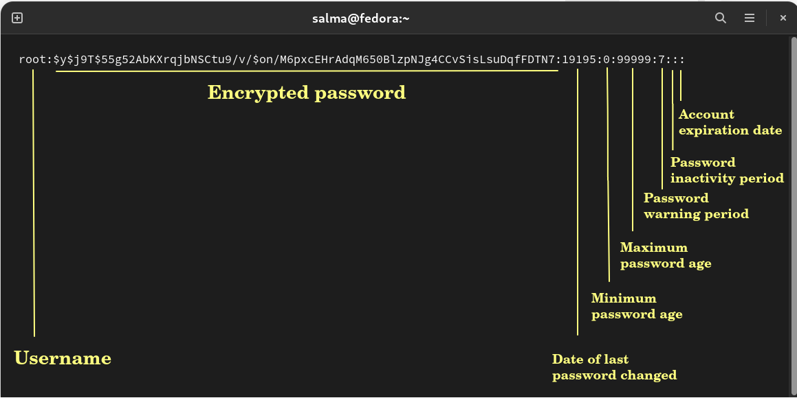
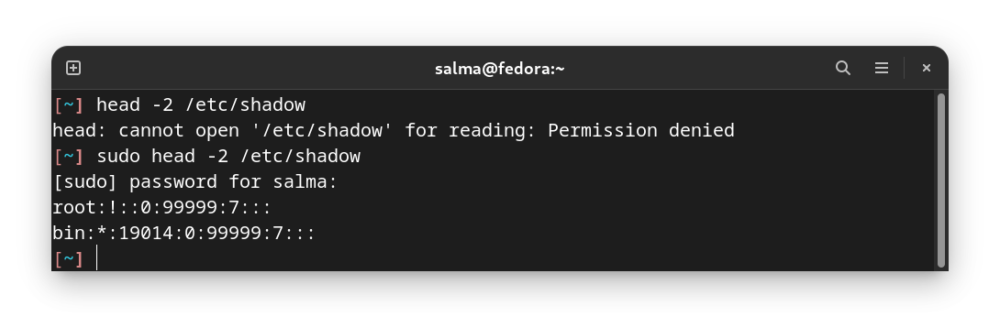
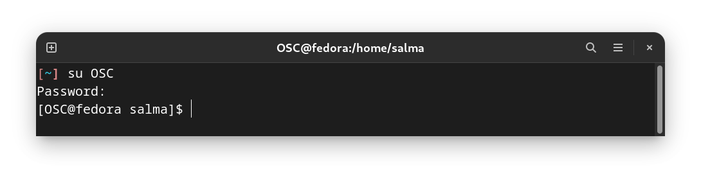
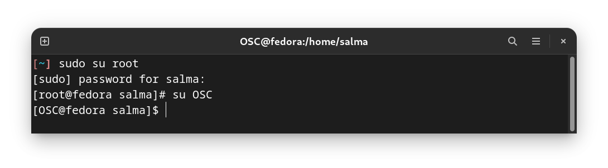
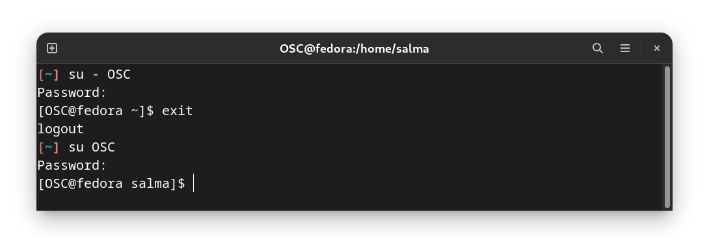

# What is a User?

A user account is used to provide security boundaries between different people and programs that can run commands.

Users have usernames to identify them to human users and make them easier to work with. Internally, the system distinguishes user accounts by the unique identification number assigned to them, **the user ID or UID**. If a user account is used by humans, it will generally be assigned a secret password that the user will use to prove that they are the actual authorized user when logging in.

User accounts are fundamental to system security. Every process (running program) on the system runs as a particular user. Every file has a particular user as its owner. File ownership helps the system enforce access control for users of the files. The user associated with a running process determines the files and directories accessible to that process.

There are three main types of user account: the **superuser, system users,** and **regular users.**

### Superuser

The **superuser** account is for administration of the system. The name of the superuser is **root** and the account has **UID 0**. The superuser has full access to the system.

### System User

The system has **system user** accounts which are used by processes that provide supporting services. These processes, or **daemons**, usually do not need to run as the superuser. They are assigned non-privileged accounts that allow them to secure their files and other resources from each other and from regular users on the system. Users do not interactively log in using a system user account.

### Regular User 

Most users have **regular user** accounts which they use for their day-to-day work. Like system users, regular users have limited access to the system

> By default, systems use the `/etc/passwd` file to store information about local users.


## UID Ranges

Specific UID numbers and ranges of numbers are used for specific purposes by Linux:

- **UID 0** - Root user
- **UID 1 - 999** - System and Program users
- **UID >=** 1000 - Real users

---------------------------------------------------

# Group

A group can contain multiple users. All users belonging to a group will have the same Linux group permissions access to the file. Suppose you have a project where a number of people require access to a file. Instead of manually assigning permissions to each user, you could add all users to a group, and assign group permission to file such that only this group members and no one else can read or modify the files.

Groups have group names to make them easier to work with. Internally, the system distinguishes groups by the unique identification number assigned to them, the **group ID or GID**. The mapping of group names to GIDs is defined in databases of group account information. By default, systems use the `/etc/group` file to store information about local groups.

## Primary Groups and Supplementary Groups

Every user has exactly **one primary group**. For local users, this is the group listed by GID number in the `/etc/passwd` file. By default, this is the group that will own new files created by the user.

Normally, when you create a new regular user, a new group with the same name as that user is created. That group is used as the primary group for the new user, and that user is the only member of this User Private Group. It turns out that this helps make management of file permissions simpler, which will be discussed soon.

Users may also have supplementary groups. Membership in supplementary groups is determined by the `/etc/group` file. Users are granted access to files based on whether any of their groups have access. It doesn't matter if the group or groups that have access are primary or supplementary for the user. For example, if the user `user01` has a primary group `user01` and supplementary groups `wheel` and `webadmin`, then that user can read files readable by any of those three groups.

> The `id` command can be used to find out about group membership for a user. 

---------------------------------

# id Command

You can use the `id` command to show information about the currently logged-in user.

To view basic information about another user, pass the username to the `id` command as an argument : `id user2`



In the preceding example, `salma` has the group `salma` as her primary group (gid). The groups item lists all groups for this user (`salma`), and other than the primary group `salma`, the user has group `wheel` as supplementary groups.

----------------------------------

# `/etc/passwd` File

The `/etc/passwd` file is owned by the **root** user. It is used to keep track of **every registered user** that has access to a system. It shows you a list of users and detailed information about them.



Normally in a user's setting page, you would expect you see just human users. However, you'll notice `/etc/passwd` contains other users. Remember that users are really only on the system to run processes with different permissions. Sometimes we want to run processes with pre-determined permissions. For example, the daemon user is used for daemon processes.

Each line displays user information for one user, most commonly you'll see the root user as the first line. There are many fields separated by colons that tell you additional information about the user, let's look at them all:

  - **Username**
  - **User's password :** You can see many different symbols that are in this field :
          - `"x"` that means the password is stored in the `/etc/shadow` file.
          - `"*"` means the user doesn't have login access. 
          - If there is a **blank field** that means the user doesn't have a password.
  - **The user ID :**  As you can see root has the **UID** of 0.
  - **The group ID**
  - **Comment field :** This is used to generally leave comments about the user or account such as their real name or phone number, it is comma delimited.
  - **User's home directory**
  - **User's shell :** You'll probably see a lot of user's defaulting to bash for their shell. A system user might use `/sbin/nologin` if interactive logins are not allowed for that user.


- You can edit the `/etc/passwd` file by hand if you want to add users and modify information with the **vipw tool**, however things like these are best left to the tools such as `useradd` and `userdel`.

-------------------------------------------------------

# `/etc/shadow` File

The `/etc/shadow` file is used to store information about **user authentication**. It requires superuser read permissions.


The fields are separated by colons as followed :
  
  - **Username**
  - **Encrypted password**
  - **Date of last password changed :** Expressed as the number of days since Jan 1, 1970 [(Unix time)](https://en.wikipedia.org/wiki/Unix_time) [(Convert Days Since Year 1970)](https://www.epochconverter.com/seconds-days-since-y0#:~:text=Days%20Since%201970%2D01%2D01,%2C%201970%2C%20the%20Unix%20epoch.). If there is a **0** that means the user should change their password the next time they login. 
  - **Minimum password age :** Days that a user will have to wait before being able to change their password again.
  - **Maximum password age :** Maximum number of days before a user has to change their password.
  - **Password warning period :** Number of days before the password expires during which the user is warned that the password must be changed.
  - **Password inactivity period :** Number of days after the user password expires before the user account is disabled. Typically this field is empty.
  - **Account expiration date :** date that user will not be able to login.
  - **Reserved field :** for future use.






> The` /etc/shadow` file should not be edited by hand unless you know what you are doing. Always use a command that is designed for the purpose. For example, to change a user password, use the `passwd` command, and to change the password aging information, use the `chage` command

### Example Entry

Let’s take a look at the following example:

```
linuxize:$6$zHvrJMa5Y690smbQ$z5zdL...:18009:0:120:7:14::
```

The entry above contains information about the user “linuxize” password:

 - The password is encrypted with SHA-512 (the password is truncated for better readability).
 - The password was last changed on April 23, 2019 - 18009.
 - There is no minimum password age.
 - The password must be changed at least every 120 days.
 - The user will receive a warning message seven days before the password expiration date.
 - If the user doesn’t attempt to login to the system 14 days after the password is expired, the account will be disabled.
 - There is no account expiration date.

---------------------------------------------------------------------

# `/etc/group` File

The file `/etc/group` contains all the groups defined in the system. There is one entry per line, and each line has the following format (all fields are separated by a colon (:)

`less /etc/group`


**Fields :**

- **Group Name :** It is the name of group. 

- **Password :** It stores the encrypted password. There isn't a need to set a group password, using an elevated privilege like sudo is standard. Linux distributions that use shadow passwords typically place an **x** in the password field; others place the encrypted password in this field. 

- **Group ID (GID) :** Each user must be assigned a group ID. 

- **Group List :** It is a list of usernames of users who are members of the group. The usernames are separated by commas.


**Notes :**
- You cannot have 2 groups owning the same file.
- You do not have nested groups in Linux. One group cannot be sub-group of other.

------------------------------

# Gaining Superuser Access

The root user has the power to override normal privileges on the file system, and is used to manage and administer the system. 

To perform tasks such as installing or removing software and to manage system files and directories, users must escalate their privileges to the root user.

The root user only among normal users can control most devices, but there are a few exceptions. For example, normal users can control removable devices, such as USB devices. Thus, normal users can add and remove files and otherwise manage a removable device, but only root can manage "fixed" hard drives by default.

This unlimited privilege, however, comes with responsibility. **The root user has unlimited power to damage the system:** remove files and directories, remove user accounts, add back doors, and so on. If the root user's account is compromised, someone else would have administrative control of the system.

The root account on Linux is roughly equivalent to the local Administrator account on Microsoft Windows. In Linux, most system administrators log in to the system as an unprivileged user and use various tools to temporarily gain root privileges.

**WARNING**

One common practice on Microsoft Windows in the past was for the local Administrator user to log in directly to perform system administrator duties. Although this is possible on Linux, Red Hat recommends that system administrators do not log in directly as root. Instead, system administrators should log in as a normal user and use other mechanisms (`sudo` for example) to temporarily gain superuser privileges.

By logging in as the superuser, the entire desktop environment unnecessarily runs with administrative privileges. In that situation, any security vulnerability which would normally only compromise the user account has the potential to compromise
the entire system.

## sudo Command

**Sudo**, the one command to rule them all. It stands for **“super user do!”**

The sudo command lets us use our account and password to execute system commands with root privileges.



The `/etc/sudoers` file is a file Linux and Unix administrators use to allocate system rights to system users. This allows the administrator to control who does what. 

-------------------------------------------------

# Switching Users `su`

SU stands for **substitute user** or **switch user**.

`su` is a command that allows you to move to a different user account, and you'll need the password for that account.



When root runs `su`, you do not need to enter the user's password.



> If you omit the user name, the `su` or `su -` command attempts to switch to root by default.

#### `su` vs. `su -`

The command `su` starts a non-login shell, while the command `su -` starts a login shell. 

The `-` switch provides us with the user's environment (path and shell variables) rather than simply giving us the user power for a single command while keeping our own environment. It has the same effect as logging into a system directly with that user account. In other words, you take on the role of the user, while `su` just starts a shell as that user, but uses the original user's environment settings.




### Notes

In some cases, the root user's account may not have a valid password at all for security reasons.

In this case, users cannot log in to the system as root directly with a password, and `su` cannot be used to get an interactive shell. 

One tool that can be used to get root access in this case is `sudo`. Unlike `su`, `sudo` normally requires users to enter **their own password** for authentication, not the password of the user account they are trying to access. 

That is, users who use `sudo` to run commands as root do not need to know the root password. Instead, they use their own
passwords to authenticate access.

Additionally, sudo can be configured to allow specific users to run any command as some other user, or only some commands as that user.

**Enabling root user account :** `sudo passwd root`

### Sudo vs. Su 

- `sudo` will ask for your password, while `su` will ask for the password for the user whom you are switching to.

- It is advisable to stick to `sudo` when performing tasks that require root privileges. By doing so, the current user is only granted privileged for the specified command. On the other hand, `su` switches to the root user completely, exposing the entire system to potential accidental modification.


| Command | Description |
|---------|-------------|
|`sudo -i`|To switch to an interactive session as a **root** user. The `-i` flag allows a user to get a **root environment** **without** having to know the **root account password**.|
|`sudo su`| You’re telling it to run the `su` command as root. This command asks for the current user’s password as opposed to root.|
|`sudo su -`|The (-) switch provides you with root's environment (path and shell variables) rather than simply giving you root user power for a single command while keeping your own environment.|
|`su salma`|This will tell the system to switch (and essentially log out of) the current user to the one specified.|
|`su - salma`|If you want to switch to the salma user account including salma's path and environment variables, use the (`-`) switch.|

--------------------------------------------------------

# Creating Users/Groups, Removing Users/Groups & Changing Passwords

Linux is a multi-user system, which means that more than one person can interact with the same system at the same time. As a system administrator, you have the responsibility to manage the system’s users and groups by creating and removing users and assign them to different groups.

### Why Not Just Use One Account?

If you use a single user account on your computer, everyone will share the same application settings, files, and system permissions.

- **Application Settings:** When you use a single user account, everyone using the computer will use the same browser. This allows other people to use your online accounts if you stay logged in, view your browser history, dig through your bookmarks, and more. If you use multiple user accounts, everyone will have their own browser, which they can log into without worry. The same is true for other applications, like email clients. Most programs will use different settings for each user account.

- **Files:** With multiple people sharing a single user account, no one really has any private files. Anyone using the same user account can view your files. If you use multiple user accounts, the other users won’t be able to view files stored in your user folder. You won’t be able to view their files, either. This provides additional privacy if the other users are standard user accounts. Note that administrator users have full system permissions and can view all files on the computer.

- **System Permissions:** Other user accounts can be either standard or administrator accounts. If they’re standard accounts, you can give them limited permissions, so they can’t view your files, install software, or make other changes to your computer. This can be particularly useful if you want to lock down a computer so less-experienced users won’t install malware.

--------------------------------------------------

# Creating Users `useradd` 

Only the root or a user with sudo privileges can create new user accounts.

**Syntax :** `useradd [OPTIONS] USERNAME`

When invoked, `useradd` creates a new user account according to the **options** specified on the command line and the default values set in the `/etc/default/useradd` file. When executed without any option, `useradd` creates a new user account using the default settings specified in the `/etc/default/useradd` file. The variables defined in this file differ from distribution to distribution, which causes the `useradd` command to produce different results on different systems.


`useradd` also reads the content of the `/etc/login.defs` file. This file contains configuration for the **shadow password suite** such as password expiration policy, ranges of user IDs used when creating system and regular users, and more.


> At this point the account does not have a valid password set, and the user cannot log in until a password is set.

- Create new user called **pingo**:


The command adds an entry to the `/etc/passwd`, `/etc/shadow`, `/etc/group` and `/etc/gshadow` files.

--------------------------------------------------

# Setting/Changing Passwords `passwd`

**To be able to log in** as the newly created user, you need to set the user password. To do that run the `passwd` command followed by the username :


`passwd` sets the initial password or changes the existing password of username.

----------------------------------------------

# Creating Groups `groupadd`

**Syntax :** `groupadd [OPTIONS] Group_name`

Only the root or a user with sudo privileges can create new groups.

When invoked, `groupadd` creates a new group using the options specified on the command line plus the default values specified in the `/etc/login.defs` file.


The command adds an entry for the new group to the `/etc/group` and `/etc/gshadow` files.

Once the group is created, you can start adding users to the group.

----------------------------------------------

# Add an Existing User Account to a Group `usermod`

`usermod` (modify a user account) command is used to add an existing user account to a group on your system.

A group must exist before a user can be added to that group.

**Syntax :** `usermod -a -G group username`

`-G` option to add a user to a supplementary group.

`-a` option makes `usermod` function in append mode. Without `-a`, the user will be removed from any of their current supplementary groups that are not included in the `-G` option's list.


Use `-g` command to change a user's primary group.

-------------------------------------------------

# Removing Users `userdel`

The command removes the details of username from /`etc/passwd` without removing the user's home directory by default. If the `-r` flag is specified, the `userdel` command also removes the user's home directory.


**WARNING**

When a user is removed with `userdel` without the `-r` option specified, the system will have files that are owned by an unassigned UID. This can also happen when a file, having a deleted user as its owner, exists outside that user's home directory. **This situation can lead to information leakage and other security issues.**

The `useradd` command assigns new users the first free UID greater than or equal to 1000, unless you explicitly specify one using the `-u` option. This is how information leakage can occur. If the first free UID had been previously assigned to a user account which has since been removed from the system, the old user's UID will get reassigned to the new user, giving the new user ownership of the old user's remaining files.


The following scenario demonstrates this situation.

```bash
[root@host ~]# useradd user01
[root@host ~]# ls -l /home
drwx------. 3 user01 user01 74 Feb 4 15:22 user01 
[root@host ~]# userdel user01
[root@host ~]# ls -l /home
drwx------. 3 1000 1000 74 Feb 4 15:22 user01
[root@host ~]# useradd user02
[root@host ~]# ls -l /home
drwx------. 3 user02 user02 74 Feb  4 15:22 user02
```
Notice that `user02` now owns all files that `user01` previously owned.

Depending on the situation, one solution to this problem is to remove all unowned files from the system when the user that created them is deleted. 

Another solution is to manually assign the unowned files to a different user. The root user can use
the `find / -nouser -o -nogroup` command to find all unowned files and directories.

----------------------------------

# Removing Groups `groupdel`

`groupdel` is used to delete a group.

**Syntax :** `groupdel group_name`

You cannot remove a group if it is the primary group of any existing user.


----------------------------------------------
----------------------------------------------

## Resources

- https://www.howtogeek.com/142434/htg-explains-why-every-user-on-your-computer-should-have-their-own-user-account/
- https://linuxize.com/post/how-to-create-users-in-linux-using-the-useradd-command/