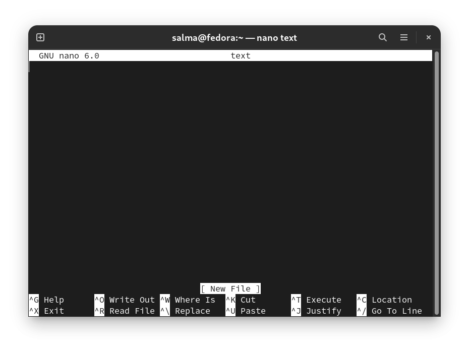
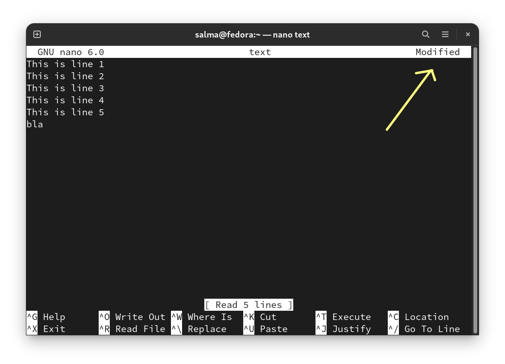
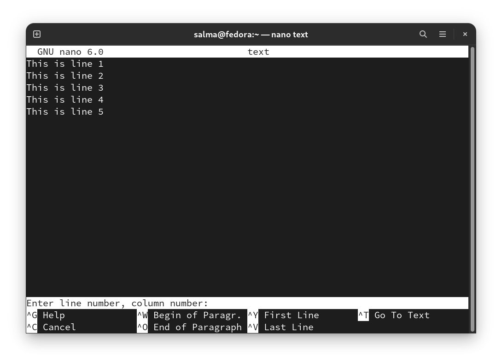
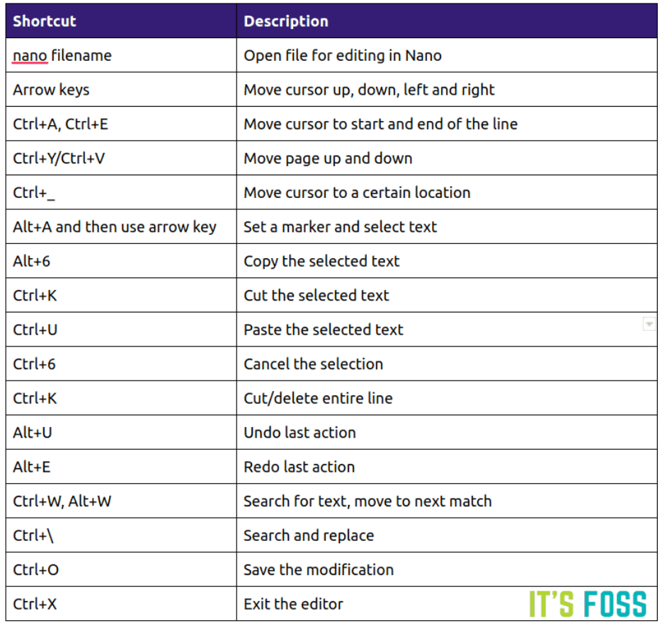

# Nano

- GNU nano is an easy to use command line text editor for Unix and Linux operating systems. It includes all the basic functionality you’d expect from a regular text editor, like syntax highlighting, multiple buffers, search and replace with regular expression support, spellchecking, UTF-8 encoding, and more.

- Nano text editor is pre-installed on most Linux distros. 

-----------------------------------

## Opening and Creating Files

- To open an existing file or to create a new file : `nano filename`

- E.g, `Nano text` This opens a new editor window, and you can start editing the file.

- If you want to open a file with the cursor on a specific line : `nano +line_number filename`

- E.g, `Nano +4 text` This opens the file with the cursor on line 4.



- At the bottom of the window, there is a list of the most basic command shortcuts to use with the nano editor.

- All commands are prefixed with either **^** or **M** character. The caret symbol (**^**) represents the **Ctrl key**. For example, the ^J commands mean to press the Ctrl and J keys at the same time. The letter **M** represents the **Alt key**.

> You can get a list of all commands by typing `Ctrl+g`.

- Nano also shows the last action you performed in the bottom.

-----------------------------------

## Saving and Exiting

- To save the changes you’ve made to the file, press `Ctrl+o`. If the file doesn’t already exist, it will be created once you save it.

- To exit nano press `Ctrl+x`. If there are unsaved changes, you’ll be asked whether you want to save the changes.

-----------------------------------

## Editing Files

- You can start typing and editing the text immediately after opening the file.

- As soon as you modify anything in the file, you’ll notice that it reflects this information on the editor.



### Jump to line X

- To move the cursor to a specific line and character number, use the `Ctrl+ Shift+ –` command. The menu on the bottom of the screen will change to “Enter line number, column number:”. Type then hit Enter.




### Search for a text

- To **search** for a text, press `Ctrl+w`, type in the search term, and press Enter. The cursor will move to the first match. To move to the next match, press `Alt+w`.

### Find and replace

- To **search and replace**, press `Ctrl+\`. Enter the search term and the text to be replaced with. The editor will move to the first match and ask you whether to replace it. After hitting `Y` or `N` it will move to the next match. Pressing `A` will replace all matches.

### Copping, cutting, and pasting

- To **select text**, move the cursor to the beginning of the text and press `Alt+a`. This will set a selection mark. Move the cursor to the end of the text you want to select using the arrow keys. The selected text will be highlighted. If you want to cancel the selection press `Ctrl+6`

- **Copy** the selected text to the clipboard using the `Alt+6` command. `Ctrl+k` will **cut** the selected text.

- If you want to **cut whole lines**, simply move the cursor to the line and press `Ctrl+k`. You can **cut multiple lines** by hitting `Ctrl+k` several times.

- To **paste** the text move the cursor to where you want to put the text and press `Ctrl+u`.


--------------------------------------------------------------------------

## Customizing Nano (nanorc)

- When nano is launched, it reads its configuration parameters from the system-wide configuration file `/etc/nanorc` and from the user-specific files `~/.config/nano/nanorc` and `~/.nanorc` if the files are present.

- Options specified in the user files take precedence over the global options.

-----------------------------------

## Set Nano as the Default Text Editor

- By default, on most Linux systems, the default text editor for commands such as visudo and crontab is set to vi. To use nano as the default text editor, you need to change the **VISUAL** and **EDITOR** environment variables.

- Bash users can export the variables in the `~/.bashrc` file:

**~/.bashrc :**
```
export VISUAL=nano
export EDITOR="$VISUAL"
```

---------------------------------------

#  Nano cheatsheet 



---------------------------------------

## Resources

- https://linuxize.com/post/how-to-use-nano-text-editor/
- https://itsfoss.com/nano-editor-guide/