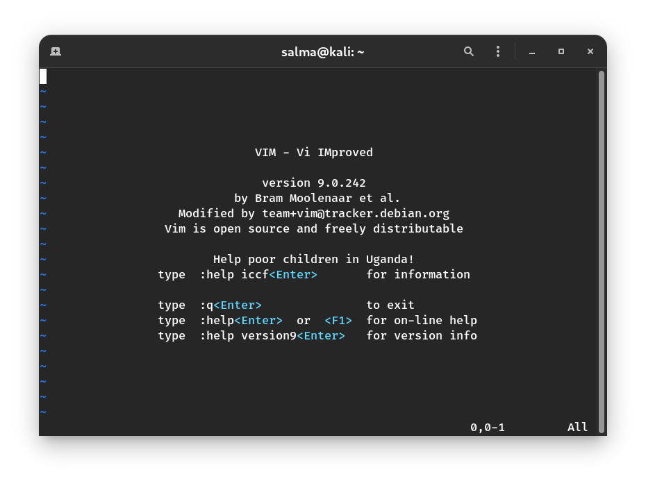

# VIM

# What is VIM ? 

**Vi** is a text editor that was originally created for the Unix operating system. **Vi** is actually short for “visual”.

**On most modern systems, Vim has replaced vi.** Even if you think you’re starting vi by running the `vi` command, for example, Vim is what actually starts.

Vim is an improved version of the **vi** editor distributed with **Linux and UNIX** systems. The name Vim is a contraction of **Vi and Improved**. So, **Vim is vi improved**.  

Vim is a highly configurable text editor that you can use for software development or any kind of text editing. When someone masters Vim, they can often be more efficient with it than using other text editors. Vim forces you to use only the keyboard and no mouse. This limits the time you waste moving your hand between devices.

# Why to learn VIM ? 

**You should know how to use at least one text editor that can be used from a text-only shell prompt.**

### Vim Is Cross-Platform.

Vim is available on a number of different operating systems. Vim is available on Linux, Unix, Mac, and Windows. 

A great thing about Vim is that it can be installed anywhere and comes preinstalled on many machines. 

Vim is **almost always installed on a server** and most Linux distributions install it by default. 

Vim’s lightweight footprint is part of why it’s pre-installed on so many operating systems and servers.

> Vim on Linux works with LF only, Vim on Windows works with both LF and CRLF

### Incredibly Fast to Use (Once you learn it) 

Vim commands all come from the keyboard, and they allow you to edit entire words, lines, or paragraphs of text with individual commands.

All the power Vim provides allows you to do things quickly. You can even make complex edits fairly quick and easily, once you know how Vim works.

### Vim is Keyboard-First

Nothing in Vim requires you to use the mouse. You can do absolutely everything from the keyboard.

This sounds daunting at first, but once you've integrated some of the keymaps into muscle memory you'll see your productivity skyrocket. Reaching for the mouse, even if only rarely, breaks your flow. And those little breaks can add up over time.

For some people, a keyboard-driven workflow is crucial to prevent RSI symptoms. If you struggle with RSI, it might be worth giving Vim a shot.

> Note : Vim has mouse support, but most people rarely use it.

### Vim Is Like a Language.

Like a language, Vim has the concept of verbs, nouns (or objects), and adjectives. For example, to delete a word you type the command `dw`, which is an action and an object. If you want to perform a different action on that object, then use a different action command. For example, to change the text of a word you would use `cw`.

To delete everything contained within a pair of quotes, you can use the command `di”`. This means “delete inside the quotes.” You have an action: delete, an adjective: inside, and an object: quotation marks.

If you want to delete 3 words, you use the command `d3w` which literally means to “delete 3 words.” It’s very language like.

There’s no need to get hung up on any of these commands at this point. The idea here is to demonstrate how easy it can be to think in Vim, and how it’s actually more efficient than manually learning dozens and dozens of commands for every little situation you might encounter.

### Incredibly Performant (no more waiting for files to open) 

If you’ve ever waited for your IDE to start up when you’re just trying to simply edit one file, you know what we mean. Vim opens files instantly and editing is superfast. No waiting. 

### Vim’s Commands, Shortcuts, and Key-Bindings Are Transferable to Other Programs.

When you learn how to navigate with Vim, you’ll find you can use those same navigation key bindings in other programs such as `man` and `less`. You can even configure your command line shell to use Vim-style line editing features. For example, you can use `set -o vi` for your Bash shell, so you can use Vim key bindings to browse any command history and even edit the current command line.

**Even other editors support Vim modes.** Sometimes the mode is built-in and other times you’ll need to install a plugin first. 

Here are just a few editors where you can put your Vim knowledge to use: 
   - Visual Studio
   - Visual Studio Code
   - NetBeans 
   - Atom
   - Eclipse
   - Notepad++
   - and more!

### You Can Use Vim With a TUI or a GUI.

Not only can you run Vim from the command line and use its textual user interface, you can run Vim in a Graphical User Interface mode suitable for graphical environments. The Graphical User Interface mode of Vim has all the same features you know and love in Vim, in addition to the features you would expect from of a graphical application. Those additional features include things like scroll bars, menus, a list of recently opened files, the ability to use a mouse, and integration with the system clipboard.

### Vim Is Thoroughly Documented.

Once you have a little exposure to Vim, Vim’s built-in help system comes in really handy. You can use it to quickly lookup commands, syntax, and more — all without leaving the editor. You can even edit your file while referring to the documentation all on the same screen. The documentation that comes with Vim is very well written and easy to use.

--------------------------------------------------------------------

# Installation

**Debian/ Ubuntu/ Mint :** `sudo apt install vim` \
**RHEL/ Fedora :** `sudo dnf install vim ` \
**Arch/ Manjaro :** `sudo pacman -S vim` 

### Check Vim version

To check the current Vim version, run: `vim --version`

-------------------------------------------------------------

# `vim` Command

Now that you have Vim installed, run this from the terminal: `vim`

You should see an **intro screen**. This is the where you will be working on your file. Unlike most text editors and IDEs, **Vim is a modal editor.** If you want to type `abc` you need to switch to insert mode with `i`. 

-------------------------------------------------------------

# VIM is a Modal Editor

A modal editor provides different modes of operation, each suited for a particular purpose. For example, in Vim, there are modes for entering keyboard commands, inserting text, and selecting text.

This is different from **non-modal** (or **modeless**) editors, which only provide one mode for inputting characters.

# VIM Modes 

At any time, you can see which mode you are in on the status bar of the editor, if the `showmode` option is set :

- **insert** mode is shown by the modeline as `-- INSERT --`
- **visual** mode is show by the modeline as `-- VISUAL --`
- **select** mode is shown by the modeline as `-- SELECT --`
- **insert normal** mode is shown by the modeline as `-- (insert) --`
- …etc

> **A side note**\
> Vim actually has **seven** so-called **'basic modes'**, and **six** **'additional modes'**, for a grand total of **13 unique modes.** That sounds super daunting — but even expert Vimmers typically use just three or four of these modes regularly.

# BASIC Modes

To change between modes, use `Esc` for normal mode.

# Normal Mode (Command Mode)         

**This mode is the place that we spent most our time in. Remember, this is what makes Vim different.**

In Normal mode you can enter all the normal editor commands. If you start the editor you are in this mode by default. 

In normal mode, there are multiple ways to move around an open file. In addition to using the cursor keys to move around, you can use `h` (left), `j` (down), `k` (up), and `l` (right) to move as well. This particularly helps touch typists who don’t like leaving the home row when making changes.

You can also make changes to single characters in normal mode. For example, to replace a single character, move your cursor over it and press `r`, and then the character you want to replace it with. Similarly, you can delete single characters by moving your cursor over it and pressing `x`.

To perform an undo, press `u` in normal mode. This undoes changes up to the last time you were in normal mode. If you want to redo (i.e., undo your undo) press `Ctrl+r` in normal mode.

> We can navigate among other modes through it.

# Insert Mode

In Insert mode the text you type is inserted into the buffer. 

You can enter it by using an `insert` command from normal mode.

Insert commands include:

- `i` for ’insert’, this immediately switches vim to insert mode
- `a` for ’append’, this moves the cursor after the current character and enters insert mode
- `o` inserts a new line below the current line and enters insert mode on the new line

There are so many more ways of inserting text in Vim that can’t be listed here, but these are the simplest.

**Beware of staying in insert mode for too long; Vim is not designed to be used in insert mode all the time.** You can type normally until you want to make a correction, save the file, or perform another operation that’s reserved for command mode or last-line mode (Cmdline Mode).

To get out of insert mode, hit the `Escape` key. Once you press Escape, you’re in command mode again.

# Visual Mode

Visual mode is used to make selections of text. 

This is like Normal mode, but the movement commands extend a highlighted area. When a non-movement command is used, it is executed for the highlighted area. 

Vim has three different visual modes. They are:

   - Character-wise visual mode (`VISUSAL`) : `v`
   - Line-wise visual mode (`V-LINE`)   : `V`
   - Block-wise visual mode (`V-BLOCK`) : `Ctrl-V `

# Command-line Mode (Cmdline or Last-Line Mode )

It's used to give vim commands. When you are in this mode, the cursor goes to the bottom of the screen where you can type in different commands.

There are 4 different commands you can use to enter the command-line mode:

- **Search patterns** : `/`, `?`
- **Command-line commands** ("Ex command") : `:`
- **External commands** ("filter command" or "bang operator") : `!`

You can enter the command-line mode from the normal mode or the visual mode.

To leave the command-line mode, you can use `<Esc>`, `Ctrl-c`, or `Ctrl-[`.

### Examples :

- `:w` to save changes made to the file.
- `:wq` save the changes then **exit vim**.
- `:q!` discard the changes we made and then **exit vim**.

# Select Mode           

Select mode looks like Visual mode, but the commands accepted are quite different. It was created to be similar to Windows' selection mode **but with time has been less and less used**.

Typing a printable character deletes the selection and starts Insert mode. 

To enter the select mode from Normal mode, press :`gh` or `gH`

Getting back to Normal Mode, press `<Esc>` or `Ctrl-C` or `Ctrl-[`.

# Ex Mode

Like Command-line mode, but after entering a command you **remain** in Ex mode.

To enter it, you type : `Q`

To get back to Normal mode from Ex mode, enter the `:visual` or `:vi` for short

To quit Ex mode, enter the already known `:q` command.

# Terminal-Job Mode 

Since **v8.1**, Vim has shipped with a **built-in terminal**. This feature allows us to have a terminal running in a Vim window.

**Why use this?** Mainly because it saves you jumping to a separate terminal window. You can also use Vim commands to manipulate a shell session and easily transfer clipboard content between the terminal and files you're working on.

To open vim terminal, just type the command `:terminal`, or `:vert terminal` to open the terminal in a vertical split window.

To close the vim terminal, type `exit` or `Ctrl-W Ctrl-C`

-------------------------------------------------------------------
-------------------------------------------------------------------

### There are seven ADDITIONAL modes. These are variants of the BASIC modes:

# Operator Pending Mode

This is like Normal mode, but after an operator command has started, and Vim is waiting for a **{motion}** to specify the text that the operator will work on.

# Insert Normal Mode

Entered when `CTRL-O` is typed in **Insert mode**.  This is like Normal mode, but after executing one command Vim returns to Insert mode. 

# Insert Visual Mode     

Entered when starting a Visual selection from Insert mode, e.g., by using `CTRL-O` and then `v`, `V` or `CTRL-V`.  When the Visual selection ends, Vim returns to Insert mode. 

# Insert Select Mode

See more

 
Entered when starting Select mode from Insert mode. E.g., by dragging the mouse or <b>&lt;S-Right&gt;</b>. When the Select mode ends, Vim returns to Insert mode. 

# Replace Mode 

Replace mode is a special case of Insert mode.  You can do the same things as in Insert mode, but for each character you enter, one character of the existing text is deleted. 

Before entering this mode, get into normal mode and put your cursor on top of the first character that you want to replace. Then press `R` to enter replace mode. Now whatever you type will replace the existing text. The cursor automatically moves to the next character just like in insert mode.

# Virtual Replace Mode  

Virtual Replace mode is similar to Replace mode, but instead of file characters you are replacing screen real estate.

Type `gR` to enter VREPLACE mode

[Replace vs Virtual Replace Modes](https://medium.com/vim-drops/replace-and-virtual-replace-modes-3e841b9161ca)

# Terminal-Normal Mode  

See more

 
Using Normal mode in a terminal window.  Making changes is impossible.  Use an insert command, such as "a" or "i", to return to Terminal-Job mode.

-------------------------------------------------------------------
-------------------------------------------------------------------

# Auto-Save 

Vim does have an auto-save feature, but it saves it to the "**recovery**" file.

When you edit a document, e.g. `MyFile.txt` vim will create the revovery file `.MyFile.txt.swp`. If your system were to crash, or your session were to die, then you can reconnect, and recover from essentially where you left off, by typing: `vim -r MyFile.txt` This will open the file for editing, and recover the last changes you made to it.

-----------------------------------------------------------

# Vim resources

### Interactive Learning

- You can learn the basics of Vim in just a few minutes using `vimtutor` command.
- [OpenVim](https://www.openvim.com/) — interactive tutorial
- [Vim Adventures](https://vim-adventures.com/) — learn Vim by playing a game

### Cheat Sheets

- [shortcutfoo](https://www.shortcutfoo.com/app/dojos/vim/cheatsheet) — has nice animation for some shortcuts
- [Vim Cheat Sheet](https://vim.rtorr.com/)
- [devhints : Vim Cheat Sheet](https://devhints.io/vim)
- [Vim scripting cheatsheet](https://devhints.io/vimscript)

-------------------------------------------------------------------