# Linux File Ownership

Every file and directory on your Unix/Linux system is assigned **3 types** of owner :

### User (Owner)

A user is the owner of the file. By default, the person who created a file becomes its owner.

### Group

A group can contain multiple users. All users belonging to a group will have the same Linux group permissions access to the file. Suppose you have a project where a number of people require access to a file. Instead of manually assigning permissions to each user, you could add all users to a group, and assign group permission to file such that only this group members and no one else can read or modify the files.

### Other

Any other user who has access to a file. This person has neither created the file, nor he belongs to a group who could own the file. Practically, it means everybody else. Hence, when you set the permission for others, it is also referred as set permissions for the world.

--------------------------------------------------------------

# Linux File Permissions

Every file and directory in your UNIX/Linux system has following **3 permissions** defined for all the 3 owners discussed above.

### Read `r`

This permission give you the authority to open and read a file. Read permission on a directory gives you the ability to lists its content.

### Write `w`

The write permission gives you the authority to modify the contents of a file. The write permission on a directory gives you the authority to add, remove and rename files stored in the directory. 

Consider a scenario where you have to write permission on file but do not have write permission on the directory where the file is stored. You will be able to modify the file contents. But you will not be able to rename, move or remove the file from the directory.

### Execute `x`

In Windows, an executable program usually has an extension “**.exe**” and which you can easily run. In Unix/Linux, you cannot run a program unless the execute permission is set. If the execute permission is not set, you might still be able to see/modify the program code(provided read & write permissions are set), but not run it.

By default, any newly created files are not executable regardless of its file extension suffix.

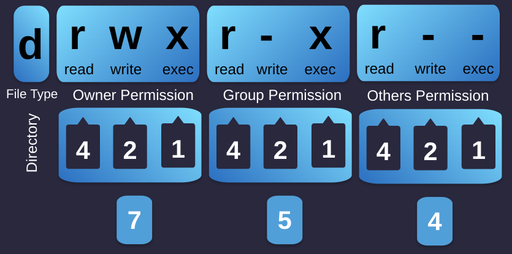

- `r` = read permission
- `w` = write permission
- `x` = execute permission
- `–` = no permission


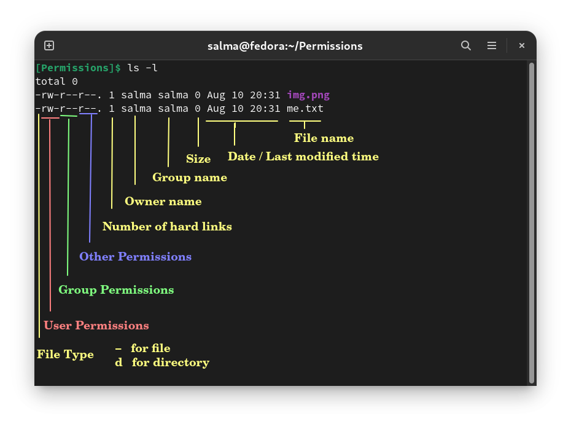

> `ls -l` displays the size of space on the disk that is used to store the **meta information**. The file metadata details include information regarding its size, permissions, creation date, access date, inode number, UID/GID, file type etc. If it is i.e. 1024 this means that 1024 bytes on the disk are used for this purpose.

--------------------------------------------------------------

# Changing Permissions 

## `chmod` Command 

Chmod command stands for **change mode**. Using the command, we can set permissions (read, write, execute) on a file/directory for the owner, group and the world.

**Syntax:** `chmod permissions filename`

- There are 2 ways to use the command :

    **1.** Absolute mode
    
    **2.** Symbolic mode


### Absolute(Numeric) Mode 

- In this mode, file permissions are not represented as characters but a three-digit octal number.

- The table below gives numbers for all for permissions types.

| Number | Permission Type       | Symbol |
|--------|-----------------------|--------|
|   0	 | No Permission         | `---`  |
|   1	 | Execute	             | `--x ` |
|   2	 | Write	             | `-w-`  |
|   3	 | Execute + Write       | `-wx`  |
|   4	 | Read	                 | `r--`  |
|   5	 | Read + Execute        | `r-x`  |
|   6	 | Read +Write	         | `rw-`  |
|   7	 | Read + Write +Execute | `rwx`  |

- Example : `chmod 764 sample`   
    - ‘764’ absolute code says the following:
        - Owner can read, write and execute
        - Usergroup can read and write
        - World can only read
    - This is shown as `-rwxrw-r--`

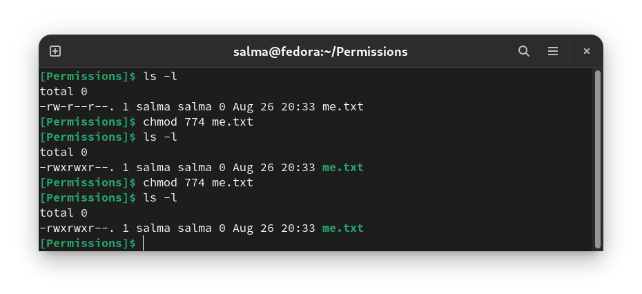

### Symbolic Mode 

In the Absolute mode, you change permissions for all 3 owners. In the symbolic mode, you can modify permissions of a **specific owner**. 

|Operator|Description|
|--------|-----------|
|   +    |Adds a permission to a file or directory. |
|   –    |Removes the permission. |
|   =    |Sets the permission and **overrides** the permissions set earlier. |

The various owners are represented as :

|User| Denotations |
|----|-------------|
| u  | user/owner  |
| g  | group       |
| o  | other       |
| a  | all         |


In this mode, file permissions are represented as `rwx`

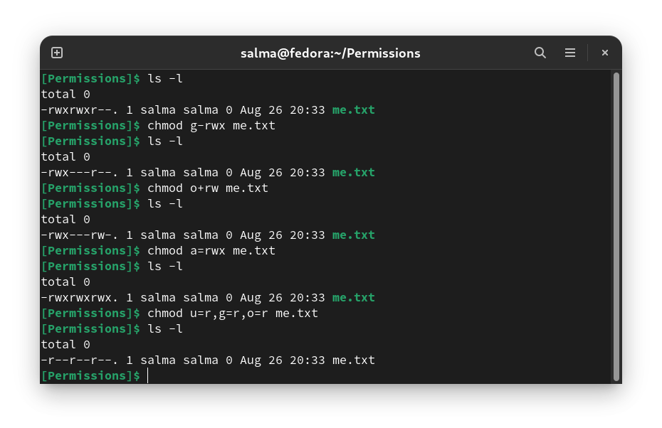


----------------------------------------------------

# Changing Ownership and Group 

## `chown`

- For changing the ownership of a file/directory, you can use : `chown user filename`

- In case you want to change the user as well as group for a file or directory use the command : `chown user:group filename`

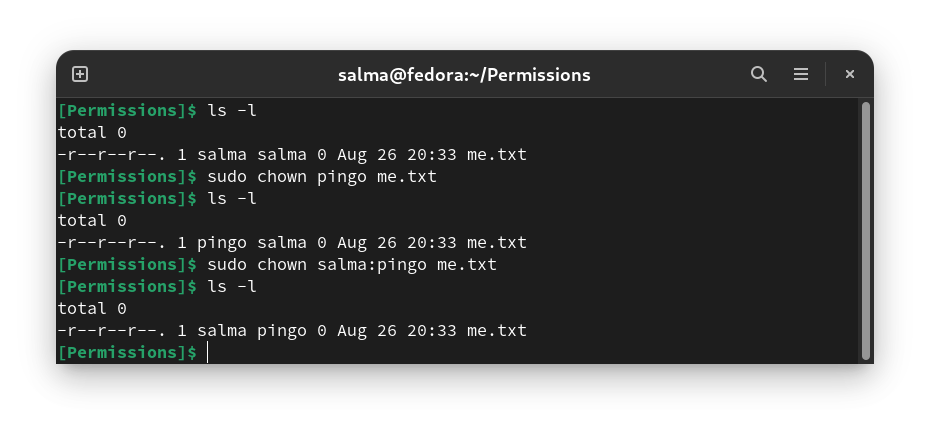

## `chgrp`

- In case you want to change group-owner only : `chgrp group_name filename` 

- ‘chgrp’ stands for **change group**.

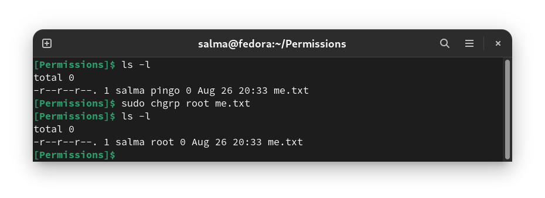

----------------------------------------------------

# `/etc/group` File

The file `/etc/group` contains all the groups defined in the system. There is one entry per line, and each line has the following format (all fields are separated by a colon (:)

`less /etc/group`

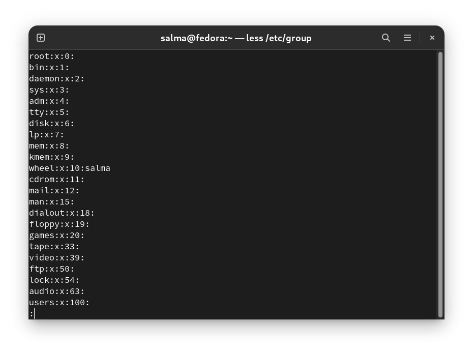

**Fields :**

- **Group Name :** It is the name of group. 

- **Password :** It stores the encrypted password. There isn't a need to set a group password, using an elevated privilege like sudo is standard. Linux distributions that use shadow passwords typically place an **x** in the password field; others place the encrypted password in this field. 

- **Group ID (GID) :** Each user must be assigned a group ID. 

- **Group List :** It is a list of usernames of users who are members of the group. The usernames are separated by commas.

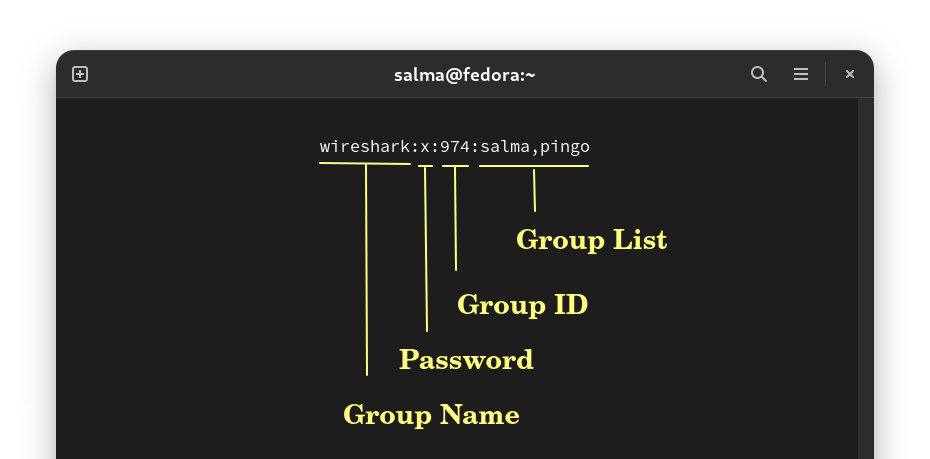

**Notes :**
- You cannot have 2 groups owning the same file.
- You do not have nested groups in Linux. One group cannot be sub-group of other.

## `groups` Command

You can use the command `groups` to find all the groups you are a member of.

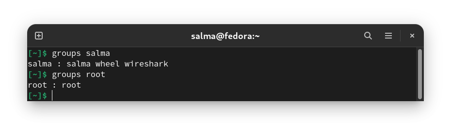

---------------------------------------------------------------------

# `/etc/passwd` File

The `/etc/passwd` file is owned by the **root** user. It is used to keep track of **every registered user** that has access to a system. It shows you a list of users and detailed information about them.


Normally in a user's setting page, you would expect you see just human users. However, you'll notice `/etc/passwd` contains other users. Remember that users are really only on the system to run processes with different permissions. Sometimes we want to run processes with pre-determined permissions. For example, the daemon user is used for daemon processes.

Each line displays user information for one user, most commonly you'll see the root user as the first line. There are many fields separated by colons that tell you additional information about the user, let's look at them all:

  - **Username**
  - **User's password :** You can see many different symbols that are in this field :
          - `"x"` that means the password is stored in the `/etc/shadow` file.
          - `"*"` means the user doesn't have login access. 
          - If there is a **blank field** that means the user doesn't have a password.
  - **The user ID :**  As you can see root has the **UID** of 0.
  - **The group ID**
  - **Comment field :** This is used to generally leave comments about the user or account such as their real name or phone number, it is comma delimited.
  - **User's home directory**
  - **User's shell :** You'll probably see a lot of user's defaulting to bash for their shell.

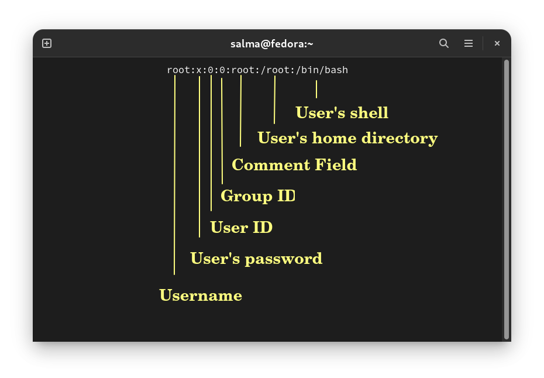

- You can edit the `/etc/passwd` file by hand if you want to add users and modify information with the **vipw tool**, however things like these are best left to the tools such as `useradd` and `userdel`.

-------------------------------------------------------

# `/etc/shadow` File

The `/etc/shadow` file is used to store information about **user authentication**. It requires superuser read permissions.

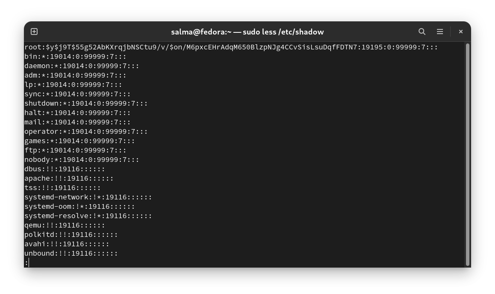

The fields are separated by colons as followed :
  
  - **Username**
  - **Encrypted password**
  - **Date of last password changed :** Expressed as the number of days since Jan 1, 1970 [(Unix time)](https://en.wikipedia.org/wiki/Unix_time) [(Convert Days Since Year 1970)](https://www.epochconverter.com/seconds-days-since-y0#:~:text=Days%20Since%201970%2D01%2D01,%2C%201970%2C%20the%20Unix%20epoch.). If there is a **0** that means the user should change their password the next time they login. 
  - **Minimum password age :** Days that a user will have to wait before being able to change their password again.
  - **Maximum password age :** Maximum number of days before a user has to change their password.
  - **Password warning period :** Number of days before the password expires during which the user is warned that the password must be changed.
  - **Password inactivity period :** Number of days after the user password expires before the user account is disabled. Typically this field is empty.
  - **Account expiration date :** date that user will not be able to login.
  - **Reserved field :** for future use.


> The` /etc/shadow` file should not be edited by hand unless you know what you are doing. Always use a command that is designed for the purpose. For example, to change a user password, use the `passwd` command, and to change the password aging information, use the `chage` command

### Example Entry

Let’s take a look at the following example:

```
linuxize:$6$zHvrJMa5Y690smbQ$z5zdL...:18009:0:120:7:14::
```

The entry above contains information about the user “linuxize” password:

 - The password is encrypted with SHA-512 (the password is truncated for better readability).
 - The password was last changed on April 23, 2019 - 18009.
 - There is no minimum password age.
 - The password must be changed at least every 120 days.
 - The user will receive a warning message seven days before the password expiration date.
 - If the user doesn’t attempt to login to the system 14 days after the password is expired, the account will be disabled.
 - There is no account expiration date.

---------------------------------------------------------------------
---------------------------------------------------------------------

## Resources

- https://www.guru99.com/file-permissions.html#:~:text=Linux%20divides%20the%20file%20permissions,ownership%20of%20a%20file%2Fdirectory.
- https://linuxize.com/post/etc-shadow-file/