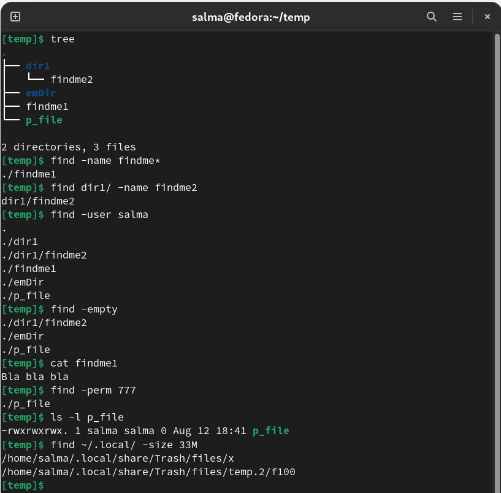
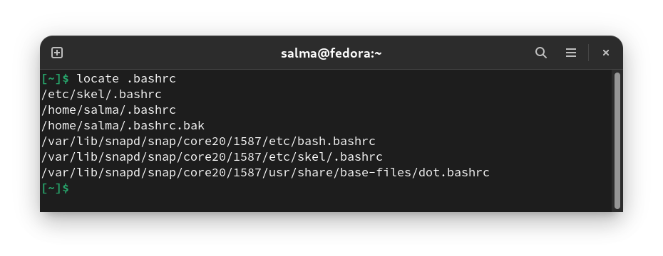
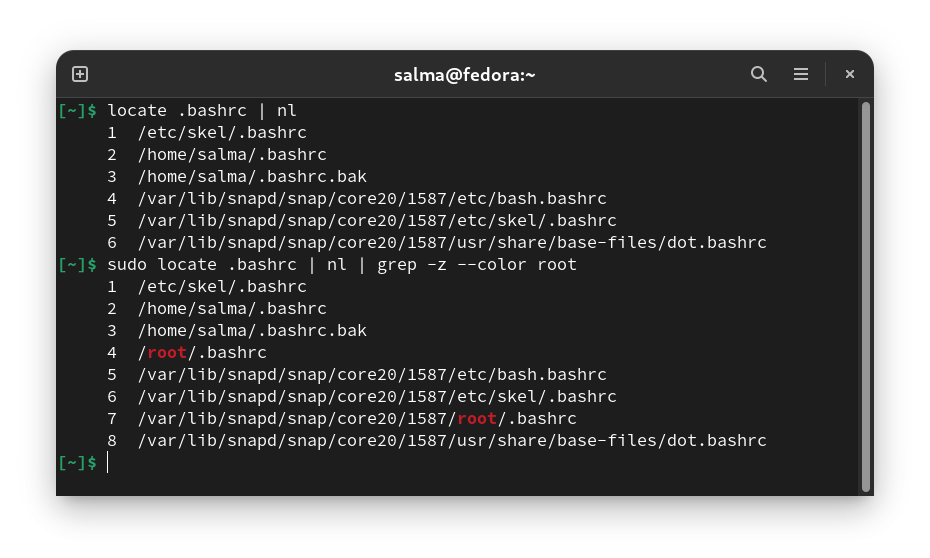
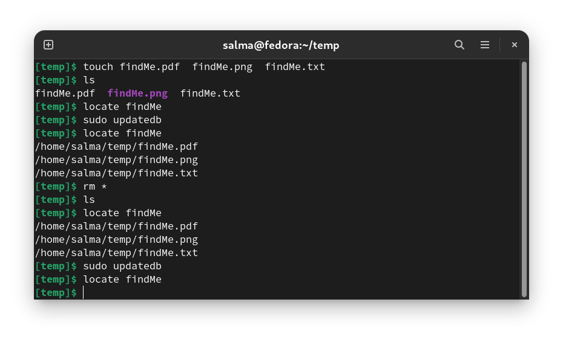

# Finding Files

There are several commands on Linux systems that allow you to search for files. Some of them :
    - `find`
    - `locate`

--------------------------------------------------

# Find Command

You can use the find command to search for files and directories based on their permissions, type, date, ownership, size, and more. 

**Syntax :** `find [options] [path] [expression]`

## Options 

| Options             | Description                                                     |
|---------------------|-----------------------------------------------------------------|
|`-name fileName`     | Search a file with specific name.                               |
|`-user name `        | Search for **files and directories** owned by username.         |
|`-empty`             | Search for empty **files and directories**.                     |
|`-perm 777 `         | Search for file with entered permissions.                       |
|`-newer sample.txt`  | Search for files that were modified/created after ‘sample.txt’. |
|`-size 1024c `       | Search for files of **exactly** 1024 bytes.                     |

**Size Option:**

You can use the following suffixes to specify the file size:

  - `b` : 512-byte blocks (default)
  - `c` : bytes
  - `k` : Kilobytes
  - `M` : Megabytes
  - `G` : Gigabytes

------------------------------------------------

# Locate Command 

- Compared to the more powerful find command that searches the file system, locate operates much faster (because it searches an index.) but lacks many features and **can search only by the file name**.

## How Does locate Work

The locate command performs the search using a **database file** containing bits of files with the corresponding paths in the system. However, locate doesn't check for files outside the database, which means it doesn't report about files created after the most recent database update. The found results are displayed on the screen, one per line.

During the installation of the **mlocate package**, a **cron job is created** (or with systemd timers) that runs the `updatedb` command **every 24 hours**. This ensures the database is regularly updated. For more information about the cron job check the `/etc/cron.daily/mlocate` file.

The **database** can be manually updated by running `updatedb` as root or user with sudo privileges: `sudo updatedb`. The update process will take some time, depending on the number of files and directories and the speed of your system.

## How to Use the locate Command

- **Syntax :** `locate [OPTION] PATTERN`

- For example to search for a file named **.bashrc** you would type: `locate .bashrc`. The output will include the names all files containing the string **.bashrc** in their names:

- The **/root/.bashrc** file will not be shown because we ran the command as a **normal user** that doesn’t have access permissions to the **/root directory**.

- The locate command also accepts patterns containing globbing characters such as the wildcard character *. When the pattern contains no globbing characters, the command searches for `*PATTERN*`. That’s why in the previous example, all files containing the search pattern in their names were displayed.

## Options

| Option | Description | Example |
|--------|-------------|---------|
|  `i`   |By default, `locate` performs case-sensitive searches. The -i (--ignore-case) option tells locate to run a case-insensitive search. | `locate -i readme.md` |
| `-n`   | To limit the search results, use the -n option followed by the number of results you want to be displayed.| `locate -n 10 *.py`|
| `-c`   | To display the count of all matching entries. |`locate -c .bashrc` | 
| `-e`   | To display only the names of the files that exist **at the time** locate is run. |`locate -e *.json` |
| `-r`   Or   `--regex`   | To search using a **basic regexp** instead of patterns.|`locate --regex -i "(\.mp4|\.avi)"`| 

## Notes 

- **The locate command will print the absolute path of all files and directories that matches the search pattern and for which the user has read permission**.

- **Files created after the database update will not be shown in the locate results**.

- **By default, locate doesn’t check whether the found files still exist on the file system. If you deleted a file after the latest database update, and if the file matches the search pattern, it will be included in the search results.**

------------------------------------------------
------------------------------------------------

## Resources

- https://linuxize.com/post/locate-command-in-linux/
- https://www.geeksforgeeks.org/find-command-in-linux-with-examples/