<!--Intro-->
# Introduction

## What is Git?
Git is a popular version control system. It was created by Linus Torvalds in 2005, and has been maintained by Junio Hamano since then.

It is used for:

* Tracking code changes
* Tracking who made changes
* Coding collaboration
## What is usually done using Git
* Initialize Git on a folder, making it a Repository
* Git now creates a hidden folder to keep track of changes in that folder
* When a file is changed, added or deleted, it is considered modified
* You select the modified files you want to Stage
* The Staged files are Committed, which prompts Git to store a permanent snapshot of the files
* Git allows you to see the full history of every commit.
* You can revert back to any previous commit.
* Git does not store a separate copy of every file in every commit, but keeps track of changes made in each commit!
## Why Git?
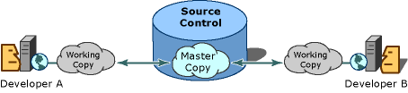
* Over 70% of developers use Git!
* Developers can work together from anywhere in the world.
* Developers can see the full history of the project.
* Developers can revert to earlier versions of a project.

---
## [How Git actually works !](https://git-scm.com/book/en/v2/Git-Internals-Git-Objects "Git Objects Documentation")

---
## GitHub
* the largest host of source code in the world, and has been owned by Microsoft since 2018.
* It's not the same as Git but it uses Git
---
---
# Installation
## Git
### Linux
```Bash
sudo apt update
sudo apt install git
```
### Windows
[Git](https://git-scm.com/)

## GitHub Desktop
[Linux](https://gist.github.com/berkorbay/6feda478a00b0432d13f1fc0a50467f1)

[Windows](https://desktop.github.com/)

### Check installation from Git version
```Bash
git --version
```
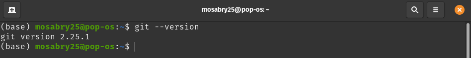

## Configure Git
> Use **global** to set the username and e-mail for every repository on your computer.

```Bash
git config --global user.name "Muhammad Sabry"
git config --global user.email "test@gmail.com"
```

## Creating Git Folder
```Bash
mkdir GP
cd GP
git init
```
## Git status
To check for any changes in the tracked directory

```Bash
git status
```
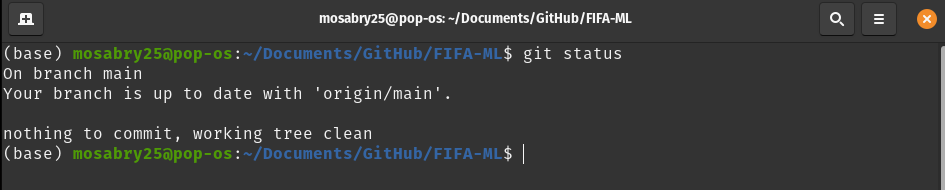

---
---

## Git Staging Environment
* adding single file
```Bash
git add script.py
```
* adding more than one file
```Bash
git add --all
git add -A
git add .
```
Using **--all** instead of individual filenames will **stage** all changes (new, modified, and deleted) files.

## Git Commit

Since we have finished our work, we are ready to move from **stage** to **commit** for our repo.

* Adding commits keep track of our progress and changes as we work. Git considers each commit change point or "save point".
* When we commit, we should always include a message.

```Bash
git commit -m "A brief message"
```

The **commit** command performs a commit, and the **-m "message"** adds a message.


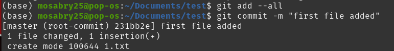

## Git Commit with Stage

```Bash
git commit -am "A brief message"
```

>The **-am** allows us to add and message at the same time.


## Git Commit without Stage

Check the status of our repository. But this time, we will use the --short option to see the changes in a more compact way:

```Bash
git status --short
```
> * ?? - Untracked files
> * A - Files added to stage
> * M - Modified files
> * D - Deleted files

**Skipping Staging Environment is not generally recommended.**

## Git Commit Log

allows us to view the history of commits for a repository.
```Bash
git log
```

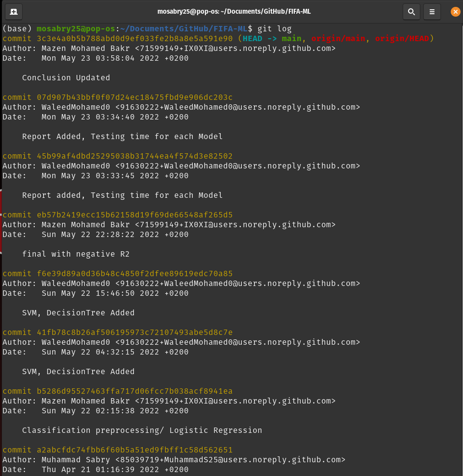

To avoid the very long log list, it's better to use **--oneline** displaying every commit with it's **hash** and **message**.
```Bash
git log --oneline
```
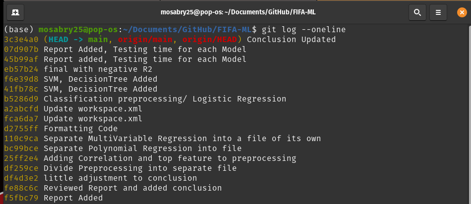

---
---
## Git diff

>It simply displays the changes between two commits

```Bash
git diff #commit1hash #commit2hash
```
>Note: change the order of the commits affects the result as it displays the changes from **commit1** and **commit2**.

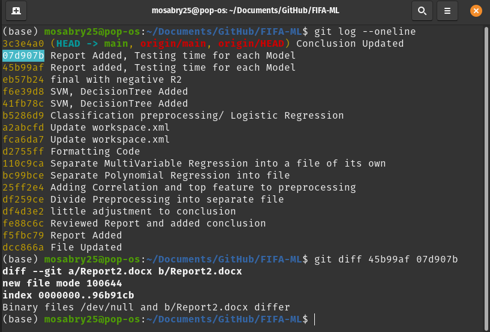

---
---


## Git Branch

A **Branch** is a new/separate version of the main repository.

Using **Branches** allows you:

* Working on a new version without impacting the live version
* Creating a new branch to fix small errors then merge it to the live version.
* divide the work between more than one person working on independent units.
* You can switch between different **Branches** and work on them without impacting eachother.

### Craeting New Branch

```Bash
git branch NewBranchName
```

### To check on Created Branches

```Bash
git branch
    NewBranch
  * master
```
the **\*** refers to that we are currently on that **Branch**.

To navigate between **Branches** 
```Bash
git checkout NewBranch  #Old Command
git switch NewBranch
```

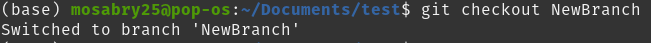

that command switches us to **NewBranch**.

```Bash
git checkout -b MyNewBranch
```
Using **-b** on **checkout** will create a new **branch** if it doesn't exit then it will navigate to the new created **branch**.

## Merge Branches

First we need to navigate to our destination branch which will have the merged version and it's usually the **master branch** 

then we **merge** the master branch with NewBranch

```Bash
git checkout master
git merge NewBranch
```

since we finished the work on **NewBranch** we can delete it.

```Bash
git branch -d Newbranch
```

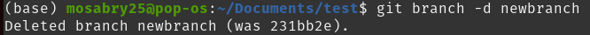

## Merge Conflicts

>Merge Conflict happens when there's two versions of the same file in the master and the other branch due to **commits on the destination branch** to fix the conflict we edit the file with the conflict **in the destination branch** then we run **git commit** that will conclude the **merge**.

---
---

## Git Revert

This Command is used when we want to take a previous commit as a new commit.

1. Find that previous commit.

1. Calculate the number of steps.

1. Make it the new commit.


```Bash
git log --oneline
```
if it's the previous commit

```Bash
git revert  HEAD --no-edit
```
Adding **--no-edit** to replace the commit message with default revert message.

To **revert** to an earlier commit, use **HEAD~x** where **x** refers (**Number of steps -1**)

```Bash
git revert HAED~2 --no-edit
```
It will make the 3rd previous commit the new one.


---
---
## Git Reset
**reset** is the command we use to move the repository to an earlier commit without making new commits.

1. Find that previous commit.
1. Get that **commithash**
1. Move the repository back to it.

```Bash
git log --oneline
```
Get the hash, then

```Bash
git reset 9a9add8
```

## Git Undo Reset

>Even if the following commits are no longer displayed in the log but they still exist.

>Store the **commithash** before applying the reset so you can get back to any commit.

```Bash
git reset e56ba1f
```
>So **reset** could be used to go backward or forward.

---
---
## Git Amend

It combines the latest staging changes with the latest commit as a **new commit** replacing the old one.

>Usually used to change the latest commit message.

```Bash
git commit --amend -m "New message"
```
---
---
## Git ignore

>.gitignore file allows us to ignore the changes of specific files as it uses regex to ignore this group of files and folders.

1. After intializing the repository, create **.gitignore** file.

1. Adding the regex of wanted untracked files.

> Note: Search in google for the .gitignore file for the programming language that will be used in that project, copy it then paste in the created **.gitignore** file.

```Bash
nano .gitignore
```
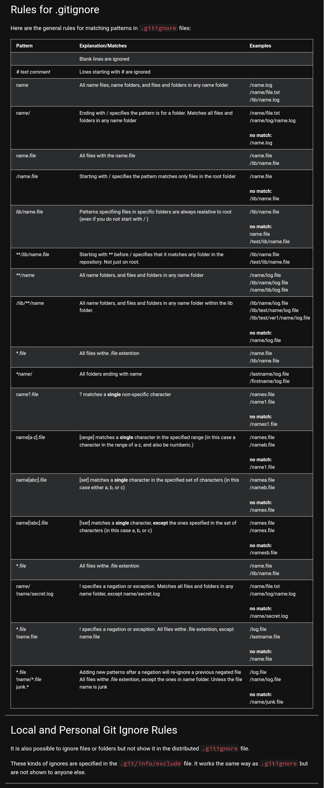

---
---
## Finally a Cheat Sheet with Extra Information

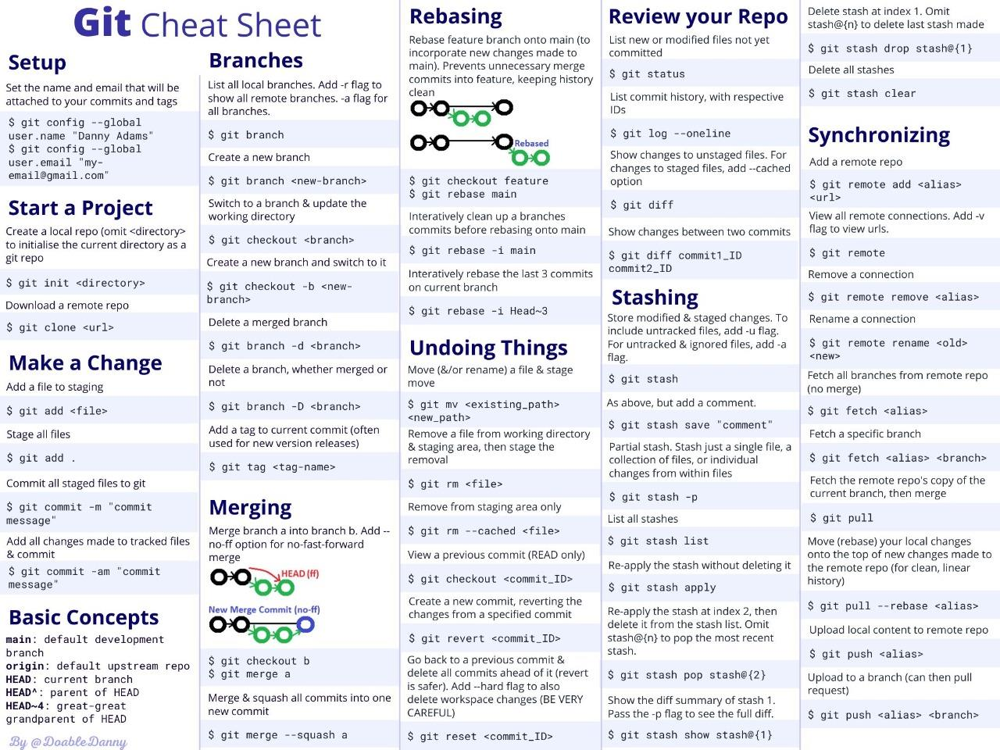

---
---
## Git Help

To see all possible commands.

```Bash
git help --all
```

or through

[Git Online man Page](https://git-scm.com/docs/git "Git Documentation")


