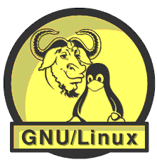
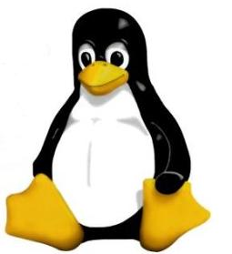
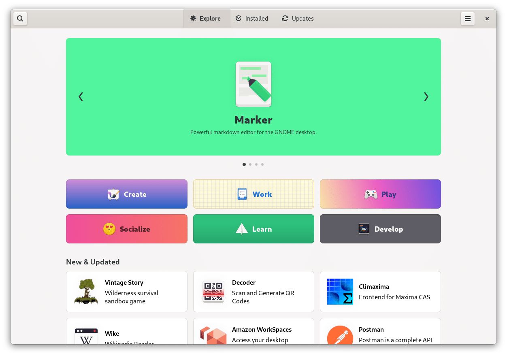

# A Glimpse on Linux History & Introduction to Operating Systems

# Operating System

It is a system program that provides interface between user and computer. OS manages all of the software and hardware on the computer. Most of the time, there are several different computer programs running at the same time, and they all need to access your computer's central processing unit (CPU), memory, and storage. The operating system coordinates all of this to make sure each program gets what it needs.

**Examples:** Unix, Minix, Linux, macOS and Microsoft Windows.

# Kernel

A kernel is the **core component** of an operating system. 

It is the first program of operating system that is loaded into the main memory to start the working of the system. Kernel remains in the main memory till the system is shut down. 

Kernel acts as a bridge between application software and hardware of the system. Kernel directly communicates with the hardware and let it know what the application software has requested. 

**That is how Kernel works:**

**Example 1:**

- Unlocking my phone with a fingerprint scanner:
   - I’ll place my finger on the scanner
   - The Hardware (Scanner) will tell the kernel that a fingerprint has been recognized.
   - Now, the kernel will tell the Software to diagnose whether it is correct or not.
   - If my fingerprint is diagnosed as correct, my phone will start.
   
**Example 2:**

- Recording a video
  - As soon as I press the Camera application on my phone, the software will tell that to the kernel.
  - Kernel will immediately ask Camera lens and Microphone inside my phone to wake up and start working.
  - Now, both S/W and H/W will work together happily.

### Conclusion

An operating system is an important software, and it is impossible to run a system without an operating system. Kernel is an important program in operating system and without kernel operating system won’t work.

--------------------------------------------------------------------

# GNU/Linux

### GNU

GNU is an acronym for **GNU’s Not UNIX**. The founder of the GNU project is **Richard Stallman**. 

The GNU project is a replacement for UNIX and does not contain any UNIX based code. It was created to produce a free software alternative to Unix. They were able to produce most of the programs an operating system would provide, **but their kernel.**

### Linux

**Linux is a kernel**, the most base level of an operating system, and was created and published under the **GNU GPL**, a free license. It came to be adopted as the kernel of the GNU OS.

> **Note:** The **correct term** is **GNU/Linux** not just Linux or GNU, because it is the GNU operating system using the Linux kernel.  We just say Linux because it is shorter, easier to say, and more popular.

### Where did it come from?

**Extras:** [History of Operating Systems | تاريخ أنظمة التشغيل](https://www.youtube.com/watch?v=fxXGLMPJnFQ)

### Linux is Open Source

Linux is distributed under an open source license. The code used to create Linux is free and available to the public to view, edit, and—for users with the appropriate skills—to contribute to. However, the trademark on the name “Linux” rests with its creator, **Linus Torvalds**.

The Linux kernel, at over 8 million lines of code and well over 1000 contributors to each release, is one of **the largest and most active free software projects in existence.**

Some companies, which employ kernel developers to contribute to the Linux kernel:
            
• Intel                
• Samsung              
• IBM  

### Linux is actually everywhere:

Linux has been around since the mid-1990s and has since reached a user-base that spans the globe. Here's an example of a smartwatch running Linux:

- It's in your :

    - **Thermostats**
    - **TV** : More than half of all SmartTVs now run Linux inside.
    - **Phones** : Android, is powered by the Linux operating system.
    - **Refrigerators** : Samsung has announced a smart refrigerator that features an LCD screen, runs Linux.
    - **Cars** : BMW, Chevrolet, Honda, Mercedes, and Tesla all have one thing in common besides making cars: Their cars all run Linux.

- It also runs **most of the Internet** : 

    - In 2021, 100% of the world’s **top 500 supercomputers** run on Linux.
    - Out of the **top 25 websites** in the world, only 2 aren’t using Linux.
    - 96.3% of the world’s **top 1 million servers** run on Linux.

- **Microsoft** has just made the **Windows Subsystem for Linux (WSL)** available in the Microsoft Store for Windows 11 systems

- **Mark Shuttleworth** (the first African in space in 2002) has been an active member of the Ubuntu community, working to create 
a universal, freely available high quality desktop software environment for everyone. In the late 1990s, Mark participated as one of developers of Debian operating system. In 2004, Mark returned to free software world by funding software development of Ubuntu.

**Fun fact:** Most laptops used by the astronauts in the International Space Station (ISS) run a Linux based operating systems (Debian).

-------------------------------------------------------------------------------

# Linux Distribution Families

Linux has a number of different versions to suit any type of user. From new users to hard-core users, you’ll find a “flavor” of Linux to match your needs. These versions are called distributions. Nearly every distribution of Linux can be downloaded for free, burned onto disk (or USB drive), and installed (on as many machines as you like).

Since Linux and GNU are both open source, many people from different communities have made different Linux Distributions.
There are too many distributions to count, so we’ll talk about the three main families:

### 1. Red Hat Family

This family concentrated on the enterprise side of things, such as servers and company workstations.

### 2. Debian Family

The Debian family started with the home user in mind, the community wanted to make GNU/Linux available for the average user as much as it was for enterprises at the time.

### 3. Other distributions built for specific use cases

Distributions such as Arch Linux, Alpine Linux, Gentoo, and many others were made for specific use cases or optimizations based on what the community wanted.

**Extras:** [Here's a link to a more full and HUGE Linux family tree.](https://upload.wikimedia.org/wikipedia/commons/1/1b/Linux_Distribution_Timeline.svg)

# Which distribution is right for you?

If your computer skills are fairly basic, you’ll want to stick with a friendly distribution such as Pop-os, Linux Mint or Ubuntu. 

If your skill set extends into the above-average range, you could go with a distribution like Debian or Fedora. 

If, however, you’ve pretty much mastered the craft of computer and system administration, use a distribution like Gentoo.

------------------------------------------------------------------

## Why Linux?

There are many reasons to use Linux, we will name a few, but there are always more reasons.

1. **Privacy and Security**

    The operating system respects the privacy of users to a unique extent, once the system starts running everything that happens is under your control unless a third party services is used.

    That is mainly due to it being open source, so developers can’t hide spyware or force anything on the user, as they will be able to somehow avoid or change it.

2. **Required in Companies**

    It is required in many companies, including Microsoft, ITWorx, Mentor, Valeo, and a lot of other big popular companies.

3. **Good Development Environment**

    Linux is suitable for the developers, as it supports almost all of the most used programming languages such as C/C++, Java, Python, Ruby, and more. Further, it facilitates with a vast range of useful applications for development. 

    Developers find that the Linux terminal is much better than the Windows command line, So, they prefer terminal over the Windows command line. The package manager on Linux system helps programmers to understand how things are done. Bash scripting is also a functional feature for the programmers. Also, the SSH support helps to manage the servers quickly.

4. **Free**

    GNU/Linux is both free as in freedom and free of charge, it has a lot of great alternatives for proprietary software that people use daily. Further, it provides various advantages over other operating systems, and we don't have to pay for it. 

5. **Decentralized Development**

    GNU/Linux isn’t owned by a single company, its development is community driven. People contribute to the Linux kernel and other assets of the GNU operating system.

6. **Customisability**

    The operating system is very modular and customisable, which allows you to create your own customized system according to your needs.

7. **Much more!**

-------------------------------------------------------------------------------------------------------

# Installing Linux

For many people, the idea of installing an operating system might seem like a very daunting task. Linux offers one of the easiest installations of all operating systems. In fact, most versions of Linux offer what is called a Live distribution ? which means you run the operating system from either a CD/DVD or USB without making any changes to your hard drive. You get the full functionality without having to commit to the installation. Once you’ve tried it out, and decided you wanted to use it, you simply double-click the “Install” icon and walk through the simple installation.

# Installing software on Linux

Just as the operating system itself is easy to install, so too are applications. Most modern Linux distributions include what most would consider an app store.

-------------------------------------------------------------------------------------------------------

# Get yourself a Linux Machine

## Linux Installation

Here are some of the possible ways to try Linux:

- Install it on a Virtual Machine.
- Install it alongside Windows.
- Install it using a Docker Container.
- Run it from a USB stick.
- Try it on [OnWorks](https://www.onworks.net/os-distributions)

# Dual Boot VS Live Boot VS Virtual Machine

## Dual Boot

We can partition our hard disk, and install multiple operating systems alongside each other.
Think of how you have multiple partitions in your Windows (C, D, E, F drives). All your Windows system files would usually be in C (local disk). What if you let go of drive F and decide to install Linux file system on it (you can install Linux file system on your computer using the **.iso** file that is available for download).

Now, you will have 3 drives of **Windows format (NTFS)**, and one drive with **Linux format (ext4).** C drive (NTFS), will have Windows installed, and F drive (ext4, and it’s name isn’t really F drive anymore), has Linux. But since your computer loads the system files during bootup, it needs to know whether to load files from C drive or from the “formerly F” drive. This is handled by **the bootloader.**

## USB Boot

In the above example, we had Windows on our C, D, E, F partitions. The C partition had the system files, while D, E, F had other files. We decided to overwrite F and install Linux file system over there. When we wanted to run Windows, we booted from C, and when we wanted to run Linux, we booted from the “former F drive” (of course we didn’t know what exactly we are booting for, GRUB handles that for us, we just have to choose).

So, can we, instead of installing Linux on our F drive, install it on an external Hard Disk, and then boot from that external hard disk? The answer is yes.

You can but 10 USB flash drives, and install 10 different operating systems on each of them, and then plug in whichever one you want, boot from it, and if your OS supports the filesystem of your hard disks, you can use your computers hard disks as well. You actually don’t even need hard disks at all. You can run your computer from a flash drive itself.

**In summary,** download the ISO, use a tool to intelligently copy the ISO to a flash drive, plug in the flash drive, and boot from it. It will ask you whether you want to Install the OS, or start running it right away (live boot). Just select the live boot option, and Linux is up and running, without any installation. However, since everything happens in volatile primary memory (RAM), changes are lost. So, everytime you boot into the live USB, it would be like running a fresh install (which can be both a good and a bad thing). With persistence mode, even this limitation is overcome, and you can have changes which persist across boots.

## Virtual Machine

Suppose you only have Windows on your machine. How do you go from a powered off system to having a fully functional Windows running on your machine. Actually, a more useful question is, what all do you need to go from nothing to functional OS running. Here are a few things we can think of-

- System files that run the OS (or in other words, system files that basically the OS).
- A small core utility which can load the system files into memory from the hard disk (bootloader) when the computer is presently in a void like situation.
- Memory where the system files are loaded.
- Processing power which runs the OS.
- Hard Disk space, where you can store stuff, Networking so that you can access the internet, and so on.

So, from a powerless state, in the presence of all the above, we can move to a state where we have a functional Windows instance running on our system. The question I want to ask you is, from a state where we have a functional Windows instance running on our system, can we move to a state where we have two functional OSs running on our system?
The answer should be, why not, if we have all the requirements that can result in a transition from 0 to 1, then if same requirements are met again, we can go from 1 to 2. In other words, if we have-

- System files that run the second OS
- A different core utility which can load the system files into memory from the hard disk (bootloader) when we have an OS running on the system already 
- Memory, separate from the already running OS’s memory, where the system files of this OS are loaded.
- Processing power, separately for this OS, which runs the OS.
- Hard Disk space, separately for this OS, where you can store stuff, Networking so that you can access the internet, and so on.

The above discussion should tell you that it would indeed be possible to run multiple OSs together, by somehow dividing the memory, hard disk space, processor power, etc. into two, and letting both OSs run on their share.

## Installing Pop!_OS

#### Steps:

1. Install [Virtualbox](https://www.virtualbox.org/).
2. Download the [ISO](https://pop.system76.com/).
3. Install Pop!_OS inside a Virtual machine ([Tutorial](https://support.system76.com/articles/install-in-vm/)).

----------------------------------------------------
----------------------------------------------------