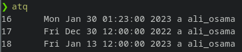
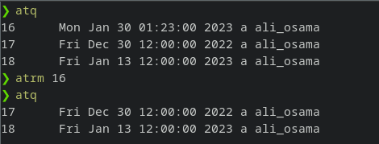
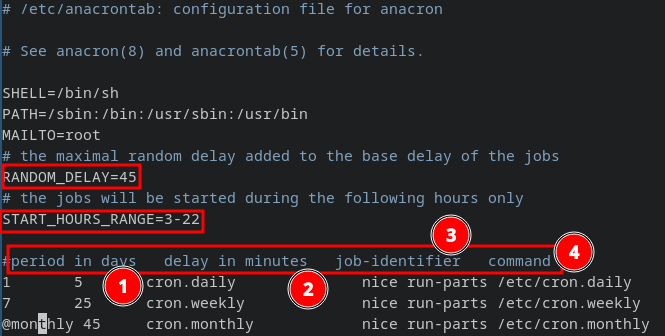
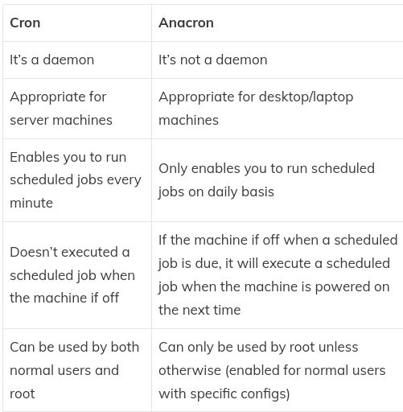

# Job Scheduling
Anyone using Linux often has jobs , scripts or other tasks that they want to run once in the future or periodically.

## `at`
We use `at` when the future task will be executed one time and will not be repeated again.

### Syntax : 
- You can type the time and date after at.
    - ***Ex :*** `at 10am 1/1/2023` 
-  You can schedule a task with a certain amount of time from now 
    - ***Ex 1 :*** `at now +10 minutes`
    - ***Ex 2 :*** `at now +1 weeks`
    - ***Ex 3 :*** `at now +1 months`
- You can use keywords like : **noon** , **midnight** and **teatime**.
    - ***Ex :*** `at noon`
- You can combine various methods together 
    - ***Ex :*** `at noon +2 weeks`
- After writing the command a prompt will open where you will enter the command or scripts you want to run, after finishing press `Ctrl + D` to exit the prompt and save the job

> The timer starts after pressing `Enter` on the `at` command not after you finish writing in the prompt

### Options

- `-f`:
  - Read command from a file
- `-c`
  - Prints the job's command, also prints other information related to the environment variables

### `atq`
To see all the tasks scheduled by `at`.

#### ***Note*** : 
if you want to see more details about a task use the command : `at -c <task id>`
### `atrm` 
To remove a scheduled task.\
`atrm <task id>`


### `batch`

- Runs commands when system load permits (When it gets below 0.8).

- Load Average in Linux is a metric that is used by Linux users to keep track of system resources. It also helps you monitor how the system resources are engaged.


## `cron` 
are the **most useful tools for scheduling** regular tasks.\
crond is the daemon which keeps tracking of all the tasks scheduled to run at specific times.\
It **reads the configuration files we call as crontabs** aka cron tables in order to execute commands or shell scripts specified if the time matches the time indicated.\
You can schedule new tasks using `crontab` command.\
The **cron daemon** keep on checking it's configurations in the /etc/crontab file, and inside the `/etc/cron.*/` directories.\
It also checks the `/var/spool/cron/` directory every minute to see whether anything which needs to be started.
### To schedule a task: 
```
crontab -e 
```
### To specify a user: 
```
crontab -u ali -e
```
### To see scheduled tasks : 
```
crontab -l 
```
### `Crontab` Syntax


#### **Examples of Scheduled Tasks** :
```
0 0 * * * ali_osama /home/ali_osama/my-scripts/script.sh
# run a script at 12 A.M Daily.
```
```
30 15 * * 0 ali_osama /home/ali_osama/my-scripts/script.sh
# run a script at sunday 3:30 P.M.
```
```
0 2 * * 0,1,2,3,4,6 ali_osama /home/ali_osama/my-scripts/script.sh
# run a script Every Day at 2:0 A.M except friday.
```
```
0 0 1 * * ali_osama /home/ali_osama/my-scripts/script.sh
# run a script at the begining of each month 12:00 A.M.
```
### **Crontab shortcuts** : 


```
@reboot ali_osama /home/ali_osama/my-scripts/script.sh
# run a script at each reboot
```

## `anacron`
`Anacron` **doesn't expect or assume a machine to be running continuously** and that is its biggest advantage over cron.

For example lets say we have a cron job scheduled to run a task every midnight such as a backup script. If your laptop or desktop is off during that time cron will skip the task and your backup script will not be executed.

Whereas if you use anacron whenever next time you desktop/laptop comes up again, the backup script will be executed. And after that it will record the date in a timestamp file in the `/var/spool/anacron` directory with the name specified in the job-id (timestamp file name) field.

### Schedule a job using `anacron`
The syntax is shown in the picture below : 


## `cron` vs `anacron` 


## Limit access to `at` and `cron`
`at` and `cron` manage access based on the files `/etc/at.deny` & `cron.deny`.\
You simply put the name of the user that you want to prevent.\
Some distors contains the files: `/etc/at.allow` & `cron.allow`.


## References : 
- https://www.freecodecamp.org/news/cron-jobs-in-linux/
- https://blog.learncodeonline.in/linux-advanced-job-scheduling
- https://www.tecmint.com/cron-vs-anacron-schedule-jobs-using-anacron-on-linux/