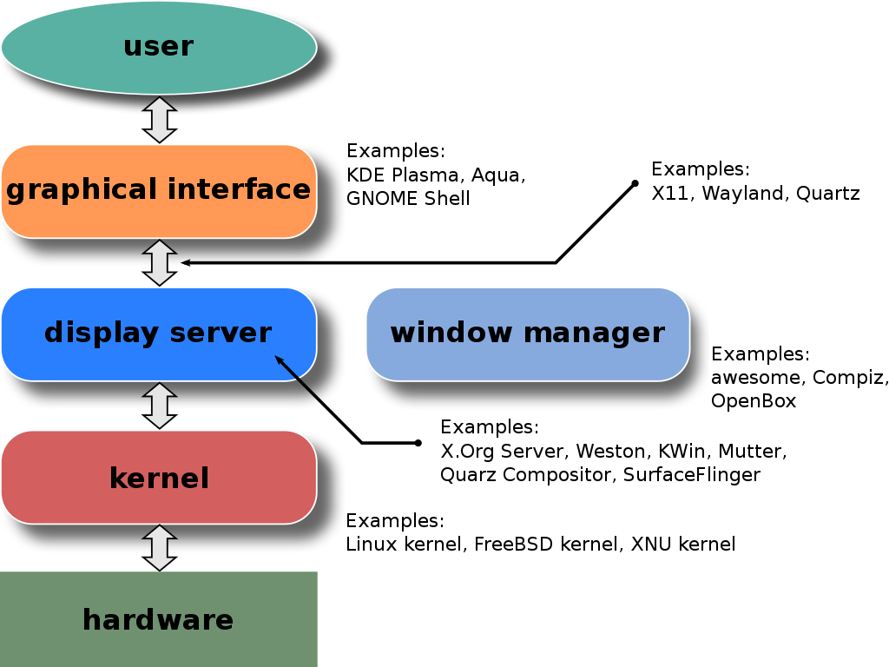
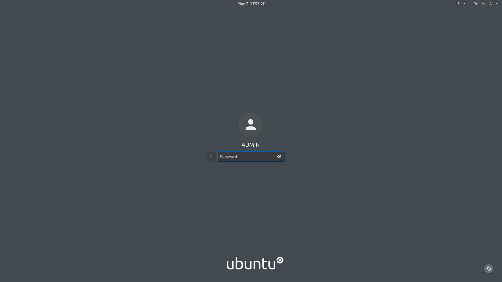
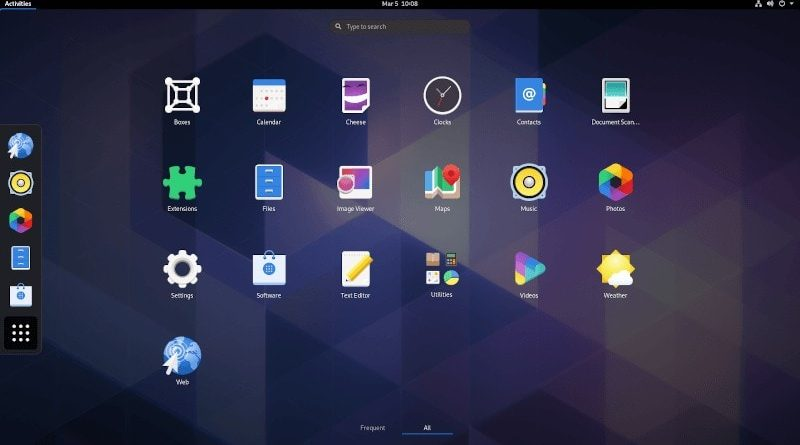

# Linux Desktop 

**With Linux, you can either just go with the defaults that ship with your distribution, or you can install more options to give you a variety of choices.**

### What happens in the background?

When you start your computer, there is a daemon for the **display server**, and it is started.

When the display server starts, a service or daemon for a display manager must be available. Then the server gives control to the **display manager** which starts up a login graphical interface for user login.

The display manager / login manager then gives the user a drop-down menu to choose which **desktop environment or window manager** to use.

This choice is only available if the user has some stand-alone tiling window manager like i3 — which can stand on its own as a desktop environment — installed.

And when the user logs in successfully, the display manager/login manager starts the desktop environment or the window manager the user selected.

And from there, the user can start opening windows and applications whose positioning and look-and-feel are controlled by either the desktop environment or the window manager based on the user's selection at the login.

This process starts automatically on all Linux distributions that come prepacked with display managers; for example Ubuntu.

But for **Arch Linux, Gentoo** — which is based on Arch Linux — and some other distributions also, you only get the Linux Kernel at installation. Which means they do not come pre-packed with all these applications. So you would have to understand this process so that you can install the appropriate variants of all these softwares in order to get a working desktop environment.

----------------------------------------------------------

# Display Server

A display server or **window server** is a program whose primary task is to coordinate the input and output of its clients to and from the rest of the operating system, the hardware, and each other. So, thanks to a display server, you can use your computer with GUI. Without it, you would only be restricted to a command-line interface (TTY).

The display server communicates with its clients over the **display server protocol** such as **X11 (or X)** and **Wayland**

### Xorg Display Server

Xorg is the **legacy display server** that has been existed for years. It is the most common display server used in Linux distributions. 

It implements the **X (or X11) protocol**. The X protocol is just a set of rules for communication between the display server and its clients.

### Wayland Display Server

Wayland is the modern display server that is supposed to replace the legacy X display server.

----------------------------------------------------------

# Display Manager

The display manager is a bit of code that provides the GUI login screen for your Linux desktop. After you log in to a GUI desktop, the display manager turns control over to the **window manager**. When you log out of the desktop, the display manager is given control again to display the login screen and wait for another login.

### Most Popular Linux Desktop Environments 

- **GDM** (Gnome Display Manager, in distributions with GNOME DE installed)
- **SDDM** (Simple Desktop Display Manager; in KDE based distributions)
- **LXDM** (LXDE Display Manager, installed on systems with LXDE)
- **LightDM** (Cross Desktop, works with any Desktop Environment).

### Installation

We will explain these commands later.

#### Step 1

- Update all the packages to their newest available versions.

#### Step 2

- **Ubuntu / Ubuntu-based distributions** : 
    - **GDM :** `sudo apt install gdm3`
    - **LightDM :** `sudo apt install lightdm`

- **Fedora** : 
    - **GDM :** `sudo dnf install gdm3`
    - **LightDM :** `sudo dnf install lightdm`

- **Arch Linux / Arch-based distributions** : 
    - **GDM :** `sudo pacmans -S gdm3`
    - **LightDM :** `sudo pacman -S lightdm-gtk-greeter`

### Step 3

- Enable the (GDM/LightDM) service so that it starts on our system startup : 

    - **GDM :** `sudo systemctl enable gdm.service`
    - **LightDM :** `sudo systemctl enable lightdm.service -f`

------------------------------------------------------------------

# Desktop Environment 

The desktop environments use display servers.

A desktop environment is the bundle of components that provide you common GUI elements such as icons, toolbars, wallpapers, and desktop widgets. Without a desktop environment, your Linux system will just have a terminal, and you’ll have to interact it using commands only. 

Most of the desktop environments have their own set of integrated applications and utilities so that users get a uniform feel while using the OS. So, you get a file explorer, desktop search, menu of applications, wallpaper and screensaver utilities, text editors and more.

Running Linux, changing or adding a different desktop environment is as easy as installing any other program. Just install the software, log out, and log in back again on the new environment. Keep in mind that most desktop environments come bundled with specific text editors and terminal programs—you can decide what you to keep and what to dump. And, choosing a different window manager just changes the way you interact with your Linux box, it doesn't cause you to lose new programs.

### Most Popular Linux Desktop Environments 

- GNOME
- GNOME Help command :`yelp`
- Xfce 
- KDE 
- LXDE 
- MATE
- Cinnamon
- Deepin DE

-----------------------------------------------------------------------------

# Window Managers

Window managers are programs which are either part of a desktop environment or, in some cases, stand-alone. 
It's allowing the windows to be opened, closed, re-sized, and moved. It is also capable of presenting menus and options to the user. It controls the look and feel of the user's GUI.

> Every Desktop Environment comes with its own Window Manager.

> You might be wondering what makes a window manager different from a desktop environment. Each desktop environment, of course, has a window manager; it can’t be otherwise. A window manager is just one piece of software, but a desktop environment may contain hundreds of other programmes.

[Window Manager vs Desktop Environment](https://www.youtube.com/watch?v=yCwOI3O97g8)

[Linux Ricing](https://www.reddit.com/r/unixporn/)

### Stacking Window Manager

- A stacking window manager is the traditional concept, where one window is "on top" and all the others are layered behind.

- **Examples :** Fluxbox, Openbox, Enlightenment 

### Tiling Window Managers

- A tiling window manager presents windows to the user in a way that they're never overlapping.

- **Examples:** i3wm, awesome, bspwm, dwm

### Some popular window managers are :

- **i3wm**
- **dwm**
- **awesomewm**
- **IceWM**
- **Openbox**
- **JWM**

### I3wm Installation

- On Debian/Ubuntu : `sudo apt install i3`  
- On Fedora : `sudo dnf install i3`   

#### i3 Beginner Guide

- [Documentation for i3](https://i3wm.org/docs/userguide.html)

- [i3 Reference Card](https://i3wm.org/docs/refcard.html)

### Videos

- [i3wm: Jump Start (1/3)](https://www.youtube.com/watch?v=j1I63wGcvU4)
- [i3wm: Configuration (2/3)](https://www.youtube.com/watch?v=8-S0cWnLBKg)
- [i3wm: How To "Rice" Your Desktop (3/3)](https://www.youtube.com/watch?v=ARKIwOlazKI)

---------------------------------------------
----------------------------------------------

# Resources 

- https://en.wikipedia.org/wiki/Windowing_system
