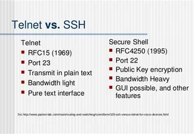
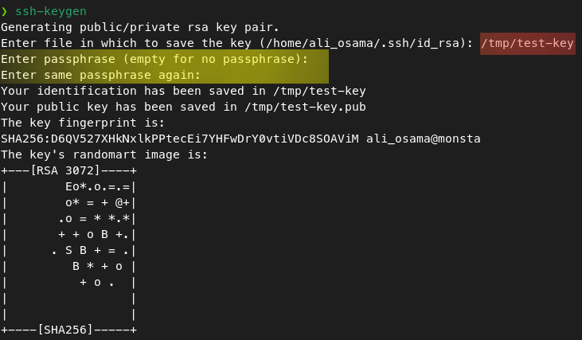
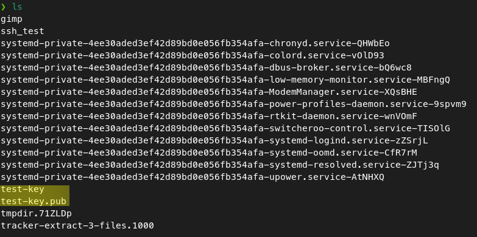
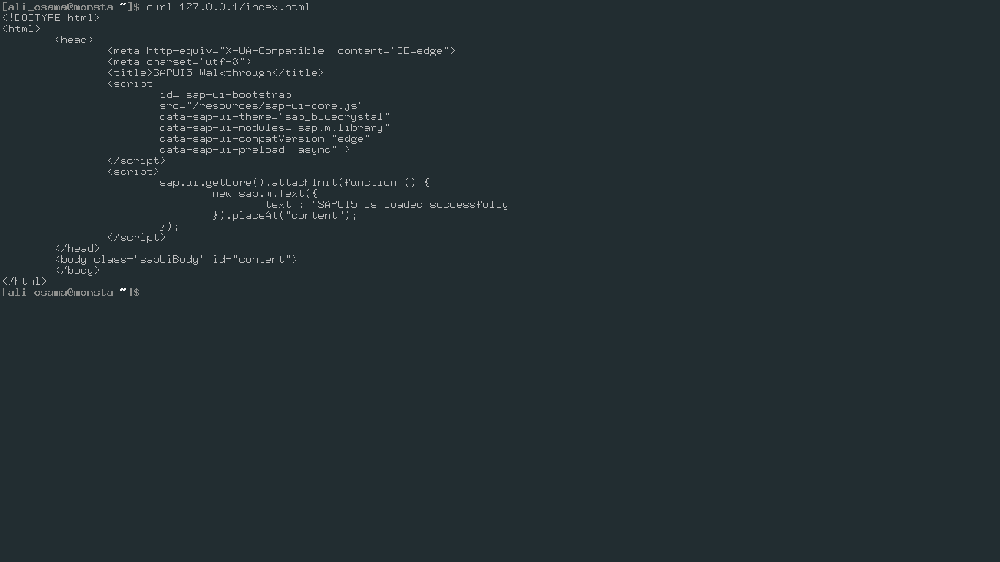
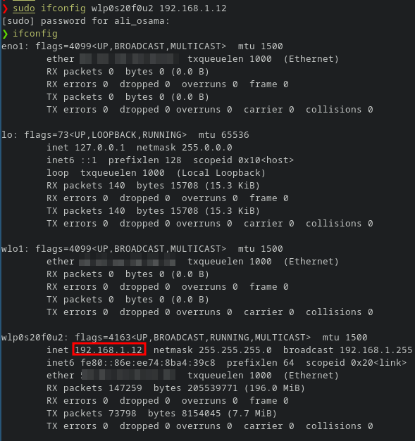

# Network Commands 
----
As a system admin, **the ability to analyze and manage your network is an invaluable skill** that is easily transferred to many other fields like Cyber Security and Network administration.\
We will discuss **the most important commands** used to ananlyze and manage networks.   
## ssh (Secure Shell)
- `ssh` helps us to  **connect to a remote computer** in a secure way.
- It is a cryptographic network protocol that is used for transferring **encrypted data** over network.

- `ssh` was a very good replacement to a protocol called `telnet` that **was transmitting data as plain text**.

  

- It's using **Asymmetrical encryption** :
    - This encryption generates two different keys :

        | Public Key | Private Key | 
        | ---------- | ----------- | 
        | **Everyone can see it** and no need to protect it. ***(for encryption function)*** | Stays in computer and **MUST** be protected. ***(for decryption function)*** |

### ***Note :***
>There is another type of encryption called Symmetric :\
This encryption works on the principle of the generation of a **single key for encrypting as well as decrypting** the data.\
The secret key generated is distributed among the clients and the hosts for a secure connection.\
Symmetrical encryption is the most basic encryption and **performs best when data is encrypted and decrypted on a single machine**.


### **SSH Key Generation** :
#### **For Linux**: 



#### **For Windows**: 


### **Usage** : 
```bash
ssh user_name@host(IP/Domain_name)
```

#### **ssh command consists of 3 different parts**:

`ssh` : command instructs the system to establish an encrypted secure connection with the host machine.

`user_name` : represents the account that is being accessed on the host.

`host` : refers to the machine which can be a computer or a router that is being accessed. It can be an IP address (e.g. 192.168.1.24) or domain name(e.g. www.domainname.com).

#### **To Use the private key for connection :**

```bash
ssh user@host -i private-key
```

---
## ping 

`ping` is a command used to **check the connectivity** between two devices. 
It uses **ICMP protocol** which stands for Internet Control Message Protocol.

```
ping 8.8.8.8
```

***Note***: 
If there is no response from the target , it's not necessary mean that the device is offline maybe there is a **firewall that blocking your request**.

---
## nmap
- nmap stands for network mapper and it's used to **detect the open ports and the running services (which represent doors to the target)** of a target and much more.

- When a computer runs a network service, it opens a networking construct called a **port** to send and receive traffic on it.\
Ports are **necessary for making multiple network requests** or having multiple services available. 

    - For example, when you load several webpages at once in a web browser, the program must have some way of determining which tab is loading which web page.
    - This is done by establishing connections to the remote webservers using different ports on your local machine.

- Every computer have ***65,536*** .

- nmap is one of the best tools you can use to gather inforamtion about a specific machine in the internet or in your local network and many other tools like `sparta` use it in the background.

- Security Testers use nmap to find the services running in their targets so they can discover a vulnerable or an outdated service running on the target.

- In it's very basic syntax `nmap` runs with the following syntax : 
    ```
    nmap {ip}
    ```
- The power of nmap starts to appear when using its switches :

    useful switches | usage  
    ----------------| -----
    `-sT` | make a complete handshake with the target within the scan
    `-sS` | stealth scan doesn't complete the 3 way handshake with the target 
    `-A` |  perform a service detection, operating system detection, a traceroute and common script scanning
    `-p-` | scan all the ports (65536 port)
    `-p` | scan a specific port 
    `-sn` | ping an IP or a range of IPs (Host Discovery)
    `-Pn` | Treat all hosts as online 

    ***Examples :***
    ```
    nmap -A -p- 192.168.1.1
    ```
    ```
    nmap -p 80 192.168.1.* 
    ```
    ```
    nmap -p 80,8080 192.168.1.1-254
    ```
    ```
    nmap -sn 192.168.1.1-254
    ```

- nmap has a very powerful scripting engine called NSE and you can write scripts using the Lua scripting language .

---
## **curl** vs **wget** 
both of them are utilities that are used to **download files through the terminal**.
### The main difference  :
The curl command transfers data from any server over to your computer.\
Whereas the wget command downloads the data as a file.

wget | curl
---- | ---
 | 

`curl -o [file name] [url]` == `wget [url]`


---
## `ifconfig` **(interface configuration)**

- It is used to assign the IP address and netmask to an interface or to enable or disable a given interface.

Switch | usage
---- | ---
`-a` | to view all the available interfaces
`-s` | display a short list, instead of details
`-v` | verbose mode (Show more details)
`up` |  activate the interface
`down` |  deactivate the interface

***Examples*** :
- `ifconfig interface_name up` 
- `ifconfig interface_name down` 
 
 ### Change your IP with ifconfig
```
ifconfig <interface name> <new ip>
```
***Ex :***
### Change your *netmask* and *broadcast*
```
ifconfig <interface name> netmask <new mask> broadcast <new broadcast>
```
***Ex :***



### Spoof your mac address (hardware adress) with ifconfig
```
ifconfig <interface name> down
ifconfig <interface name> hw ether <new mac>
ifconfig <interface name> up
```
***Ex:*** 
```
ifconfig wlo1 down
ifconfig wlo1 hw ether 00-10-FA-6E-38-4A
ifconfig wlo1 up
```

## `dig` 
Gather DNS information about a target.
***Ex 1:***

ns : nameserver
***Ex 2:***

mx : mail exchange server
### How to change your DNS server ?
You need to edit `/etc/resolv.conf` 
***for example***: if you want to point the DNS requests to Google's DNS server 
```
echo "nameserver 8.8.8.8" >> /etc/resolv.conf
```

## Map a domain name to an IP 
We can map a domain name to an IP locally in our machine by editing the file `/etc/hosts`
 


## References 
- https://www.geeksforgeeks.org/ssh-command-in-linux-with-examples/
- https://nmap.org
- https://tryhackme.com/room/furthernmap
-  https://www.geeksforgeeks.org/ifconfig-command-in-linux-with-examples/
- Chapter 3 from "Linux Basiscs for Hackers" Book.