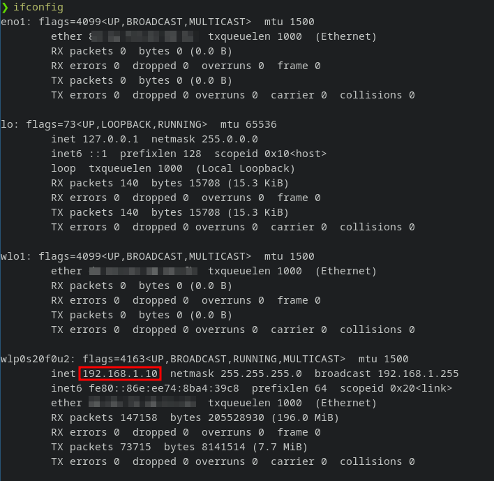
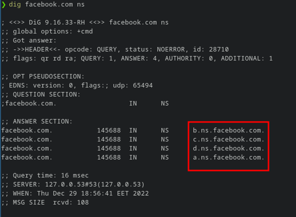
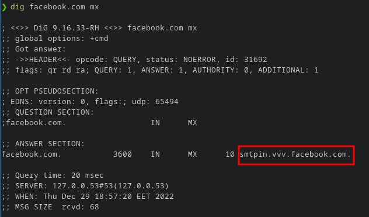
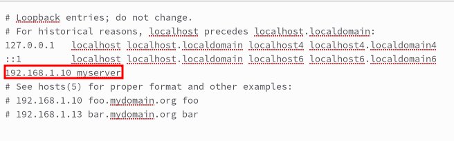
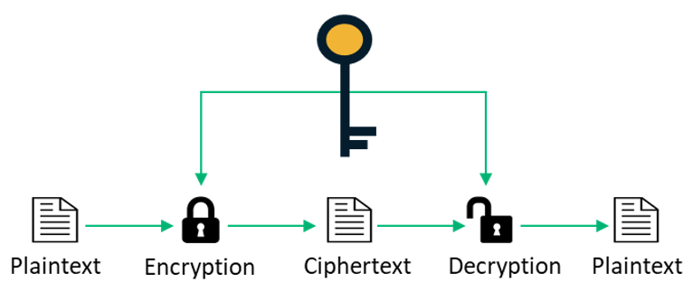
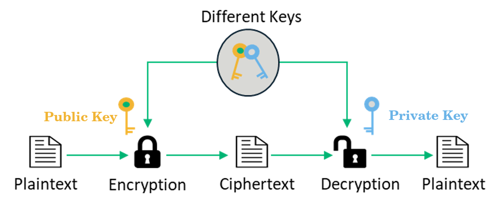

# Network Tools

# `ping` 

- This command can be used to **test network connectivity** and troubleshoot network issues.

- The ping command sends packets of data to a specific IP address on a network, and then lets you know how long it took to transmit that data and get (receive) a response. It uses **ICMP protocol**.
 
- It’s a handy tool that you can use to quickly test various points of your network. You can test whether your computer can reach another device—like your router—on your LAN, or whether it can reach a device on the Internet. This can help you determine if a network problem is somewhere on your local network, or somewhere beyond. The time it takes packets to return to you can help you identify a slow connection, or if you’re experiencing packet loss.

> Ping only knows how to communicate with IP addresses, so the first thing it did when you asked it to ping “`example.com`” was to look up the corresponding IP address.

### ICMP PING responses

- The **ICMP echo request** and the **ICMP echo reply** messages are commonly known as **ping messages**. 

- The ping command sends an **ICMP echo request** to a device on the network, and the device immediately responds with an **ICMP echo reply**. 

> Sometimes, a company's network security policy requires ping (ICMP echo reply) to be disabled on all devices to make them more difficult to be discovered by unauthorized persons.

### How to Use Ping

You issue the ping command along with a specific URL or IP address. `ping [IP / Web address]`. 

E.g, `ping 172.217.22.14`, `ping google.com`

By default, the ping command will send packets continuously until you manually stop it by pressing `Ctrl + C`. However, you can also specify a specific number of packets to send using the "`-c`" option. For example: `ping -c 5 192.168.1.1`

If the ping statistics don't show any loss of packets, your internet connection is working as it should. However, if you get lost packets, that means that either your internet connection is broken, or that the website you pinged is not online.
 
### Ping results

**Reply from :** It means that your connection is good. 
    
  > NOTE: The Reply from response can be tricky so always remember to verify that you are getting a reply from the same IP address that you pinged.  For example, if you typed in "ping 4.2.2.2", ensure that you can also see a reply from “4.2.2.2” and not from another number.  If you are receiving a reply from a different IP address, this could mean that the IP address you pinged is not available.

**Destination host unreachable :**  It means that there was no valid route to the requested host. It is usually due to the lack of available and suitable routes from the user to the destination. 
 
**Request timed out :** It means that the local host did not receive a response from the destination host, but it was **able** to **reach it**.
  
   - It is generated when after some time, no answer was received whatsoever due to many factors: 
     - Congestion in the network (network congestion occurs when the network is exchanging/carrying more data than it can comfortably handle.)
     - Firewall configurations
     - The host being down or unresponsive, or packet losses.

### Ping of Death (POD)

A Ping of death (PoD) attack is a denial-of-service (DoS) attack, in which the attacker aims to disrupt a targeted machine by sending a packet larger than the maximum allowable size, causing the target machine to freeze or crash. The original ping of death attack is less common today. A related attack known as an **ICMP flood attack** is more prevalent.

------------------------------------------------------------------

# `traceroute`

The traceroute command is a network diagnostic tool that is used to track the path that network packets take from one networked device to another. 

**Syntax:** `traceroute <IP/ hostname>`

**Example:**`traceroute google.com`

When you run the traceroute command, it will display a list of the routers and devices that the packets travel through on their way to the destination. Each line of the output represents one "hop" in the path, and displays the IP address of the device at that hop, along with the amount of time it took for the packet to reach that hop.

------------------------------------------------------------------

# `ifconfig` (Interface Configuration)

Displays information about the network interfaces on the system, including **IP addresses**, **netmasks**, and **MAC addresses**.

It is also used to **assign** the IP address and netmask to an interface, to **enable or disable** a given interface.

> the `ifconfig` command has been deprecated and replaced with the `ip` command on most Linux distributions. This is because `ifconfig` has some limitations and does not support all the features of modern networks, while ip provides more advanced networking capabilities and options. Although `ifconfig` may still be available on some Linux distributions, it is recommended to use the `ip` command instead, as it is more versatile and powerful.

|Switch| Usage |
|------|-------|
|`-a`  |To view all the available interfaces |
|`-s`  |Display a short list, instead of details |
|`-v`  |Verbose mode (Show more details) |
|`up`  |Activate the interface |
|`down`|Deactivate the interface |

### Examples

- `ifconfig interface_name up` 
- `ifconfig interface_name down` 
 
### Change your IP with `ifconfig`

```
ifconfig <interface name> <new ip>
```
### Change your *netmask* and *broadcast*

```
ifconfig <interface name> netmask <new mask> broadcast <new broadcast>
```



- **IP address information line :**

   - **inet** --> IPV4
   - **int6** --> IPV6
   - **netmask** --> IPv4 netmask 

- **MAC address line :**

   - For an IPv4 address, the line shows the MAC address (Ethernet layer address) that is assigned to the interface. 
   - **ether** --> MAC address 

### Spoof your Mac Address (Hardware Adress)

```
ifconfig <interface name> down
ifconfig <interface name> hw ether <new mac>
ifconfig <interface name> up
```

***Ex:*** 

```
ifconfig wlo1 down
ifconfig wlo1 hw ether 00-10-FA-6E-38-4A
ifconfig wlo1 up
```

-------------------------------------------------------
# `ip`

The ip command is a powerful tool for configuring and managing network interfaces in Linux. It is a replacement for the older `ifconfig` command and provides more advanced networking capabilities and options.

Here's how to use the `ip` command to perform some common networking tasks:

|Function|Command|Explanation|
|--------|-------|-----------|
|View network configuration|`ip address show` or `ip a`|Displays a list of all the network interfaces on your system along with their IP addresses, netmask, and other information.|
|Configure network interface|`ip link set <interface name> up` or `ip link set <interface> down`| To bring the interface up/down.|
|Assign IP address|`ip address add <ip_address>/<netmask> dev <interface>`|To assign an IP address to a network interface.|
|Remove IP address|`ip address del <ip_address>/<netmask> dev <interface>`|To remove an IP address from a network interface.|

-------------------------------------------------------

# `nmap`

Nmap (Network Mapper) is a powerful open-source tool used for network exploration, management, and security auditing. It is designed to be a flexible and extensible tool that can be used by system administrators, network engineers, and security professionals.

Nmap can be used for various tasks such as:

   - **Network discovery:** It can scan a network and identify the IP addresses of hosts that are available and the services they are running.

   - **Port scanning:** It can scan for open ports on a remote system (which represent doors to the target) and identify which services are running on those ports.

   - **Operating system detection:** It can identify the operating system running on a remote system.

   - **Vulnerability assessment:** It can be used to identify vulnerabilities in a network or system.


Nmap is one of the best tools you can use to gather information about a specific machine in the internet or in your local network and many other tools like `sparta` use it in the background.

> nmap has a very powerful scripting engine called NSE and you can write scripts using the Lua scripting language .

### Usage 

|Command                     |Description|
|----------------------------|-----------|
|`nmap <target>	   `         |Scan target IP or hostname.|
|`nmap -F <target>`	         |Fast scan; only scan the most common ports.|
|`nmap -sU <target>`         |Scan for open UDP ports.|
|`nmap -v <target>`	         |Verbose output; provides more details during the scan.|
|`nmap -O <target>`	         |OS detection only; identify the operating system running on the target.|
|`nmap -p <port(s)> <target>`|Scan only the specified port(s)|

**Examples :**

```
nmap -p 80 192.168.1.* 
```
```
nmap -p 80,8080 192.168.1.1-254
```

----------------------------------------------------

# `dig` 

This command is used to query the Domain Name System (DNS) for information about a specific domain or hostname. It can be used to obtain information such as the IP address associated with a domain, the name servers responsible for a domain, or the mail servers associated with a domain.

**Syntax :** `dig <domain>`
### Examples

`ns : nameserver`



`mx : mail exchange server`



-------------------------------------------------------

# Changing your DNS server

To change your DNS server, you can follow these steps:

1. Open the file `/etc/resolv.conf` with a text editor such as nano or vim. This file contains the DNS configuration for your system.

2. Find the line that begins with `nameserver`. This line specifies the IP address of your current DNS server(s).

3. To change your DNS server, replace the existing IP address(es) with the IP address(es) of your new DNS server(s), separated by spaces. 
    - For example: `nameserver 8.8.8.8  8.8.4.4` , This line sets the DNS server to Google's public DNS servers.

4. Save and close the file.

**Note that** some Linux distributions may automatically overwrite changes made to `/etc/resolv.conf` on reboot or network restart. In this case, you may need to modify other configuration files, such as `/etc/network/interfaces` or `/etc/sysconfig/network-scripts/ifcfg-eth0`, depending on your distribution.

Alternatively, you can also use the `nmcli` command-line tool to modify your DNS settings. For example, to set your DNS server to `8.8.8.8` using `nmcli`, you can run: `nmcli connection modify <connection-name> ipv4.dns "8.8.8.8"`

Replace `<connection-name>` with the name of your network connection (e.g. eth0, wlan0, etc.). This command sets the DNS server for IPv4 connections only.

-------------------------------------------------------
# Map a domain name to an IP 

We can map a domain name to an IP locally in our machine by editing the file `/etc/hosts` and adding a new line with the IP address followed by the domain name we want to map to that IP address. 

For example, to map `example.com` to IP address `192.168.1.100`, you would add the following line: `192.168.1.100   example.com`

Now, when you enter `example.com` in your web browser or try to connect to that domain in any other way, your system will use the IP address you specified in the `/etc/hosts` file.

Note that this mapping is **only valid on your local machine** and will not affect other computers on the network

### Example

 


-------------------------------------------------------

# `wget` & `curl`

Both of them are utilities that are used to **download files through the terminal**.

The main difference between them is that `curl` transfers data from any server over to your computer, whereas `wget` downloads the data as a file. 

wget | curl
---- | ---
 | 


## `wget`

wget is a command-line utility used for downloading files from the internet or transferring data over a network. It supports downloading files using the HTTP, HTTPS, and FTP protocols. Here are some common uses of `wget`:

|Command | Description |
|--------|-------------|
|`wget http://example.com/file.zip` | Download a single file |
|`wget -i urls.txt`                 | Download multiple files |
|`wget -r http://example.com/`      | Download an entire website. This will download all the files necessary to render the website, including images, CSS files, and scripts.|

## `curl`

curl is a another command-line utility used for transferring data over a network. It supports transferring data using the HTTP, HTTPS, FTP, and SCP protocols. Here are some common uses of `curl`:

|Command | Description |
|--------|-------------|
|`curl http://example.com/file.zip`                                   | Download a single file |
|`curl -O http://example.com/file1.zip  http://example.com/file2.zip` | Download multiple files |
|`curl -O http://example.com/file{1..5}.zip` | Download multiple files using a range |
|`curl -O http://example.com/file{a..z}.zip` | Download multiple files using a range |
|`curl -O http://example.com/file{a..z}{1..5}.zip` | Download multiple files using multiple ranges |

These are just a few examples of what `wget` and `curl` can do. For more information, you can refer to their respective manuals by typing `man wget` or `man curl` in your terminal.

-------------------------------------------------------

# Encryption 

Encryption is the process of converting human-readable data (plaintext) into unintelligible ciphertext.  This scrambling of data is the result of an algorithmic operation that uses a cryptographic key. Simply put, encryption takes your data and makes it random enough so that anybody who steals it can’t read it unless they have the key to turn it back into a legible form.

The use of encryption is necessary if we want privacy and for protecting our data. There are two main types: 
  - Symmetric encryption
  - Asymmetric encryption 

### Symmetric Encryption (only a single key)

Symmetric encryption is a type of encryption where **one key** can be used to encrypt messages to the opposite party, and also to decrypt the messages received from the other participant. This means that **anyone who holds the key can encrypt and decrypt messages** to anyone else holding the key.

This type of encryption scheme is often called **shared secret** encryption, or **secret key** encryption. There is typically only a single key that is used for all operations.



### Asymmetric Encryption (public & private key)

Asymmetric encryption also known as **public-key cryptography** or **public key encryption**.

Asymmetric encryption uses a pair of related keys — **a public and a private key**. **The public key** is what’s used to **encrypt** a plaintext message before sending it (Here, you take the file, take the public key from the other node, and you get your protected file). To decrypt and read this message, you need to hold the **private key**. The public and the private keys are mathematically related, but the private key cannot be derived from it.

The **public key** is shared openly **with everyone**, while the **private key** must remain known **only to its owner**. 



Because asymmetric encryption is a **more complicated** process than its symmetric counterpart, **the time required is greater**. However, this type of encryption offers a **higher level of security** as compared to symmetric encryption since the private key is not meant to be shared and is kept a secret. 


### Hybrid Encryption

Hybrid Encryption **combines** the efficiency of symmetric encryption with the convenience of public-key (asymmetric) encryption. 

**Asymmetric encryption** is often used to establish a secure connection between two parties, e.g. when connecting to an online web secure website. The extra overhead of the public/private key operation is only incurred at the beginning of the exchange to ensure a trusted relationship. Typically, once a secure connection is established, the two entities will then use faster **symmetrical encryption** to share multiple transactions of sensitive data. The combination of using both symmetric and asymmetric algorithms together is known as hybrid encryption.

----------------------------------------------

# `ssh` (Secure Shell)


`ssh` helps us to  **connect to a remote computer** in a secure way. It is a cryptographic network protocol that is used for transferring **encrypted data** over network.

ssh was a very good replacement to a protocol called **telnet** that **was transmitting data as plain text**.

### How does ssh work ?

- It's using **Asymmetrical encryption**

- This encryption generates two different keys :

    | Public Key | Private Key | 
    | ---------- | ----------- | 
    | **Everyone can see it** and no need to protect it. ***(for encryption function)*** | Stays in computer and **MUST** be protected. ***(for decryption function)*** |


### **SSH Key Generation** :
#### **For Linux**: 


#### **For Windows**: 


### Syntax  
```bash
ssh user_name@host(IP/Domain_name)
```
**ssh command consists of 3 different parts**:

`ssh` : command instructs the system to establish an encrypted secure connection with the host machine.

`user_name` : represents the account that is being accessed on the host.

`host` : refers to the machine which can be a computer or a router that is being accessed. It can be an IP address (e.g. `192.168.1.24`) or domain name(e.g. `www.domainName.com`).


> For private key authentication, you need to specify the private key file using the `-i` option. For example, if your private key file is named `private-key`, you can use the following command to connect to the remote host: `ssh user@host -i private-key`

----------------------------------------------