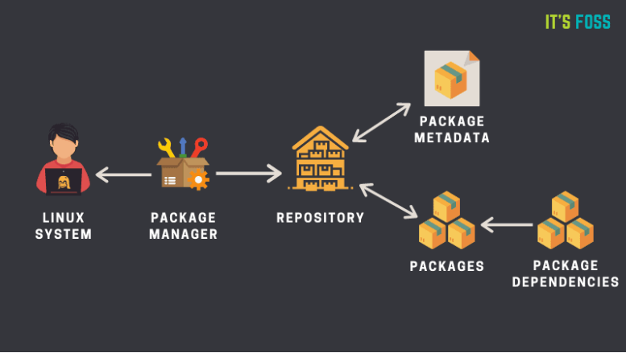
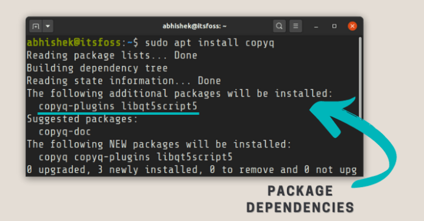

# Package Managers

A package manager is a tool that allows users to **install, remove, upgrade, configure and manage** software packages on an operating system. The package manager can be a **graphical application** like a software center or a **command line tool** like `apt-get` or `pacman`.

## What is a Package

- Linux OS is basically made up of 2 parts:
    - The **Linux Kernel** and
    - **Software packages** that work with the Kernel to give us a complete Operating System

- A package is usually referred to an application, but it could be a **GUI application**, **command line tool**, device drivers to talk to the hardware or a **software library** (required by other software programs). **Everything other than the kernel is a package in Linux**.

- Common types of Linux packages include **.deb**, **.rpm**, and **.tgz**. 

## Contents of Packages

- The content of the packages managed by these **package managers** involves the following 4 main components :

    - **Binaries** or the **executable programs**
    - **metadata files** containing the version, dependencies, signatures and other relevant information
    - **documentation and manuals**
    - **configuration files**

By keeping these components organized in a certain format, the entire process of installing, updating and uninstalling software can be automated.

## Package Dependencies

- Packages very rarely work by themselves, they are most often accompanied by dependencies to help them run. In Linux, these dependencies are often other packages or shared libraries. Shared libraries are libraries of code that other programs want to use and don't want to have to rewrite for themselves. If the dependencies aren't there the package will end up in a broken state and most of the time not even install.

- **For example,** if you need to run python-based apps, then you need to have the python present. 

- Practically any software will not just have one dependency, it can have tens and sometimes even hundreds of dependency packages. 

## Package Repositories

- Repositories (or **repos** for short) are basically a place where **verified packages are stored** for easy retrieval by the package manager. They can be online like the **YUM repository** or they can be on a **local folder** or a DVD where you have a special collection of software that you need.

## How does the package manager work

- Almost all Linux distributions have **software repositories** which is basically collection of software packages. Yes, there could be more than one repository. The repositories contain software packages of different kind.

- Repositories also have **metadata files** that contain information about the packages such as the name of the package, version number, description of package and the repository name etc. This is what you see if you use the `apt show [Package Name]` in Ubuntu/Debian

- Your system’s package manager **first interacts with the metadata**. The package manager creates a **local cache** of metadata on your system. When you run the `update` option of the package manager (for example `apt update`), it updates this local cache of metadata by referring to metadata from the repository.

- When you run the installation command of your package manager (for example `apt install [Package Name]`), the package manager refers to this cache. If it finds the package information in the cache, it uses the internet connection to connect to the appropriate repository and downloads the package first before installing on your system.

- A package may have dependencies. Meaning that it may require other packages to be installed. The package manager often takes care of the dependencies and installs it automatically along with the package you are installing.

    

- Similarly, when you remove a package using the package manager, it either automatically removes or informs you that your system has unused packages that can be cleaned.

- Apart from the obvious tasks of installing, removing, you can use the package manager to configure the packages and manage them as per your need. For example, you can prevent the upgrade of a package version from the regular system updates. There are many more things your package manager might be capable of.

## Functions of a Package manager

Package managers serve the following functions to fulfill the needs mentioned above

- Automatically resolves dependencies by keeping track of what software is needed to make a package work

- Uninstall and update with ease

- Verifies the integrity of the package before installing it :
    - The software you downloaded came through to your system in **one piece without any damages** from the server to your computer.
    - The software you downloaded is from the **official provider** so that you can be sure that there are no malware and other security issues with this software!

- Verifies the architecture compatibility :
    - Packages are compiled keeping in mind the specific processor architecture we use. A package compiled for a 64-bit system will not work on a 32-bit system. Another example is ARM processors vs Intel/AMD processor. A package compiled for AMD and Intel will not work on an ARM-processor based system. 

- Keeps track of all the packages installed in the system so that the system administrator can easily get information about what packages are present, when was it installed, what version are they running in, etc.

## Different kinds of package managers

- Package Managers differ based on packaging system, but same packaging system may have more than one package manager.

|Package Managers            |  Distribution                                       |
|----------------------------|-----------------------------------------------------|
|**RPM** and **YUM**/**DNF** | RHEL, CentOS, Fedora and other derivatives of RHEL  | 
|**dpkg** and **APT**        | Debian, Ubuntu, Mint and other derivatives of Debian|
|**Pacman**	                 | Arch Linux and derivatives                          |
|**Portage**                 | Gentoo                                              |

## Architecture of Package managers

- When package managers were first developed, there was only one single level. The 2 of the biggest distro around that time **Debian** and **RedHat** developed independently these managers. Debian called theirs **dpkg** **(Debian package manager)** and RedHat called their **RPM (RedHat Package manager)**. dpkg used the `.deb` format to organize these packages and RedHat used the `.rpm` format.

- **RPM** was very primitive as compared to dpkg such that it could not even resolve dependencies. leaving a lot of work to be done by the end-user. Then this problem was soon addressed and we got another layer on top of rpm known as **YUM** (stands for Yellowdog Updater Modified) which does more automation to make the life of the system administrator much easier.

- Debian’s **dpkg** tool also evolved over time with layers like apt tools on top of it and that where the famous `apt-get` command was developed.

- Hence these days the package manager software we use are usually multilevel ones, with dpkg and rpm being the lowest level and a level on top to manage these packages more efficiently.

## Commands

- Search for package :  
    - **Debian :** `apt search package_name`
    - **RPM :** `dnf search packagename`

- Install a package : 
    - **Debian :** `sudo apt install package_name`
    - **RPM :** `sudo dnf install packagename`

- View package details : 
    - **Debian :** `apt show package_name`
    - **RPM :** `dnf info package_name`

- Remove packages : 
    - **Debian :** `sudo apt remove package_name`
    - **RPM :** `sudo dnf remove packagename`

- Remove unused packages : 
    - **Debian :** `sudo apt autoremove`
    - **RPM :**  `sudo dnf autoremove`

- Find dependencies of a package : 
    - **Debian :** `apt depends package_name`
    - **RPM :** `dnf deplist package_name`

- Reinstall Packages :
    - **Debian :** `sudo apt reinstall package_name`
    - **RPM :** `sudo dnf reinstall package_name`

- List installed packages :
    - **Debian :** `apt list --installed`
    - **RPM :** `dnf list installed`

- Upgrade a package :

    - **Debian :** `sudo apt upgrade package_name`
    - **RPM :** `sudo dnf upgrade package_name`
    
- Upgrade system packages : 
    - **Debian :** `sudo apt upgrade`
    - **RPM :** ` sudo dnf upgrade`
    > install new versions of all the packages on your system.

- Update packages for a repository :
    - **Debian :** `sudo apt update`
    - **RPM :** `sudo dnf update`

    > It's always best practice to update your package repositories so they are up to date before you install a package.

------------------------------------------------------------------------

## Related Questions

### Which is the best package management system? 

The answer is whichever package manager that came with your distro as default! The reason is the fact that package management tools work hand in hand with the repositories and the official repos have the latest versions of packages precompiled and ready for various different architectures and distro versions so that half the work is done there in the repository itself.

### Can you use yum on Ubuntu and other Debian based systems? 
### Can you use apt on Fedora and other RHEL based distros? 

Yes, you can, but in this case, you need to do the work that the repository does. In other words, you need to compile your own packages and there are not a lot of good reasons to be doing that!

## Notes

> Not all packages are installed through package managers though, you can commonly install packages directly from their source code. The majority of the time you will use a package manager to install software.

-----------------------------------------------------------------------
-----------------------------------------------------------------------

# Compile Source Code

While **yum, apt-get, rpm** are very handy to install a package that is **already compiled**, you still might encounter some situations where you have to install a software **from source code**. You'll need to use a few commands to get that source code package **compiled and installed on your system**.

**5 Steps**
- fetch
- unpack
- configure
- compile 
- install 

**1.** **Download the Source Code Package and Unpack it**

The source code for software on Linux comes in the form of **compressed tar files**, which typically have either `.tar.gz` or `.tar.bz2` extensions. The tools that are used for packing the source code into these tar balls are **‘tar’** (used for combining multiple files into one), **‘gzip’** or **bzip2** (used for compression). To fetch the source code tarball for a particular software you need to know the URL to the tarball.

- Once you have the download link, use ‘wget’ to fetch the tarball from command line : 

    - `wget <link to the tarball>`

    - The above command will download the tarball into **the current directory**. 

- Next you needs to **unpack the tarball** in order to get access to the source code and other files. Depending on the extension, use one of the following commands:

    - `tar -xvfz <name of tarball with .tar.gz extension>`

    (or)
    
    - `tar -xvfj <name of tarball with tar.bz2 extension>`

**2. Read Install Documentation**

Once the software source code is downloaded and extracted, the very first thing that one should do is to go through the documentation. This may sound boring to most of us but this is a very important step as doing this step thoroughly would save you from most of the future problems. Sometimes there will be specific installation instructions.

**3. Configuration**

Most of the packages come along with a **configuration script** that can be used for configuring the environment. The file name for configuration file is mostly **‘configure’**. This script usually accepts parameters that can be used to control some features of this software. Also this script makes sure that all the tools required for compilation are present in the system and if you are missing anything, you'll see an error and you'll need to fix those dependencies.

- To start configuring the build environment, execute the following command :
    -  `./configure`

    - The above command will check and/or create the build environment and if everything goes fine then it produces a file called **‘makefile’**. The file ‘makefile’ contains rules to building the software. When you run the `make` command, it looks at this file to build the software..

**4. Compilation**

Once the **makefile** is generated, then in the same directory just run the following command:

  - `make`
  - The above command will compile all the source code related to the software. If compilation encounters some problem then error is thrown on the console.

**5. Installation**

Once the compilation is done successfully then **all the required binaries are created**. Now is the time to **install these binaries** in the standard paths so that they can be invoked from anywhere in the system. To do this run the following command :

   - `make install` or `checkinstall`

   > Note that some times installing the software may require root privileges, so one may gain the rights and then proceed with the above command.

Be wary when using `make install`, you may not realize how much is actually going on in the background. If you decide to remove this package, you may not actually remove everything because you didn't realize what was added to your system. Instead, use the `checkinstall` command. This command will make a .**deb file** for you that you can easily install and uninstall. To uninstall use the system package manager, e.g, `sudo apt remove package_name`. 

------------------------------------------------------------------------------------

## Resources

- https://embeddedinventor.com/a-beginners-introduction-to-linux-package-managers-apt-yum-dpkg-rpm/

- https://itsfoss.com/package-manager/

- https://www.thegeekstuff.com/2012/06/install-from-source/