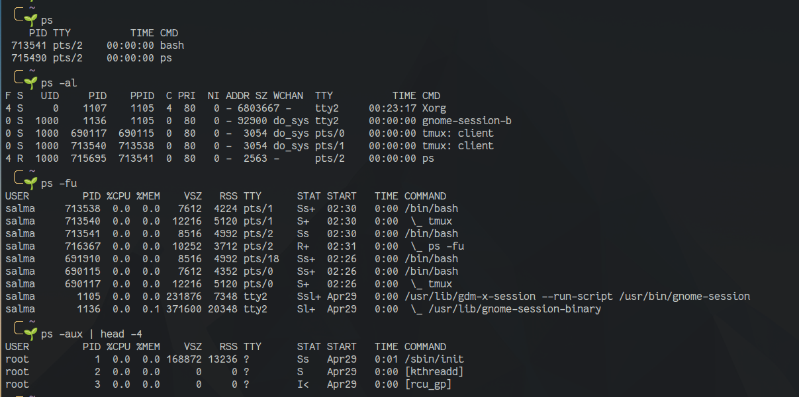

# Processes 

Every time you run a shell command, a program is run and a process is created for it. When we say we are running a program we are not really running the program but a copy of it which is called a process. What we do is copy those instructions and resources from the hard disk into working memory (or RAM). We also allocate a bit of space in RAM for the process to store variables (to hold temporary working data) and a few flags to allow the operating system to manage and track the process during it's execution.

Linux is a multitasking operating system, which means that multiple programs can be running at the same time (processes are also known as tasks). Each process has the illusion that it is the only process on the computer. The tasks share common processing resources (like CPU and memory).

For example I could have two terminals open and be running the command cp in both of them. In this case there would be two cp processes currently existing on the system. Once they are finished running the system then destroys them and there are no longer any processes representing the program cp.

When we are at the terminal we have a Bash process running in order to give us the Bash shell. If we start a script running it doesn't actually run in that process but instead starts a new process to run inside.

Each process in Linux has a **process id (PID)** and it is associated with a particular user and group account.

## Foreground and Background Processes

### Foreground Processes (non automatic)

These are initialized and controlled through a terminal session. There has to be a user connected to the system to start such processes; they haven’t started automatically as part of the system functions/services. such as Google Chromium, Firefox, GIMP, Codeblocks, etc..

When a process is run in foreground, no other process can be run on the same terminal until the process is finished or killed.

### Background Processes (automatic processes)

Not connected to a terminal; they don’t expect any user input.

Can't seen by the user, this will include things such as update managers, network managers, etc...

To run a process in the background, add an ampersand `&` at the end of the command: `command &` This launches the command in the background and returns control of the terminal to the user.

To bring a background process to the foreground, use the `fg` command followed by the job number: `fg %job_number`. This brings the specified background process to the foreground, allowing the user to interact with it as if it were launched in the foreground.

> To view all running background processes, use the `jobs` command

### Daemon Process

This is a type of background process that runs continuously, typically performing system-related tasks. Daemon processes are often started during system boot-up and run in the background, without any user interaction. They usually have no controlling terminal, which is indicated by a `?` in the TTY field of the ps command's output.

------------------------------------------------------------------

## Process Relationships

### Parent Process

This is the process that created another process, either directly or indirectly. Every process has a parent process, except for the initial kernel process (PID 0). When a process is created, it inherits various attributes from its parent process, such as its working directory and file descriptors.

### Child Process

This is a process that was created by another process (its parent process). Child processes inherit most of their attributes from their parent process, but can also have their own unique attributes. For example, a shell may create a child process to run a command, and the child process may have its own environment variables and command line arguments.

### Orphan Process

This is a process that has lost its parent process. This can happen if the parent process terminates before the child process does. When this occurs, the orphan process is assigned a new parent process, which is typically the init process (PID 0) on most systems.

### Zombie Process

This is a process that has completed execution (already dead) but still has an entry in the process table, as its parent process has not yet retrieved its exit status. Zombie processes are usually terminated once the parent process retrieves the exit status.

--------------------------------------------------
## `ps` Command

The `ps` command is used to display information about the currently running processes on a Linux system. It provides a snapshot of the current processes along with detailed information like process ID (PID), parent process ID (PPID), process state, user id, cpu usage, memory usage, command name etc.

### Syntax

```bash
ps [options]
```
### Options

| Option | Description |
| ------ | ----------- |
|  `-a`  | Displays information about all processes on the system, including processes that are not associated with a terminal. |
|  `-e`  | Displays information about all processes on the system, including processes that are not associated with a terminal. |
|  `-f`  | Displays a full listing of processes, including the user ID, parent process ID, CPU usage, and start time. |
|  `-l`  | Displays a long listing of processes, including the process ID (PID), parent process ID (PPID), process state, user ID, CPU usage, memory usage, and command name. |
|  `-u`  | Displays a listing of processes that belong to a specific user. |
|  `-x`  | Displays information about processes that are not associated with a terminal. |
| `--forest`| Displays the process hierarchy in a tree-like format, showing parent-child relationships between processes. |

In addition to these options, the `ps` command supports many more options and arguments that can be used to customize the output.

### Examples

```bash
# Display information about all processes on the system
ps -e

# Display a full listing of processes
ps -f

# Display a long listing of processes
ps -l

# Display a listing of processes that belong to a specific user
ps -u root

# Display information about processes that are not associated with a terminal

ps -x
```



You'll notice you're seeing a lot more fields now, no need to memorize them all. Here's a quick summary of the most important ones:

- **USER:**  The effective user (the one whose access we are using)
- **PID:** Process ID
- **%CPU:**  CPU time used divided by the time the process has been running
- **%MEM:**  Ratio of the process's resident set size to the physical memory on the machine
- **VSZ:** Virtual memory usage of the entire process
- **RSS:** Resident set size, the non-swapped physical memory that a task has used
- **TTY:** Controlling terminal associated with the process
- **STAT:**  Process status code
- **START:** Start time of the process
- **TIME:** Total CPU usage time
- **COMMAND:** Name of executable/command


------------------------------------------------------

## Process States

A process can be in one of the following states:

### Running Process (R)
The process is currently executing on a CPU.

### Waiting Process (D)
The process is waiting for an event to occur, such as user input or completion of an I/O operation.

### Stopped Process (T)
The process has been stopped, usually by a user or by a signal.

### Zombie Process (Z)

The process has completed execution (already dead) but still has an entry in the process table, as its parent process has not yet retrieved its exit status.


-------------------------------------

## Process Codes

Each process has a state that describes what the process is currently doing. The state of a process is indicated by a single character in the output of the `ps` command in the **STAT** column. Here are the possible process states and their corresponding codes:

`R (Running):` The process is currently executing on a CPU.
`S (Sleeping):` The process is waiting for an event to occur, such as user input or completion of an I/O operation.
`D (Waiting):` The process is in an uninterruptible sleep state, usually waiting for I/O to complete.
`Z (Zombie):` The process has completed execution but still has an entry in the process table, as its parent process has not yet retrieved its exit status.
`T (Stopped):` The process has been stopped, usually by a user or by a signal.
`t (Stopped, traced):` The process has been stopped and is being traced by a debugger.
`W (Paging):` The process is waiting for memory to be paged in or out.
`X (Dead):` The process has been terminated or has crashed.
`< (High-priority):` The process has a high priority.
`N (Low-priority):` The process has a low priority.
`L (Locked):` The process is locked into memory.
`+ (Foreground):` The process is in the foreground process group.

> Note that not all process states may be visible in the output of the ps command, depending on the options used. To see all processes and their states, use the `ps -ef` command.


--------------------------------------------------

## `top` Command

The `top` command is used to display dynamic real-time information about running processes in a Linux system. It provides a list of processes currently running on the system, detailed information about each process, and the amount of system resources each process is using.


* PID : Unique Process ID given to each process.
* User: Username of the process owner.
* PR: Priority given to a process while scheduling.
* NI: ‘nice’ value of a process.
* VIRT: Amount of virtual memory used by a process.
* RES : Amount of physical memory used by a process.
* SHR : Amount of memory shared with other processes.
* S : state of the process
    * ‘D’ = uninterruptible sleep
    * ‘R’ = running
    * ‘S’ = sleeping
    * ‘T’ = traced or stopped
    * ‘Z’ = zombie
* %CPU: Percentage of CPU used by the process.
* %MEM; Percentage of RAM used by the process.
* TIME+: Total CPU time consumed by the process.
* Command: Command used to activate the process.
  
### Syntax

```bash
top [options]
```

### Options

| Option | Description |
| ------ | ----------- |
|  `-c`  | Displays the absolute path of the command being executed. |
|  `-p`  | Monitors specific processes. |
|  `-u`  | Displays processes that belong to a specific user. |

### Examples

```bash
# Display a list of processes
top

# Display a list of processes that belong to a specific user
top -u root
```
--------------------------------------------------

## `htop` Command

The `htop` command is an interactive process viewer for Linux. It is an alternative to the `top` command. It displays all running processes in a hierarchical view and allows users to monitor process resource usage in real-time.


### Syntax

```bash
htop [options]
```

---------------------------------

## Signals

A signal is a notification to a process that something has happened.(command sent by the system to a process)

For example, the kernel sends a signal to a process when it terminates. A process can also send a signal to another process.


Each signal has a unique number and a name. Some signals are used for specific purposes, such as the SIGKILL signal which is used to forcefully terminate a process. Other signals are used for more general purposes, such as the SIGTERM signal which is used to request that a process terminate gracefully.

Signals can be sent to a process using the `kill` command or the `kill()` system call. The kill command can be used to send a signal to a process by specifying its **PID** (process ID). For example, to send the SIGTERM signal to a process with PID 1234, you can run the command `kill -TERM 1234`.

Each signal is defined by integers with symbolic names that are in the form of **SIGxxx** . Numbers can vary with signals so they are usually referred by their names.

There are many different signals in Linux, each with its own purpose. Here are some commonly used signals:

### SIGINT (2)

This signal is sent to a process when the user presses the interrupt key (usually CTRL+C) in the terminal. By default, this signal terminates the process.

### SIGTERM (15)

This signal is used to request that a process terminate gracefully. By default, this signal terminates the process.

### SIGKILL (9)

This signal is used to forcefully terminate a process. Unlike other signals, this signal cannot be ignored or caught by a signal handler.

### SIGSTOP (19)

This signal is used to pause a process. Unlike other signals, this signal cannot be ignored or caught by a signal handler.

### SIGCHLD (17)

This signal is sent to the parent process when a child process terminates.

Overall, signals are an important part of the Linux process management system and are used for various purposes, including process control and inter-process communication.

----------------------------------------------


## `kill` & `killall` Commands

The `kill` command is used to send a signal to a process. By default, the signal that is sent is the SIGTERM signal, which requests that the process terminate gracefully. However, you can specify a different signal using the `-s` option.

The `killall` command is used to send a signal to all processes with a specific name. By default, the signal that is sent is the SIGTERM signal, which requests that the process terminate gracefully. However, you can specify a different signal using the `-s` option.

### Syntax

```bash
kill [options] <PID>
killall [options] <process_name>
```

### Options

| Option | Description |
| ------ | ----------- |
|  `-s`  | Specifies the signal to send. |
|  `-l`  | Lists all available signals. |


### Examples

```bash
# Send the SIGTERM signal to a process with PID 1234
kill 1234

# Send the SIGKILL signal to a process with PID 1234
kill -s KILL 1234

# Send the SIGTERM signal to all processes with the name "firefox"
killall firefox
```

----------------------------------------------

## Change priority of a process

In Linux, you can prioritize between processes. The priority value for a process is called the ‘Niceness’ value. Niceness value can range from **-20** to **19** . ***0*** is the default value.

The fourth column in the output of top command is the column for niceness value.

## To start a process and give it a nice value other than the default one, use :

```bash
$ nice -n [value] [process name]
```


To set the negative priority for a process 


To change nice value of a process that is already running use:

```
$ renice -n [value] -p 'PID'
```


------------------------------------------
------------------------------------------