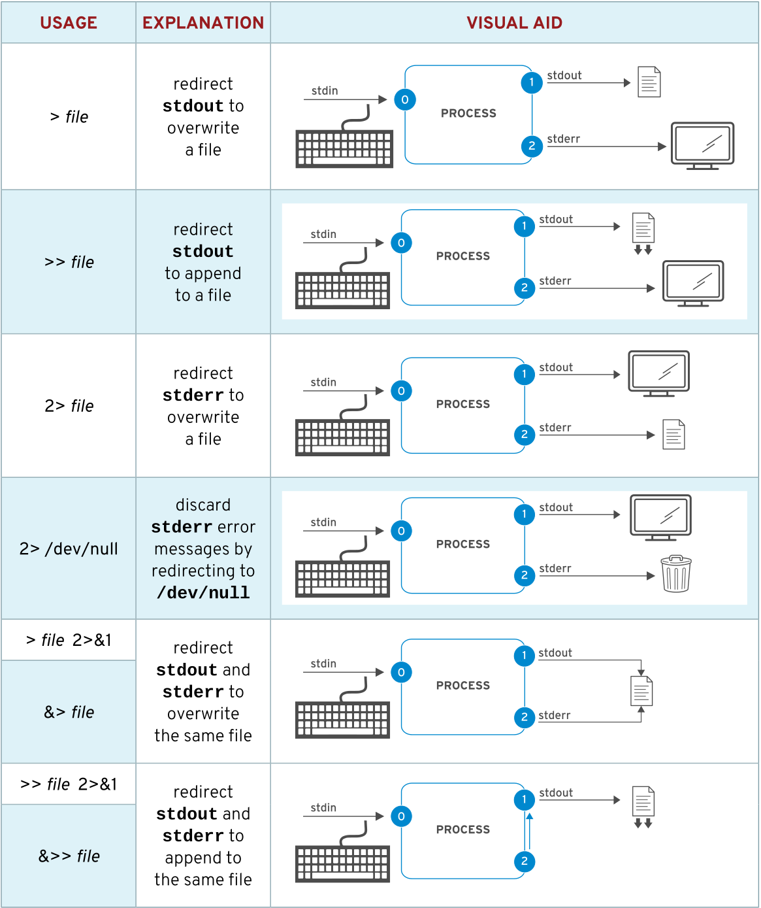
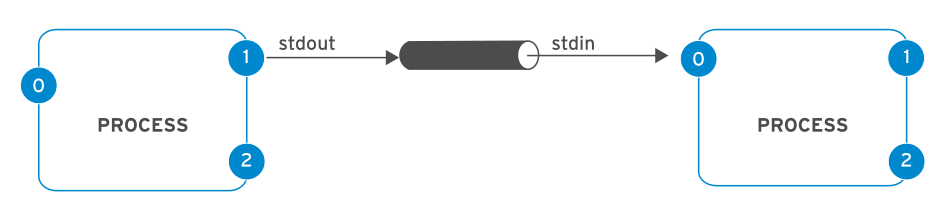
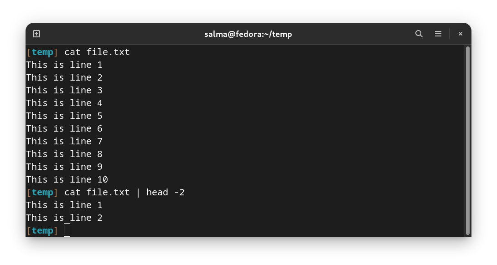
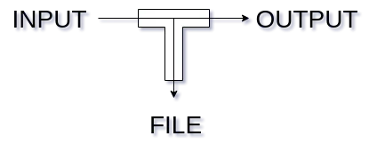
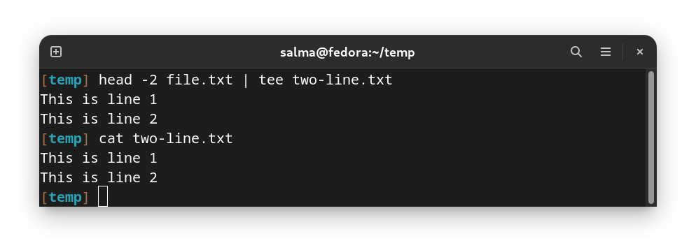
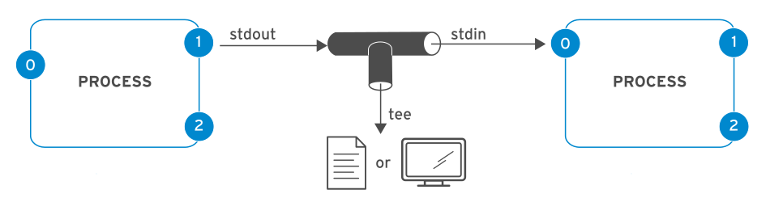
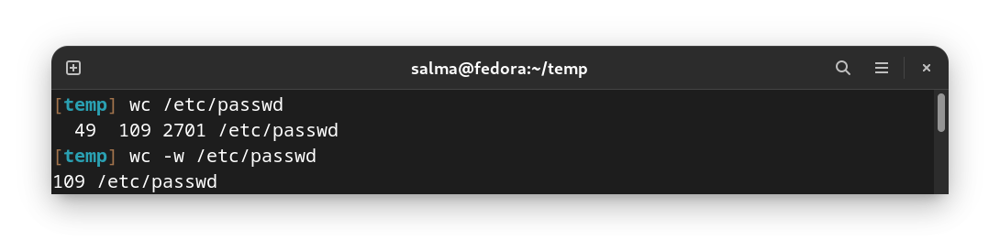
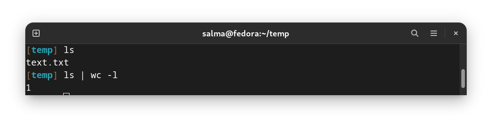

# Redirecting Output to a File or Program

# Unix Philosophy
#### "Do One Thing and Do It Well"

The ideology of creating small pieces of software and connecting them together to form a bigger, more powerful software is what makes Unix-like operating system so efficient. Unix-like OSs is powerful in part because of high composability. 
This ideology was first developed at AT&T Bell Labs by Doug Mcilroy and Ken Thompson under the name of **I/O Redirection and Piping.**

<p float="left">


</p>


# Standard Input, Standard Output & Standard Error

A running program, or process, needs to read input from somewhere and write output to somewhere.

A command run from the shell prompt normally reads its input from the keyboard and sends its output to its terminal window.

A process uses numbered channels called **file descriptors** to get input and send output. 

All processes start with at least three file descriptors:
 - Standard input (channel 0) reads input from the keyboard.
 - Standard output (channel 1) sends normal output to the terminal.
 - Standard error (channel 2) sends error messages to the terminal.
 
If a program opens separate connections to other files, it may use higher-numbered file descriptors.

## Channels (File Descriptors)

Each file in Linux has a corresponding File Descriptor associated with it

In Linux/Unix, everything is a file. Regular file, Directories, and even Devices are files. Every File has an associated number called File Descriptor (FD).

Your screen also has a File Descriptor. When a program is executed the output is sent to File Descriptor of the screen, and you see program output on your monitor. If the output is sent to File Descriptor of the printer, the program output would have been printed.


|NUMBER|CHANNEL NAME|DESCRIPTION    |DEFAULT CONNECTION|USAGE            |
|------|------------|---------------|------------------|-----------------|
|  0   |stdin       |Standard input |Keyboard          |read only        |
|  1   |stdout      |Standard output|Terminal          |write only       |
|  2   |stderr      |Standard error |Terminal          |write only       |
|  3+  |filename    |Other files    |none              |read and/or write|


These channels are the way to interact with any program, for example in Linux we can give the computer orders in the form of commands through the shell we call this stdin, an example for stdin will be **ls** or any other command, and the computer responds with either stdout or stderr depending on the input.

Running ``ls`` gives normal output, thus channeled to stdout:


Running ``hello`` or any unknown command or syntax will give an error, thus channeled to stderr:    


Notice that in the previous examples, both the output and the error were printed to terminal as we haven’t redirected either of them.


## Redirecting Output to a File

I/O redirection changes how the process gets its input or output. 

Instead of getting input from the keyboard, or sending output and errors to the terminal, the process reads from or writes to files. 

Redirection lets you save messages to a file that are normally sent to the terminal window. 

Alternatively, you can use redirection to discard output or errors, so they are not displayed on the terminal or saved.

If you want to discard messages, the special file `/dev/null` quietly discards channel output redirected to it and is always an empty file.

### Output Redirection Operators



### Why Error Redirection?

Error re-direction is one of the very popular features of Unix/Linux.

Frequent UNIX users will reckon that many commands give you massive amounts of errors. 

For instance, while searching for files, one typically gets permission denied errors. These errors usually do not help the person searching for a particular file.

While executing shell scripts, you often do NOT want error messages cluttering up the normal program output.


### I/O Redirection Examples

We can redirect stdout into file by using the greater than sign **>**.

Example:


Notice that the output of the command was printed into the file instead of the terminal.

We can redirect stderr into file by using the sign **2>**.

Example:


Notice that the output here stayed on the terminal although we redirected stdout, that is because the type of the output is stderr. That’s why when we used **2>** it redirected it into a file, but **>** didn’t.

Using **>** will override what’s in the file, to append to the file without deleting its content we can add another greater than sign **>>**.

We can also use **&>** to redirect both STDOUT and STDERR.

You can also redirect input from a file into a program using the smaller than sign **<** followed by the filename. 

**Example:** ``./program < inputfile.txt``


### IMPORTANT Notes

The order of redirection operations is important. 

The following sequence redirects standard output to file and then redirects standard error to the same place as standard output (file).

```
> file 2>&1
```

However, the next sequence does redirection in the opposite order. This redirects standard error to the default place for standard output (the terminal window, so no change) and then redirects only standard output to file.

```
2>&1 > file
```

Because of this, some people prefer to use the merging redirection operators: 
    - `&>file` instead of` >file 2>&1` 
    -`&>>file` instead of `>>file 2>&1` 


However, other system administrators and programmers who also use other shells related to bash (known as Bourne-compatible shells) for scripting commands think that the newer merging redirection operators should be avoided, because they are not standardized or implemented in all of those shells and have other limitations.


## Another I/O Redirection Examples

Many routine administration tasks are simplified by using redirection. Use the previous table to assist while considering the following examples:

- Save a time stamp for later reference : `$ date > /tmp/saved-timestamp`
- Copy the last 100 lines from a log file to another file: `$ tail -n 100 /var/log/dmesg > /tmp/last-100-boot-messages`
- Concatenate four files into one : `$ cat file1 file2 file3 file4 > /tmp/all-four-in-one`
- List the home directory's hidden and regular file names into a file: `$ ls -a > /tmp/my-file-names`
- Append output to an existing file : `$ echo "new line of information" >> /tmp/many-lines-of-information`

The next few commands generate error messages because some system directories are inaccessible to normal users. 

- Redirect errors to a file while viewing normal command output on the terminal :`$ find /etc -name passwd 2> /tmp/errors`
- Save process output and error messages to separate files :`$ find /etc -name passwd > /tmp/output 2> /tmp/errors`
- Ignore and discard error messages : `$ find /etc -name passwd > /tmp/output 2> /dev/null`
- Store output and generated errors together : `$ find /etc -name passwd &> /tmp/save-both`
- Append output and generated errors to an existing file :`$ find /etc -name passwd >> /tmp/save-both 2>&1`


------------------------------------------------------------------

# Pipeline `|`

A pipeline is a sequence of one or more commands separated by the pipe character (`|`). A pipe connects the standard output of the first command to the standard input of the next command.



In other words, what the pipe does is that it takes any output passed to it then uses it as an input for the following command.

Example: 



Executing this command will first send the content of the file to **STDOUT** then the pipe will take it and use at as **STDIN** to the `head -2` command which will show the first two lines of the file.

Pipelines allow the output of a process to be manipulated and formatted by other processes before it is output to the terminal. 

One useful mental image is to imagine that data is "flowing" through the pipeline from one process to another, being altered slightly by each command in the pipeline through which it flows.


We can use the pipe as many times as we want and to perform multiple commands sequentially with the I/O relations.

You can do all sort of fun things with pipes. For example: `fortune | cowsay | lolcat`.

`fortune` will print an adage and pipe it to `cowsay` which will draw an ascii art of a cow speaking and then this output will be piped to `lolcat` which will give the output the colorful look.


**NOTE**

Pipelines and I/O redirection both manipulate standard output and standard input. **Redirection** sends standard output to files or gets standard input from files. **Pipes** send the standard output from one process to the standard input of another process.

## Pipeline Examples

- This example takes the output of the `ls` command and uses `less` to display it on the terminal one screen at a time : `ls -l /usr/bin | less`

- The output of the `ls` command is piped to `wc -l`, which counts the number of lines received from
`ls` and prints that to the terminal : `$ ls | wc -l`

- In this pipeline, `head` will output the first 10 lines of output from `ls`, with the final result redirected to a file : `$ ls | head -n 10 > /tmp/ten-last-changed-files`

If output redirection is used in the middle of a pipeline, the output will go to the file and not to the next command in the pipeline.

- In this example, the output of the `ls` command goes to the file, and less displays nothing on the terminal : `$ ls > /tmp/saved-output | less`


**IMPORTANT**

Standard error can be redirected through a pipe, but the merging redirection operators (`&>` and `&>>`) cannot be used to do this. The following is the correct way to redirect both standard output and standard error through a pipe: 
`$ find -name / passwd 2>&1 | less`

---------------------------------------------------------

# Pipelines, Redirection, and the tee Command

In a pipeline, `tee` copies its standard input to its standard output and also redirects its standard output to the files named as arguments to the command. 

If you imagine data as water flowing through a pipeline, tee can be visualized as a **"T"** joint in the pipe which directs output in two directions.



**Example :**

This example redirects the output of the `head -2` command to the file and displays it on the terminal at the same time.



### Pipeline Examples Using the tee Command

This example redirects the output of the `ls` command to the file and passes it to `less` to be displayed on the terminal one screen at a time: `$ ls -l | tee /tmp/saved-output | less`



If tee is used at the end of a pipeline, then the final output of a command can be saved and output to the terminal at the same time : 
`$ ls | head -n 10 | tee /tmp/ten-last-changed-files`

------------------------------------------

# Pipelines, and the wc Command 

The `wc` command counts lines, words, and characters in a file. It takes a `-l`, `-w`, or `-c` option to display only the number of lines, words, or characters, respectively.



You can use it with pipe to count number of files in a directory:



------------------------------------------

# Extras 

[Creating a program that convert man pages into PDFs and preview them in a menu using pipes only](https://www.youtube.com/watch?v=8E8sUNHdzG8)
