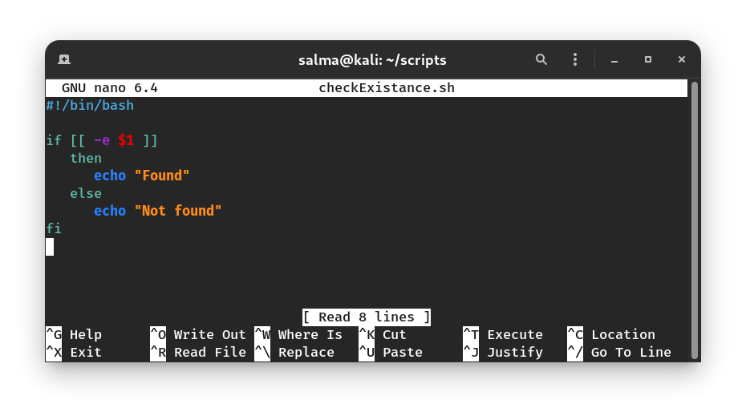
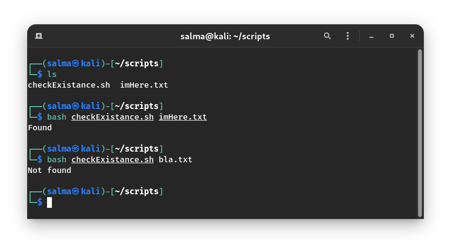
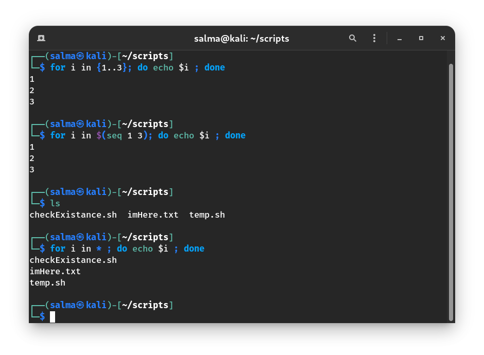
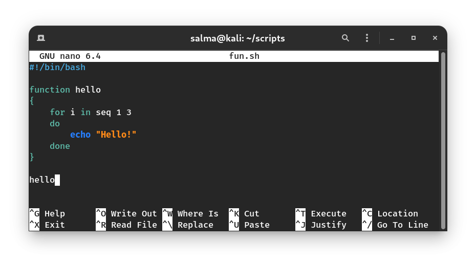
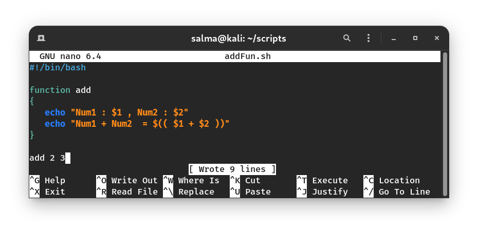
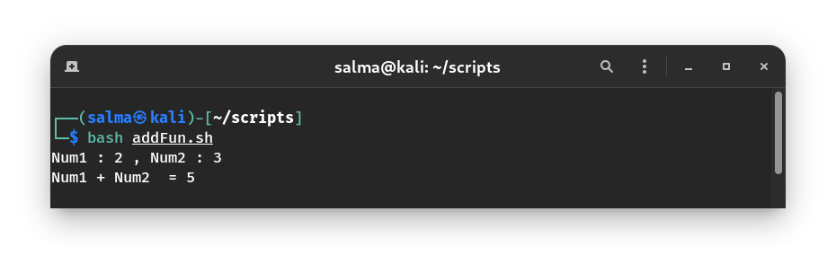

# Conditionals in BASH

# If Statements

If conditions are used to control a program's flow, as in they control what a program does and when.


### Writing Conditionals in BASH

- Start a condition with `if [[ condition ]]`
- The next line contains `then` which is roughly equivalent to ‘{‘
- Write the commands that will execute if the condition is true.
- End your condition with `fi` which is roughly equivalent to ‘}’
- Or start an `elif [[ condition ]]`, with `then` in the line after it.
- Write the commands that will execute if the elif condition is true.
- End your conditionals with `fi`
- Or start an `else`, with **NO then** in the line after it.
- Write the commands that will execute if the else condition is true.
- End your conditionals with `fi`

### Syntax

```bash
if [[ $x -eq 5 ]]
  then
    #DoSomething
fi

 
Or

if [ $x -eq 5 ]
  then
    #DoSomething
fi

```
> [[ … ]] is preferred over [ … ]


```bash
if [[ $x = "String" ]]
  then 
      echo 1
elif [[ $x = "String 2" ]]
  then
      echo 2
else
      echo 3
fi
```

--------------------------------------

# Conditions

It is very important to understand that all the conditional expressions should be placed inside square braces `[ Cond ]` with spaces around them. For example, `[ $a <= $b ]` is **correct** whereas, `[$a <= $b]` is **incorrect**.

### Comparing Numerical Variables

|Expression in C|Expression in BASH |Description                                  |
|:-------------:|:-----------------:|---------------------------------------------|
|`a == b`       |   `$a -eq $b`     |Checks if `a` is equal to `b`                |
|`a != b`       |   `$a -ne $b`     |Checks if `a` is not equal to `b`            |
|`a < b`        |   `$a -lt $b`     |Checks if `a` is less than `b`               |
|`a > b`        |   `$a -gt $b`     |Checks if `a` is greater than `b`            |
|`a >= b`       |   `$a -ge $b`     |Checks if `a` is greater than or equal to `b`|
|`a <= b`       |   `$a -le $b`     |Checks if `a` is less than or equal to `b`   |

**Another way of comparing numerical values is to use ```((  ))``` instead of ```[[  ]]``` which allows you to use C-like operators.**
- Example: `if [[ $a -eq $b ]]` becomes `if (( a == b ))`

### Comparing String Variables

|Expression in C |Expression in BASH      |Description                                 |
|:--------------:|:----------------------:|--------------------------------------------|
|`a == b`        |`$a = $b` or `$a == $b` |Checks if `a` is equal to `b`               |
|`a != b`        |`$a != $b`              |Checks if `a` is not equal to `b`           |
|`a < b`         |`$a < $b`               |Checks if `a` is less than `b`              |                   
|`a > b`         |`$a > $b`               |Checks if `a` is greater than `b`           |                
|`strlen(a) == 0`|`-z $a`                 |Checks if `a` has a length of zero          |
|`strlen(a) != 0`|`-n $a`                 |Checks if `a` has a length greater than zero|


### Boolean Conditions 

|Expression in BASH                                          |Description |
|:----------------------------------------------------------:|------------|
|`[[ cond. A \|\| cond. B ]]`<br> `[[ cond. A -o cond. B ]]` |A OR B      |
|`[[ cond. A && cond. B ]]`  <br> `[[ cond. A -a cond. B ]]` |A AND B     |
|`[[ ! cond. A ]]`                                           |Not A       |

> It won't work with `[..]`

### File Conditions

| Expression in BASH | Description                                                                                    |
|:------------------:|------------------------------------------------------------------------------------------------|
|   `-d $file`       | Checks if file is a **directory**                                                              |
|   `-f $file`       | Checks if file is an **ordinary file** as opposed to a directory or special file|`[ -f $file ]`|
|   `-e #file`       | Checks if **file/directory exists**                                                            |
|   `-r $file`       | Checks if file is **readable**                                                                 | 
|   `-w $file`       | Checks if file is **writable**                                                                 | 
|   `-x $file`       | Checks if file is **executable**                                                               | 

### Example





------------------------------------------------

# Case Statements

Case statements can be very useful when you need to take a specific path based on a variable matching a series of patterns. You still can use `if` statements, but case statements would be cleaner.

### Syntax

```bash
case <variable> in
    <pattern 1> )
        <commands>
        ;;
    <pattern 2> )
        <other commands>
        ;;
esac
```

### Example

```bash
case $1 in
    start)
        echo starting
        ;;
    stop)
        echo stopping
        ;;
    restart)
        echo restarting
        ;;
    *)
        echo don\'t know
        ;;
esac
```
------------------------------------------------

# Loops 

Loops are used to repeat a process/commands a certain no. of times.

There are 3 types of loops in Bash (`for`, `while`, and `until`).


## For Loops

For loops are said to loop in a certain range/array.

### Syntax

```bash
for VAR in RANGE
do
   #SOMETHING
done
```

### Example

```bash
read x
for i in $(seq 1 $x)
do
    echo $i
done
```
`seq 1 $x` means “sequence from 1 to the value of x, ‘`$x`’ can be replaced with any other value. Ex: `seq 1 12` or `seq 1 $y`

### Tip

You can write a for loop in you terminal in one line:



## While Loops

While loops keep repeating a block of commands until the condition becomes false.

### Syntax

```bash
while [[ CONDITION ]]
do
   #SOMETHING
done
```
### Example

```bash
x=1
while [[ $x -lt 11 ]]
do
    echo $x
    let x+=1
done
```

## Until Loops

The while and until loops are similar to each other. The main difference is that the **while loop** iterates as long as the condition evaluates to **true** and the **until loop** iterates as long as the condition evaluates to **false**.

### Syntax

```bash
until [CONDITION]
do
  #SOMETHING
done
```

### Example

```bash
counter=0

until [[ $counter -gt 5 ]]
do
  echo Counter: $counter
  ((counter++))
done
```

## Break & Continue Statements

### Break

When the user enters 0, the code continues to run outside the loop.

```bash
while [[ x -lt 10 ]]
do
    read i
    
    if [[ i -eq 0 ]]
    then 
         break
    fi

    echo $i
done

echo "break sent me here"
```

### Continue

When the user enters 0, the code skips the lines of code below it and continues to the next iteration.

```bash
while [[ x -lt 10 ]]
do
    read i
    
    if [[ i -eq 0 ]]
    then 
        echo "Skipping the rest of the code!"
        continue
    fi
    echo $i
done
```
---------------------------------------------------------

# Functions

You can write functions in Bash to organize your code, and you can also pass arguments to functions like you can pass them to scripts.

### Syntax

```bash
function NAME #Function Definition
{
     #DoThings
}

NAME #Function call
```

Or

```bash
NAME() #Function Definition
{
     #DoThings
}
NAME #Function call
```

### Example

This is a function that prints "Hello!" 3 times.




## Passing Arguments to a Function

To use the arguments as variables, you can access their values by using `$n` where `n` is the order of the argument passed to the function.

### Example  

This is a function that adds 2 numbers.




# The Fork Bomb 
## :(){:|:&};:


Fork Bomb is a program that harms a system by making it **run out of memory**. It forks processes infinitely to fill memory. The fork bomb is a form of **denial-of-service (DoS)** attack against a **Linux based system**. Once a successful fork bomb has been activated in a system it may not be possible to resume normal operation without rebooting the system as the only solution to a fork bomb is to destroy all instances of it.

To shield your system from Fork bomb ensure that you are limiting the number of processes to the local users where they could create.


```bash
:()        # Create a function named ‘ : ’
{          # Start of the function body
    : | :& # Calls itself, once in the foreground and once in the background
}          # End of the function body

:          # Function call
```


-------------------------------------

## Resources

- https://www.shellscript.sh/
- https://opensource.com/article/17/6/set-path-linux
- https://www.tutorialspoint.com/unix/unix-basic-operators.htm
- https://github.com/mazzensaadd/OSC22-Linux-Workshop