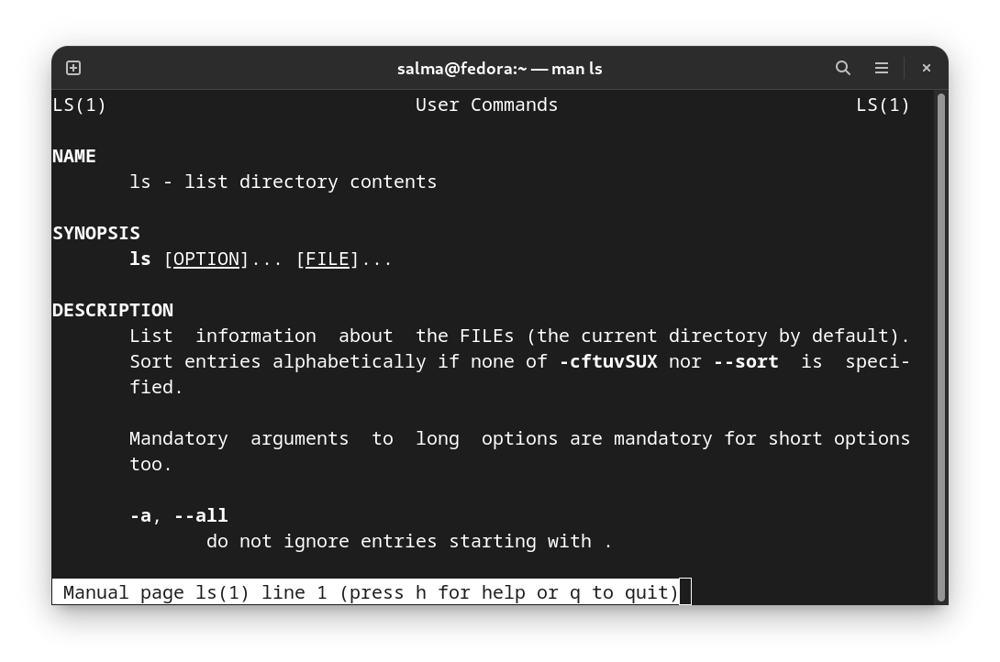
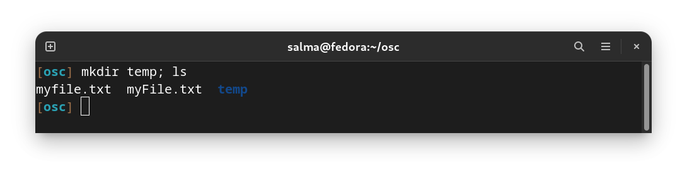
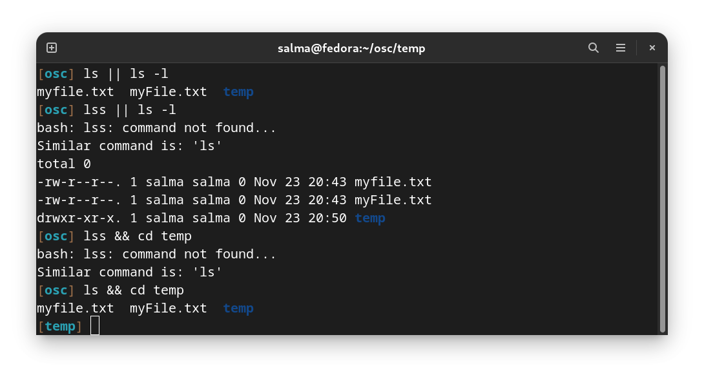

# GETTING HELP
# Man Pages

One source of documentation that is generally available on the local system are system **manual pages** or **man pages**.

These pages are shipped as part of the software packages for which they provide documentation, and can be accessed from the command line by using the `man` command.

They’re a set of pages that explain what every command on the system does, what options are available, what arguments it can take, and shows you how to use them.

To open a man page type: `man [COMMAND NAME]`

**Example :** `man ls`

This will show you the manual of the “ls” command. 

> You can also use `info` and `--help` to get information about a command.\
> Example: `info ls` and `ls --help`

## Common Sections of the Linux Manual

The historical Linux Programmer's Manual, from which man pages originate, was large enough to be multiple printed sections. Each section contains information about a particular topic.

| SECTION | CONTENT TYPE                                                      |
|---------|-------------------------------------------------------------------|
|   1     |User commands (both executable and shell programs)                 |
|   2     |System calls (kernel routines invoked from user space)             |
|   3     |Library functions (provided by program libraries)                  |
|   4     |Special files (such as device files)                               |
|   5     |File formats (for many configuration files and structures)         |
|   6     |Games (historical section for amusing programs)                    |
|   7     |Conventions, standards, and miscellaneous (protocols, file systems)|
|   8     |System administration and privileged commands (maintenance tasks)  |
|   9     |Linux kernel API (internal kernel calls)                           |

To distinguish identical topic names in different sections, man page references include the section number in parentheses after the topic. For example, **passwd(1)** describes the command to change passwords, while **passwd(5)** explains the `/etc/passwd` file format for storing local user accounts.

To read specific man pages, use man topic. Contents are displayed one screen at a time. The `man` command searches manual sections in alphanumeric order. For example, `man passwd` displays `passwd(1)` by default. To display the man page topic from a specific section, include the section number argument: `man 5 passwd` displays `passwd(5)`.

## Navigate and Search Man Pages

The ability to efficiently search for topics and navigate man pages is a critical administration skill. GUI tools make it easy to configure common system resources, but using the command-line interface is still more efficient.  To effectively navigate the command line, you must be able to find the information you need in man pages. 

The following table lists basic navigation commands when viewing man pages:

## Navigating Man Pages

| COMMAND   | RESULT|
|-----------|-------|
|`Spacebar`   Or   `PageDown` |Scroll forward (down) one screen|
|`PageUp  ` |Scroll backward (up) one screen|
|`DownArrow`|Scroll forward (down) one line|
| `UpArrow `|Scroll backward (up) one line|
| `D       `|Scroll forward (down) one half-screen|
| `U       `|Scroll backward (up) one half-screen|
| `/string `|Search forward (down) for string in the man page|
| `N       `|Repeat previous search forward (down) in the man page|
| `Shift+N `|Repeat previous search backward (up) in the man page|
| `G       `|Go to start of the man page|
| `Shift+G `|Go to end of the man page|
| `Q       `|Exit man and return to the command shell prompt|

>  Keyboard shortcuts aren't case-sensitive. For example, `n` is the same as `N`.

**IMPORTANT**

When performing searches, string allows regular expression syntax (we will explain it later). While simple text (such as passwd) works as expected, regular expressions use meta-characters (such as `$`, `*`, `.`, and `^`) for more sophisticated pattern matching. Therefore, searching with strings that include program expression meta-characters, might yield unexpected results.

## Searching for a Command

If you need to do a specific task but don’t know which command can do it:

You can use `apropos` or `man -k` to search for that command by the keyword of the command.

**Example:** `man -k "rename"`

 

As you can see, all of these are commands that can rename something. Which one you choose is up to you. You can use man pages to know more about these commands and select the suitable one for your case.

## What a command does

You can use `whatis` or `man -f` to quickly see what a command does

**Example:** `whatis mv`

-------------------------------------------------------------

# Basic Command Syntax

If you want to type more than one command on a single line, use the semicolon (`;`) as a command separator. A semicolon is a member of a class of characters called metacharacters (we will explain it later) that have special meanings for bash.

To combine two commands (command1 and command2) on the command line: `$ command1; command2`

----------------------------------------------------------------------------------------

# Bash Logical Operators

### Logical AND (`&&`)

`$ command1 && command2`

It is used to chain commands together, such that the next command is run if and only if the preceding command exited without errors (or, more accurately, exits with a return code of 0).

### Logical OR (`||`)

`$ command1 || command2`

OR Operator is completely opposite of `&&` Operator. OR Operator will execute the second command only if the First command Fails. 

----------------------------------------------------------------------------------------