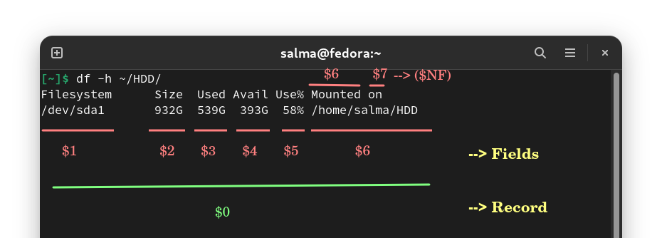
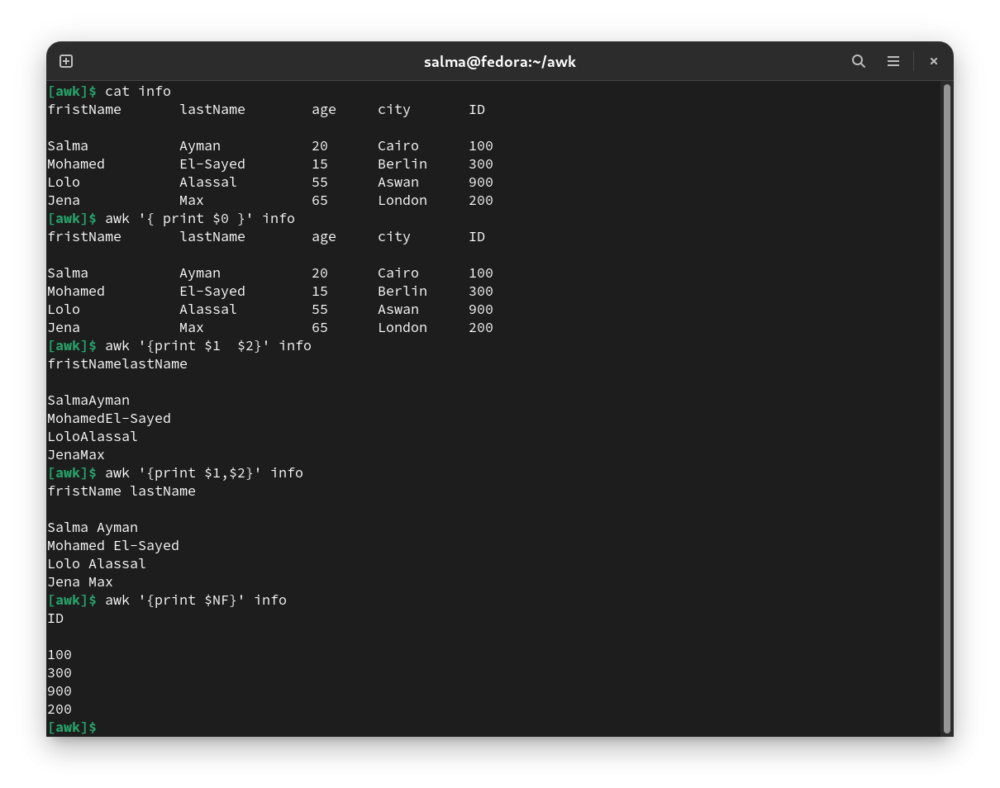
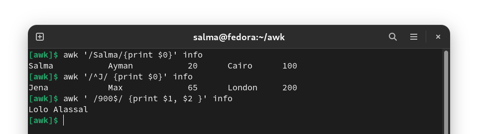
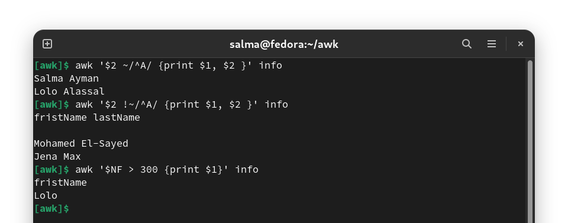
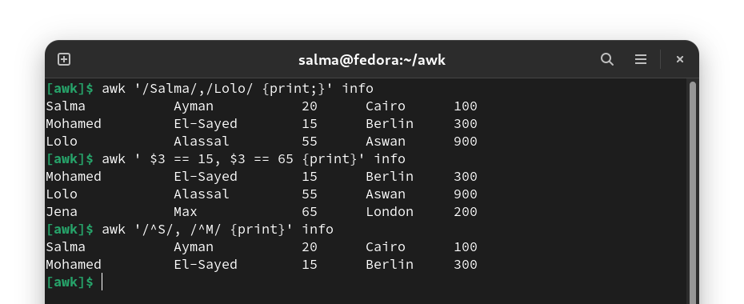
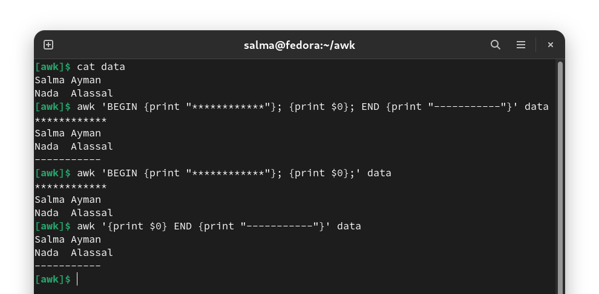
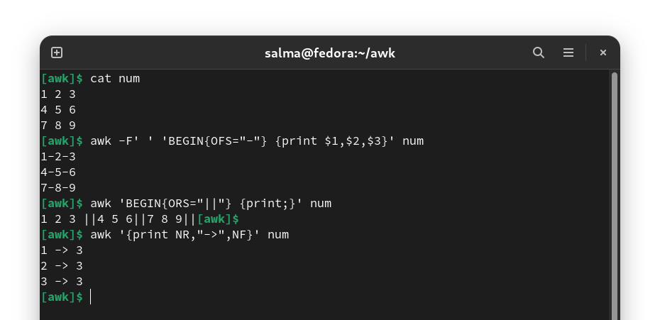
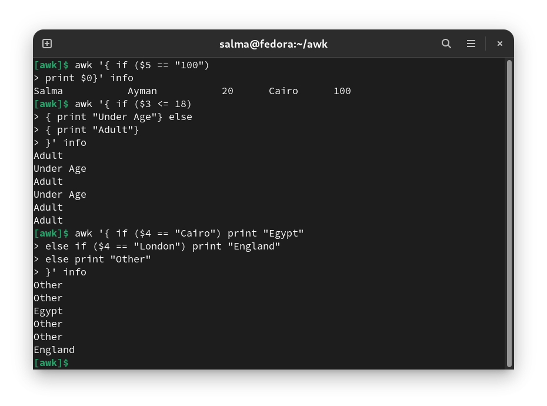

# AWK

- Awk is a programming language which allows easy manipulation of structured data. Like common programming language, Awk has variables, conditionals, loops, arithmetic and string operators.

- It is mostly used for **advanced text processing**. 

- `awk` is **data-driven**, which means that you define a set of actions to be performed against the input text. It takes the input data, transforms it, and sends the result to standard output. For example, some operations you can do with `awk` are searching for a specific word or pattern in a piece of text given, or even select a certain line or a certain column in a file you provide.

- There are several different implementations of awk. We’ll use the **GNU implementation** of awk, which is called **gawk**. On most Linux systems, the awk interpreter is just a symlink to gawk.

---------------------------------------------------

# How AWK Works

## Records and Fields

- Awk can process textual data files and streams. The input data is divided into **records** and **fields**. Awk operates **on one record at a time** until the end of the input is reached. Records are separated by a character called the **record separator**. 

- The **default record separator** is the **newline** character, which means that each line in the text data is a record. 

- Records consist of fields which are separated by the **field separator**. By default, the value of the field separator is **any number of space or tab characters**.

- The fields in each record are referenced by the dollar sign **($)** followed by **field number**, beginning with 1. The first field is represented with `$1`, the second with `$2`, and so on. The last field can also be referenced with the special variable `$NF`. The entire record can be referenced with `$0`.

- Here is a visual representation showing how to reference records and fields:

   


## Syntax

- When the rule has no pattern : `awk '{action}' file.txt`
   
-  When the rule has a pattern : `awk 'pattern {action}' file.txt`
    


> An action can have zero or more statements. Multiple statements are executed in the order they appear and must be separated by newline or semi-colons (;).

## Awk Working Methodology

**1.** Awk reads the input files one line at a time.

**2.** For each line, it matches with given pattern in the given order, if matches performs the corresponding action.

**3.** If no pattern matches, no action will be performed.

**4.** Either search pattern or action are optional, But not both.

**5.** If the search pattern is not given, then Awk performs the given actions for each line of the input.

**6.** If the action is not given, print all that lines that matches with the given patterns which is the default action.

**7.** Empty braces with out any action **does nothing**. It won't perform default printing operation.

**8.** Each statement in Actions should be delimited by semicolon.

---------------------------------------------------------------

# Awk Patterns

- Patterns in awk control whether the associated **action should be executed or not**.

- Awk supports different types of patterns, including **regular expression**, **relation expression**, **range**, and **special expression patterns**.


## Regular Expression Patterns

- Awk regular expression patterns are enclosed in slashes (`//`): `/regex pattern/ { action }`

- For example, to display the first field of each record that contains “0.5” you would run the following command: `awk '/0.5/ { print $1 }' file.txt`

- The pattern can be any type of extended regular expression. Here is an example that prints the first field if the record starts with two or more digits: `awk '/^[0-9][0-9]/ { print $1 }' file.txt`



## Relational Expressions Patterns

- The relational expressions patterns are generally used to match the content of a **specific field or variable**.

- By default, **regex** patterns are matched **against the records**. To match a regex against a field, specify the field and use the “contain” comparison operator (`~`) against the pattern.

- For example, to print the first field of each record whose second field contains “ia” you would type: `awk '$2 ~ /ia/ { print $1 }' file.txt`

- To match fields that do not contain a given pattern use the `!~` operator: `awk '$2 !~ /ia/ { print $1 }' file.txt`

- You can compare strings or numbers for relationships such as, greater than, less than, equal, and so on. The following command prints the first field of all records whose third field is greater than 50: `awk '$3 > 50 { print $1 }' teams.txt`



## Range Patterns

- Range patterns consist of two patterns separated by a comma: `awk '/pattern1/,/pattern2/ { print; }' file.txt`

- All records starting with a record that matches the first pattern until a record that matches the second pattern are matched.

- The patterns can also be relation expressions. The command below will print all records starting from the one whose fourth field is equal to 32 until the one whose fourth field is equal to 33: `awk '$4 == 31, $4 == 33 { print $0 }' teams.txt`



## Special Expression Patterns

- Awk includes the following special patterns:

    - BEGIN ➖ Used to perform actions before records are processed.
    - END ➖ Used to perform actions after records are processed.




## Combining Patterns

- Awk allows you to combine two or more patterns using the logical AND operator (`&&`) and logical OR operator (`||`).

- Here is an example that uses the && operator to print the first field of those record whose third field is greater than 50 and the fourth field is less than 30: `awk '$3 > 50 && $4 < 30 { print $1 }' file.txt`


-----------------------------------------------------

# Built-in Variables 

- There are two types of built-in variables in Awk :

    - Variable which defines values which can be changed such as field separator and record separator.
    - Variable which can be used for processing and reports such as Number of records, number of fields.

- Some of the most common built-in Variables:

    - `NF` - The number of fields in the record.
    - `NR` - The number of the current record.
    - `FILENAME` - The name of the input file that is currently processed.
    - `FS` - Field separator.
    - `RS` - Record separator.
    - `OFS` - Output field separator.
    - `ORS` - Output record separator.

- Here is an example showing how to print the file name and the number of lines :
`awk 'END { print "File", FILENAME, "contains", NR, "lines." }' file.txt`

- Variables in AWK can be set at any line in the program. To define a variable for the entire program, put it in a `BEGIN` pattern.



## Changing the Field and Record Separator

### Field Separator

- The default value of the field separator is any number of space or tab characters. It can be changed by setting in the FS variable.

- For example, to set the field separator to `.` you would use: `awk 'BEGIN { FS = "." } { print $1 }' file.txt`

- The field separator can also be set to more than one characters: `awk 'BEGIN { FS = ".." } { print $1 }' file.txt`

- When running awk one-liners on the command-line, you can also use the **-F option** to change the field separator: `awk -F "." '{ print $1 }' file.txt`

### Record Separator

- By default, the record separator is a newline character and can be changed using the RS variable.

- Here is an example showing how to change the record separator to `.`: `awk 'BEGIN { RS = "." } { print $1 }' teams.txt`


### Example

Let us take students marks are stored in a file, each of the records are separated by double new line, and each of the fields are separated by a new line character.

```
$cat student.txt
Jones
2143
78
84
77

Gondrol
2321
56
58
45

RinRao
2122
38
37
65

Edwin
2537
78
67
45

Dayan
2415
30
47
20
```

Now the below Awk script prints the Student name and Rollno from the above input file.
```
$cat student.awk
BEGIN {
	RS="\n\n";
	FS="\n";

}
{
	print $1,$2;
}

```
```
$ awk -f student.awk  student.txt
Jones 2143
Gondrol 2321
RinRao 2122
Edwin 2537
Dayan 2415
```

In the script `student.awk`, it reads each student detail as a single record, because awk RS has been assigned to double new line character and each line in a record is a field, since FS is newline character.

> -f file  To specify a file that contains awk script.

---------------------------------------------------

#  Awk Conditional If Statements 

- Most of the Awk conditional statement syntax are looks like ‘C’ programming language.

- Awk supports two different kinds of if statement: 

    - Awk Simple If statement
    - Awk If-Else statement
    - Awk If-ElseIf-Ladder

### Awk Simple If Statement

#### Single Action

**Syntax:**
```
if (conditional-expression)
	action
```

#### Multiple Action

If more than one action needs to be performed, the actions should be enclosed in **curly braces**, separating them into a **new line** or **semicolon** as shown below.

**Syntax:**
```
if (conditional-expression)
{
	action1;
	action2;
}
```

### Awk If Else Statement

**Syntax:**
```
if (conditional-expression)
	action1
else
	action2
```
**Ternary Operator ( ?: ) Syntax :**

```
conditional-expression ? action1 : action2 ;
```

### Awk If Else If ladder

```
if(conditional-expression1)
	action1;
else if(conditional-expression2)
	action2;
else if(conditional-expression3)
	action3;
	.
	.
else
	action n;
```



-----------------------------------------

# Notes

- To print a custom text, you must quote the text with **double-quote** characters: `awk '{ print "The first field:", $1}' file.txt`

- When print is used without an argument `awk '{print;}' file.txt`, it defaults to print $0. The current record is printed.

- You can print special characters such as newline: `awk 'BEGIN { print "First line\nSecond line\nThird line" }'`

- When printing multiple items, you need to separate them with commas. Here is an example: `awk '{ print $1, $3, $5 }' file.txt` The printed items are separated by **single spaces**. If you don’t use commas: `awk '{ print $1 $3 $5 }' file.txt` there will be no space between the items.


# Examples

- To count the lines in a file : `awk 'END { print NR }' file.txt`

- To print non-empty line from a file : `awk 'NF > 0' file.txt`

- To print the first item and then the second last item $(NF-1) from each line : `awk '{print $1, $(NF-1) }' sample.txt`

- To print the line-number count : `awk '{print NR,$0}' file.txt`

- To print The row number, then a dash and space ("- ") and then the first item from each line : `awk '{print NR "- " $1 }' file.txt`

- To print specific lines of a column : `awk '{print $1}' file.txt | head -1` 

- To print the lines that DON'T end in a 0 : `awk '! /0$/' information.txt` 

------------------------------------------
------------------------------------------

## Resources

- https://linuxize.com/post/awk-command/

- https://www.freecodecamp.org/news/the-linux-awk-command-linux-and-unix-usage-syntax-examples/

- https://www.thegeekstuff.com/2010/01/8-powerful-awk-built-in-variables-fs-ofs-rs-ors-nr-nf-filename-fnr/
