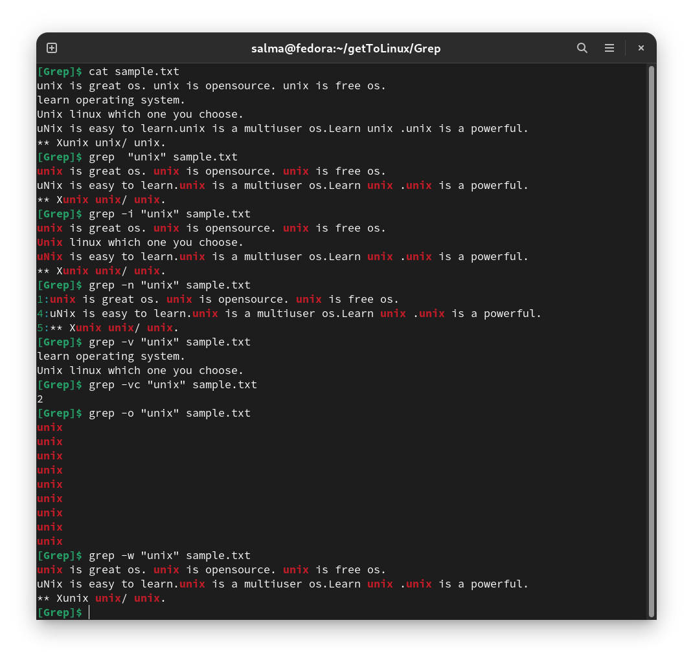
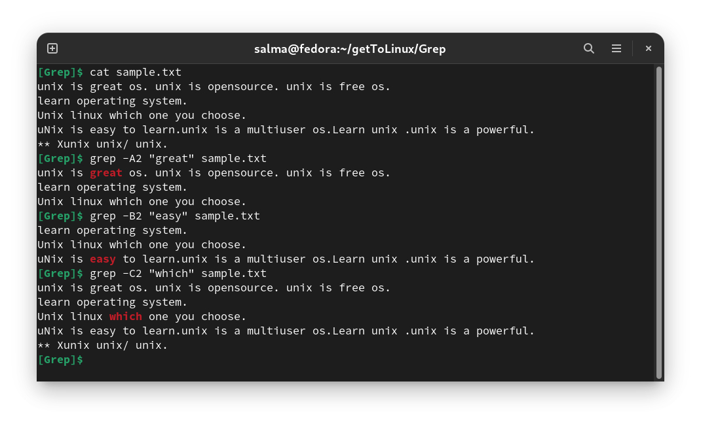
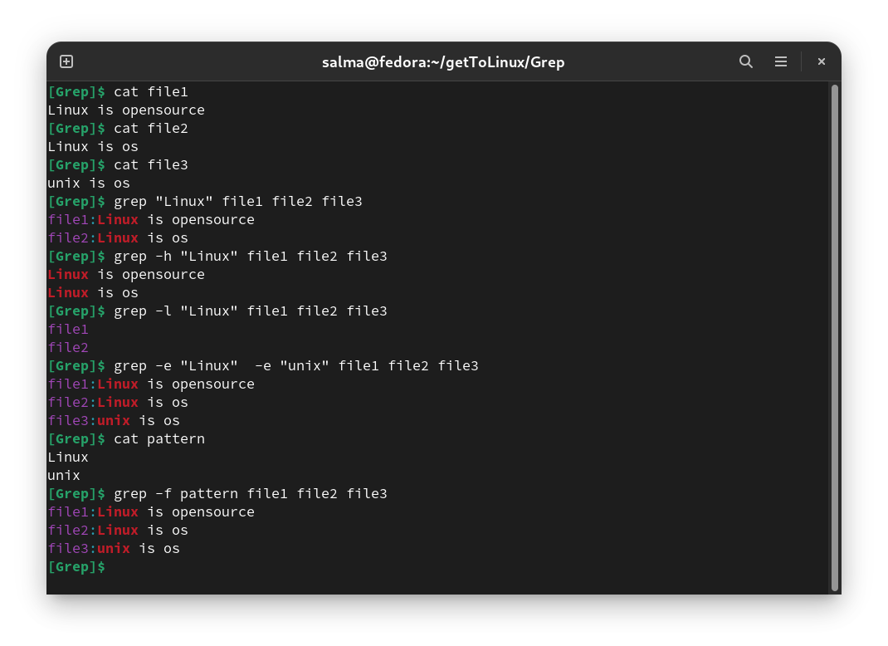
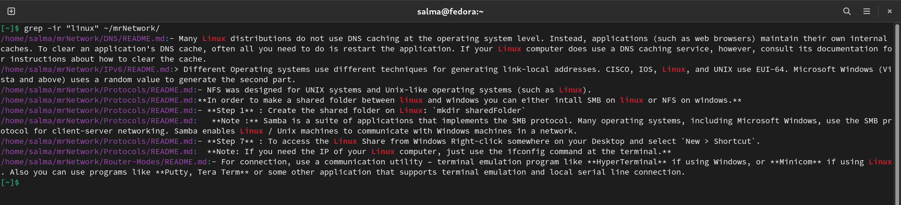
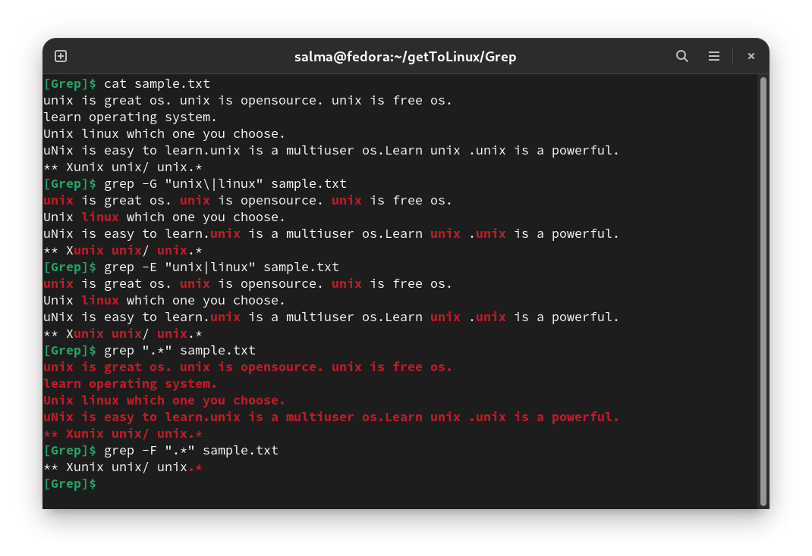

# Grep Command

- Grep stands for global search for regular expression and print out. 

- The grep filter searches a file for a particular pattern of characters, and displays all lines that contain that pattern. The pattern that is searched in the file is referred to as the **regular expression**. 

### Syntax
 
 `grep [options] [pattern] [files]`

-------------------------------------------------------------------------------

# Options

|  Option  | Function |
|----------|----------|
|   `-i`   | Match both (upper and lower) case.                                                             |
|   `-n`   | Shows the matching line and its number.                                                        |
|   `-v`   | Shows all the lines that do not match the searched string.                                     |
|   `-c`   | Displays only the count of matching lines.                                                     |
|   `-o`   | Print only the matched parts of a matching line, with each such part on a separate output line.|
|   `-w`   | Match whole word.                                                                              |
|  `-A n`  | Prints searched line and nlines after the result.                                              |
|  `-B n`  | Prints searched line and n line before the result.                                             |
|  `-C n`  | Prints searched line and n lines after before the result.                                      |
|   `-h`   | Display the matched lines, but do not display the filenames.                                   |
|   `-l`   | Displays list of a filenames only.                                                             |
|  `-e`    | Specifies expression with this option. Can use multiple times.                                 |
|  `-f`    | Takes patterns from file, one per line.                                                        |

### Recursive File Searching `grep -r`

To recursively search for a pattern, invoke grep with the -r option (or --recursive ). When this option is used grep will search through **all files in the specified directory**.

-------------------------------------------------------------------------------

## Linux Grep Regular Expressions

The grep tool has the following options to use regular expressions:

| Option | Function |
|--------|----------|
|   -G   | Treats pattern as as BRE (Basic Regular Expressions). |
|   -E   | Treats pattern as ERE (Extended Regular Expressions). |
|   -P   | Treats pattern as PRCE (Perl Regular Expressions).    |
|   -F   | String is read literally.                             |

-------------------------------------------------------------------------------
-------------------------------------------------------------------------------