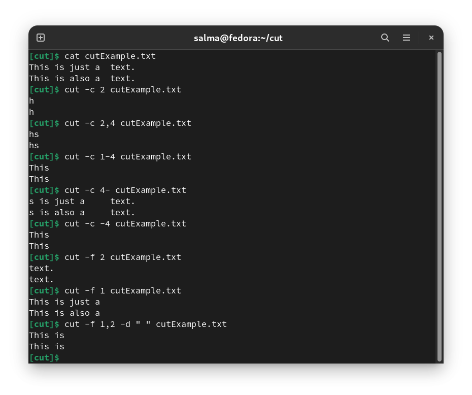
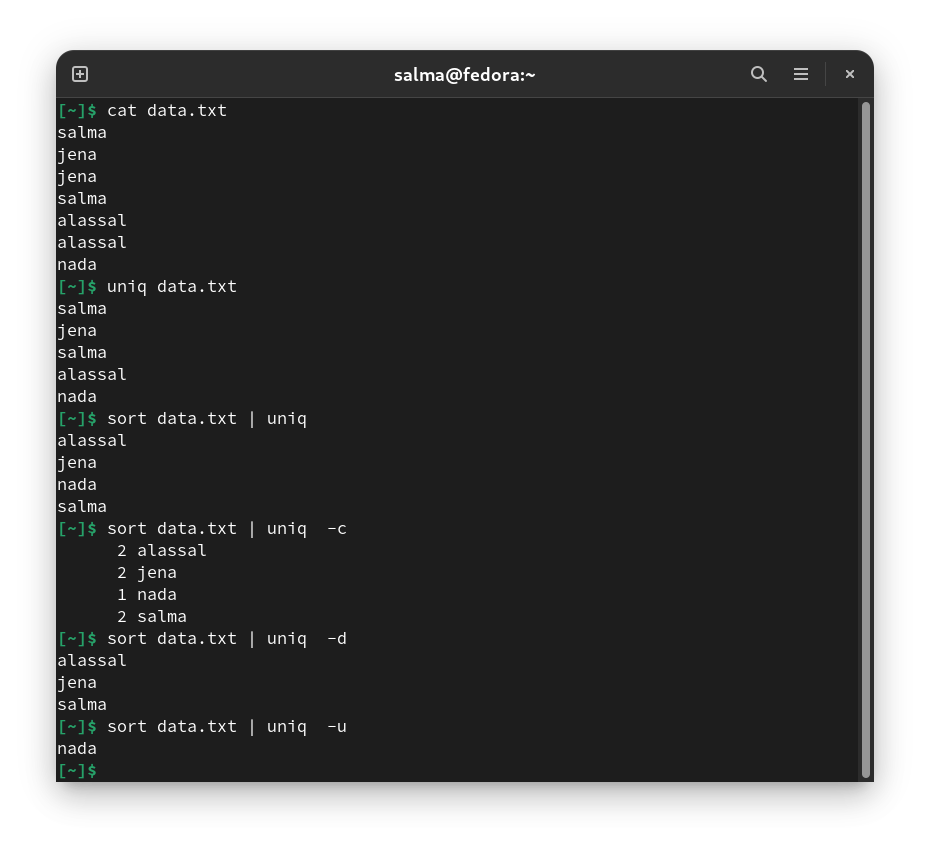
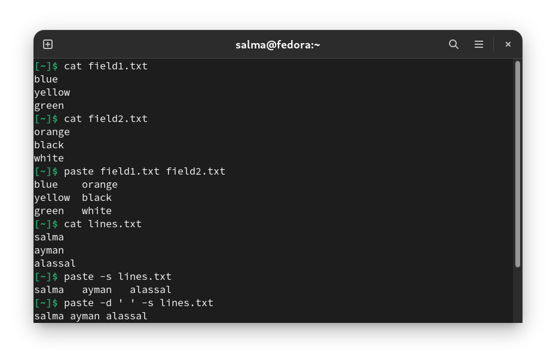

## Sort

Sort command is used to sort a file, arranging the records in a particular order. By default, the sort command sorts file assuming the contents are ASCII. 

| Command          | Description |
|------------------|-------------|
|`sort file`       |sort lines of text files.  |
|`sort -r file`    |reverse sort.              |
|`sort -n filename`|To sort a file numerically.|

--------------------------------------------------------
--------------------------------------------------------

## Cut

Cut is a command for cutting out the sections from each line of files and writing the result to standard output. It can be used to cut parts of a line by byte position, character and field.

**Syntax:** `cut Option [FILE]`

**Examples**

|       Command          | Description |
|------------------------|-------------|
|`cut -c 5 sample.txt`   |This outputs the 5th character in each line of the file.|
|`cut -c 2,7`            |This outputs the second and the 7th character in each line of the file.|
|`cut -c 5-10 sample.txt`|This outputs from 5th character to 10th character in each line of the file.|
|`cut -c 5- sample.txt`  |This outputs from 5th character to the end in each line of the file|
|`cut -c -5 sample.txt`  |This outputs from first character to 5th character in each line of the file|
|`cut -f 2 sample.txt`   |This outputs the second field. The `-f` or field flag cuts text based off of fields, by default it uses **TABs** as delimiters so everything separated by a TAB is considered a field.|
|`cut -f 1-3`            |This outputs the first three fields.|
|`cut -f 1 -d ";" sample.txt`|This will change the TAB delimiter to a ";" delimiter|

--------------------------------------------------------
--------------------------------------------------------

## Uniq

Uniq is the tool that helps to detect the adjacent duplicate lines and also deletes the duplicate lines.

Notice that uniq isn’t able to detect the duplicate lines unless they are adjacent to each other. The content in the file must be therefore sorted before using uniq or you can simply use `sort -u` instead of `uniq` command. 

**Syntax:** `uniq [Option] [File]`

**Examples**

| Command      | Description |
|--------------|-------------|
|`uniq file`   | Removes the consecutive duplicates |
|`uniq -c file`| Prints how many times a line was repeated by displaying a number as a prefix with the line|
|`uniq -d file`| Prints the repeated lines only.|
|`uniq -i file`| Makes the comparison case-insensitive.|
|`uniq -u`     | Print only unique lines.|

--------------------------------------------------------
--------------------------------------------------------

## tr

Tr (stands for translate) is a command line utility for **translating** or **deleting** characters. It supports a range of transformations including uppercase to lowercase, squeezing repeating characters, deleting specific characters and basic find and replace. 

**Syntax :** `tr [Option] SET1 SET2`

| Command       | Description |
|---------------|-------------|
|`tr a-z A-Z`   or   ` tr “[a-z]” “[A-Z]”`|translating all lower case characters to uppercase characters|
|`tr '{}' '()'` | Translates braces into parenthesis.|
|`tr -d 'w'`    | Delete specified characters|
|`tr -d "a-z"`  | Deletes all the lowercase characters.|
|`tr -s ' ' ' '`|To squeeze repeat occurrences of characters specified in a set use the `-s` option. This replace all sequences of multiple spaces with just one space|

--------------------------------------------------------
--------------------------------------------------------

## paste

It is used to join files horizontally (parallel merging) by outputting lines consisting of lines from each file specified, separated by tab as delimiter, to the standard output.

| Command                     | Description |
|-----------------------------|-------------|
|`paste file2 file2`          |to join files horizontally, separated by tab as delimiter by default|
|`paste -s sample2.txt`       | Merges all these lines into a single line with each line separated by **tab**.|
|`paste -d ' ' -s sample2.txt`| Merges all these lines into a single line with each line separated by space|
|`paste - - - file.txt`       | Combining three consecutive rows|

--------------------------------------------------------
--------------------------------------------------------
