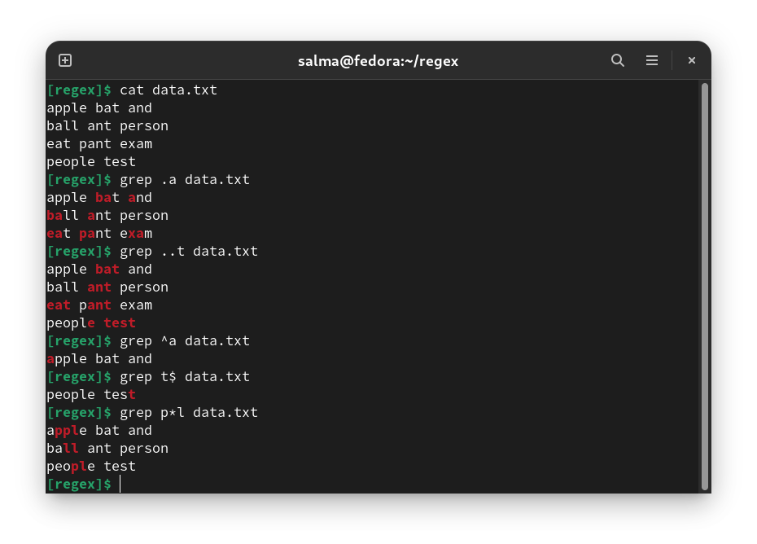
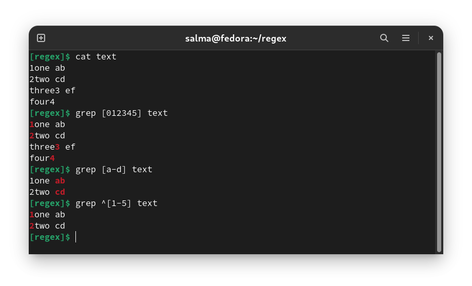
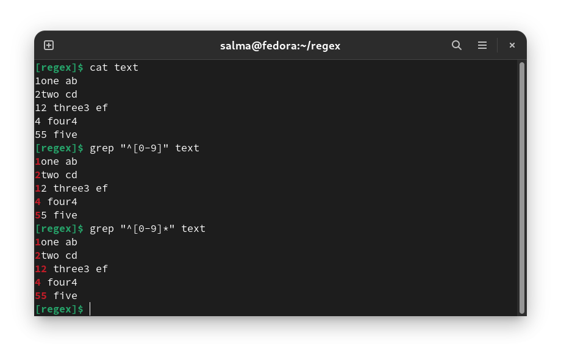
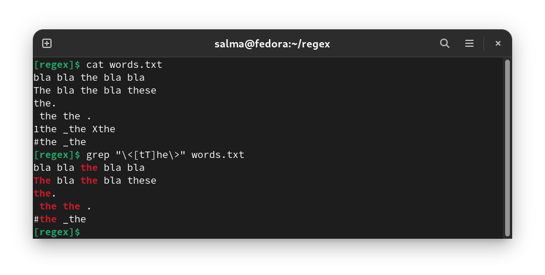
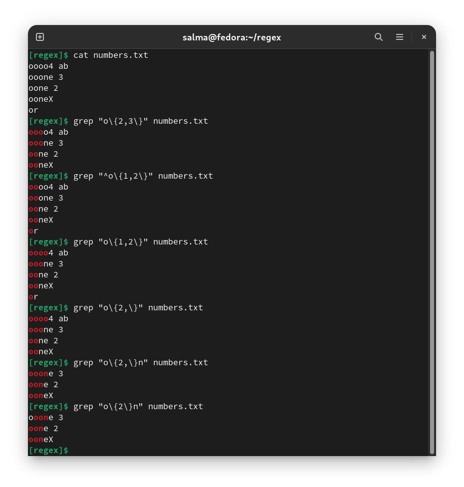
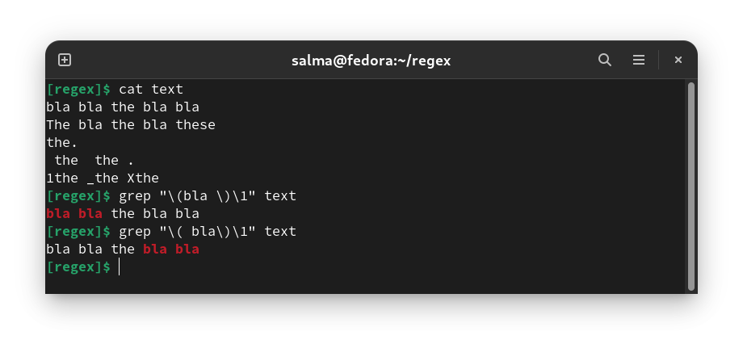
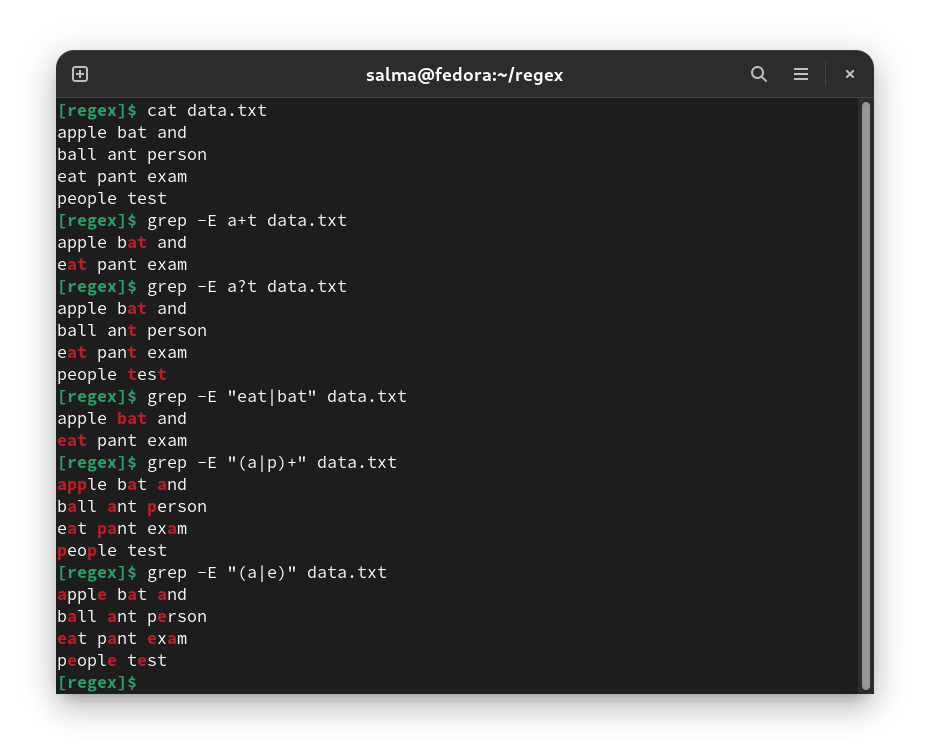
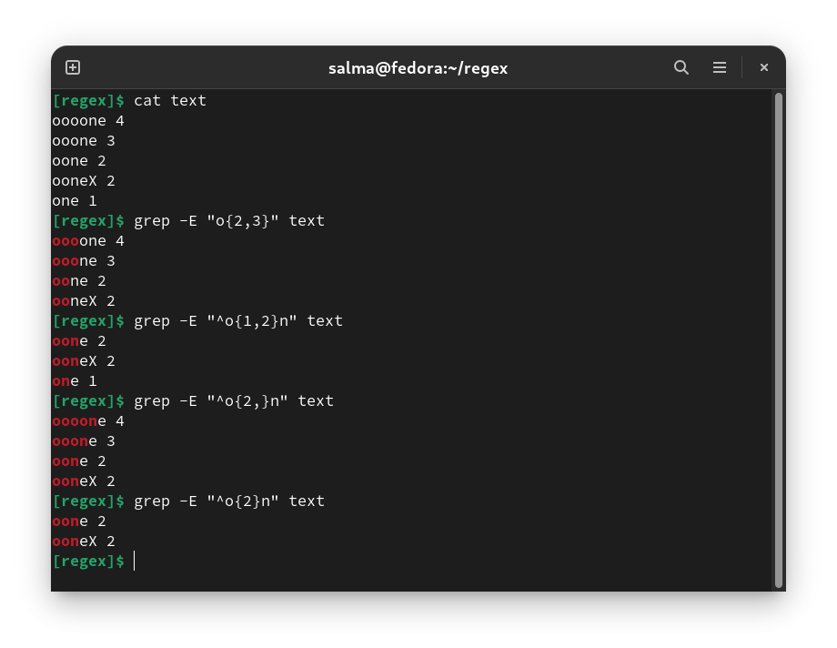

# Regular Expressions

- Regular Expressions are special characters which help search data and matching complex patterns.

- Regular expressions are shortened as **‘regexp’** or **‘regex’**. 

- Regular expressions **search for patterns on a single line, and not for patterns that start on one line and end on another**.

--------------------------------------------------------

# Regex Versions

- There are three versions of regular expressions syntax:

    - **BRE :** Basic Regular Expressions
    - **ERE :** Extended Regular Expressions
    - **PRCE:** Perl Regular Expressions

- Depending on tool or programs, one or more of these versions can be used but most use the "basic" regular expression :

    | Utility | Regular Expression Type |
    |---------|-------------------------|
    | vi	  |        Basic            |
    | sed	  |        Basic            |
    | grep	  |        Basic            |
    | csplit  |        Basic            |
    | dbx	  |        Basic            |
    | dbxtool |        Basic            |
    | more	  |        Basic            |
    | ed	  |        Basic            |
    | expr	  |        Basic            |
    | lex	  |        Basic            |
    | pg	  |        Basic            |
    | nl	  |        Basic            |
    | rdist	  |        Basic            |
    | awk	  |       Extended          |
    | nawk	  |       Extended          |
    | egrep	  |       Extended          |
    | EMACS	  |EMACS Regular Expressions|
    | PERL	  |PERL Regular Expressions |

--------------------------------------------------------

# Syntax

- Syntax of Regular Expression command: `Search/Read Command [Pattern] [File Name]`

    - **Search/Read Command:** We can use any searching or reading command in Linux like **vim, vi, sed, awk, find, grep**, etc.
    - **Pattern:** We need to provide the regular expression pattern in the syntax.
    - **File Name:** Input file.

--------------------------------------------------------

# Regex Special Characters

| Name                       |Character|
|----------------------------|---------|
|Backslash                   |   \     |
|Caret                       |   ^     |
|Dollar sign                 |   $     |
|Period or dot               |   .     |
|Vertical bar or pipe symbol |   \|    | 
|Question mark               |   ?     |
|Asterisk or star            |   *     |
|Plus sign                   |   +     |
|Opening parenthesis         |   (     |
|Closing parenthesis         |   )     |
|Opening square bracket      |   [     |
|Opening curly brace         |   {     |

- These special characters are often called **“metacharacters”**. Most of them are errors when used alone.

- If you want to use any of these characters as a **literal** in a regex, you need to **escape them with a backslash `\`**. 
    - E.g, If you want to match `1+1=2`, the correct regex is `1\+1=2`. Otherwise, the plus sign has a special meaning.
         - Note that `1+1=2`, with the backslash omitted, is a **valid regex**. So you won’t get an error message. But it doesn’t match `1+1=2`. It would match `111=2` in `123+111=234`, due to the special meaning of the plus character.

- Normally a backslash **turns off** the special meaning for a character. A period is matched by a "\." and an asterisk is matched by a "\*". If a backslash is placed before a `<`, `>`, `{`, `}`, `(`, `)`, or before a `digit`, the backslash **turns on** a special meaning. 

- If you forget to escape a special character where its use is not allowed, such as in `+1`, then you will get an error message.

- Most regular expression flavors treat the brace `{` as a literal character, unless it is part of a repetition operator like `a{1,3}`. So you generally do not need to escape it with a backslash, though you can do so if you want. 

- All other characters should not be escaped with a backslash. That is because the backslash is also a special character. The backslash in combination with a literal character can create a regex token with a special meaning. E.g. `\d` is a shorthand that matches a single digit from 0 to 9.

--------------------------------------------------------

# Basic Regular expressions

## First Four Symbols

| Symbol |      Description           |     
|--------|----------------------------|
|  `.`   | Replaces any character.    |
|  `^`   | Matches beginning of line. |
|  `$`   | Matches end of line.       |
|  `*`   | Matches **zero or more** instance of the preceding character.|

-----------------------------------------------------

## Specifying a Range of Characters with `[...]`

| Expression |          Description          | Example |
|------------|-------------------------------|---------|
|    `[]`    | To match specific characters. |`grep "[0123456]" file`    `grep "[0-6]" file`    `grep "[a-zA-Z0-9]" file` |
|

## Exceptions in a character set `[^...]`

- You can easily search for all characters **except** those in square brackets `[]` by putting a `^` as the first character after the `[`. 

## Repeating character sets with `*`

- The special character `*` matches zero or more copies. That is, the regular expression `"0*"` matches zero or more zeros, while the expression `"[0-9]*`" matches zero or more numbers.

- This explains why the pattern `"^#*"` is useless, as it matches any number of "#'s" at the beginning of the line, including zero. Therefore this will match every line, because every line starts with zero or more "#'s".

## Matching words with `\<` and `\>`

- Searching for a word isn't quite as simple as it at first appears. The string `"the"` will match the word **"other"**. You can put spaces before and after the letters and use this regular expression: `" the "`. However, this does not match words at the beginning or end of the line. And it does not match the case where there is a punctuation mark after the word.

- There is an easy solution. The characters `\<` and `\>` do "anchor" the expression between to only match if it is on a word boundary. The pattern to search for the word "the" would be `\<[tT]he\>`. The character before the "t" must be either a new line character, or **anything except a letter, number, or underscore**. The character after the "e" must also be a character other than a number, letter, or underscore or it could be the end of line character.

## Matching a specific number of sets with `\{min,max\}`

- To specify the **minimum** and **maximum** number of repeats. This is done by putting those two numbers between `\{` and `\}`. E.g, `\{1,5\}`. 

- Any numbers between **0 and 255** can be used. The second number may be omitted, which removes the upper limit. If the comma and the second number are omitted, the pattern must be duplicated the **exact number** of times specified by the first number.

## Backreferences - Remembering patterns with `\( \)` and `\n`

Another pattern that requires a special mechanism is searching for repeated words. The expression `"[a-z][a-z]"` will match any two lower case letters. If you wanted to search for lines that had two adjoining identical letters, the above pattern wouldn't help. You need a way of remembering what you found, and seeing if the same pattern occurred again. You can mark part of a pattern using `\(` and `\)`. You can recall the remembered pattern with "`\`" followed by a **single digit**. Therefore, to search for two identical letters, use `"\([a-z]\)\1"`.

- To detect 4-letter palindromes (e.g.: deed) : `\(.\)\(.\)\2\1`
- To detect 5-letter palindromes (e.g. "radar") : `\([a-z]\)\([a-z]\)[a-z]\2\1`

# Notes

- Like the anchors in places that can't be considered an anchor, the characters **"]"** and **"-"** do not have a special meaning if they directly follow `[`. Here are some examples:

    | Regular Expression |              	Matches                         |
    |--------------------|--------------------------------------------------|
    |       []	         |The characters "[]"                               |
    |       [0]	         |The character "0"                                 |
    |      [0-9]	     |Any number                                        |
    |      [^0-9]        |Any character other than a number                 |
    |      [-0-9]        |Any number or a "-"                               |
    |      [0-9-]        |Any number or a "-"                               |
    |      [^-0-9]       |Any character except a number or a "-"            |
    |      []0-9]        |Any number or a "]"                               |
    |      [0-9]]        |Any number followed by a "]"                      |
    |      [0-9-z]       |Any number,or any character between "9" and "z".  |
    |     [0-9\-a\]]     |Any number, or a "-", a "a", or a "]"             |

- You must remember that modifiers like **"*"** and **"\{1,5\}"** only act as modifiers if they follow a character set. If they were at the beginning of a pattern, they would not be a modifier. Here is a list of examples, and the exceptions:

| Regular Expression |                      	Matches                                |
|--------------------|-----------------------------------------------------------------| 
|        `*`	     | Any line with an asterisk                                       |
|        `\*`	     | Any line with an asterisk                                       |
|        `\\`	     | Any line with a backslash                                       |
|        `^*`	     | Any line starting with an asterisk                              |
|       `^A*`	     | Any line                                                        |
|       `^A\*`	     | Any line starting with an "A*"                                  |
|       `^AA*`	     | Any line if it starts with one "A"                              |
|      `^AA*B`	     | Any line with one or more "A"'s followed by a "B"               |
|    `^A\{4,8\}B`	 | Any line starting with 4, 5, 6, 7 or 8 "A"'s followed by a "B"  |
|    `^A\{4,\}B`	 | Any line starting with 4 or more "A"'s followed by a "B"        |
|    `^A\{4\}B`	     | Any line starting with "AAAAB"                                  |
|     `\{4,8\}`	     | Any line with "{4,8}"                                           |
|      `A{4,8}`	     | Any line with "A{4,8}"                                          |

- The Anchor Characters: ^ and $

| Pattern | Matches                         |
|---------|---------------------------------|
|   ^A    |	"A" at the beginning of a line. |
|   A$    |	"A" at the end of a line.       |
|   A^    |	"A^" anywhere on a line.        |
|   $A    |	"$A" anywhere on a line.        |
|   ^^    |	"^" at the beginning of a line. |
|   $$    |	"$" at the end of a line.       |

-------------------------------------------------
-------------------------------------------------

# Extended Regular Expressions

- Two programs use the extended regular expressions: **egrep** and **awk**. With these extensions, those special characters preceded by a backslash **no longer have the special meaning**: `\{ , \}`, `\<, \>`, `\(, \)` as well as the `\digit`. 

- The character `?` matches **0** or **1** instances of the character set before, and the character `+` matches **one or more** copies of the character set. 

- Extended regular expressions lets you match a choice of patterns `"(..|..)"`. As an example, you can `egrep` to print all **From:** and **Subject:** lines from your incoming mail: `egrep '^(From|Subject): ' /usr/spool/mail/$USER`

    - All lines starting with **"From:"** or **"Subject:"** will be printed. There is no easy way to do this with the basic regular expressions. You could try `"^[FS][ru][ob][mj]e*c*t*: "` and hope you don't have any lines that start with `"Sromeet:"`. 
    
- One extra bonus with extended regular expressions is the ability to use the `*`, `+` , and `?` modifiers after a `(...)` grouping. The following will match **"a simple problem,"** **"an easy problem,"** as well as **"a problem"** : `egrep "a[n]? (simple |easy )?problem" data`

    - Note the space after both "simple" and "easy".

## Interval Regular Expressions

These expressions tell us about the number of occurrences of a character in a string :

| Expression |Description |
|------------|------------|
|   {n}	     | Matches the preceding character appearing **‘n’ times exactly** in a string **one after the other**. |
|  {n,m}     | Matches the preceding character appearing **‘n’ times but not more than m**. |
|   {n, }    | Matches the preceding character only when it appears **‘n’ times or more**.|

> Note: You need to add `-E` with interval regular expressions.

-----------------------------------------------------
-----------------------------------------------------

# POSIX Character Sets

- POSIX added newer and more portable ways to search for character sets. Instead of using `[a-zA-Z]` you can replace `'a-zA-Z'` with `[:alpha:]`. The advantage is that this will match **international** character sets. You can mix the old style and new POSIX styles, such as `grep '[1-9[:alpha:]]'`

- Here is the list :

| Character Group |	           Meaning               |
|-----------------|----------------------------------|
|   [:alpha:]	  | Alphabetic                       | 
|   [:lower:]	  | Lower case character             | 
|   [:upper:]	  | Upper Case Character             | 
|   [:digit:]	  | Digit                            | 
|   [:alnum:]	  | Alphanumeric                     | 
|   [:cntrl:]	  | Control Character                | 
|   [:space:]	  | Whitespace                       | 
|   [:blank:]	  | whitespace, tabs, etc.           |
|   [:punct:]	  | Punctuation                      | 

> Note that some people use `[[:alpha:]]` as a notation, but the outer `[...]` specifies a character set.

-------------------------------------------------
-------------------------------------------------

# Perl Extensions

| Class (REGEX) |     Type      |	          Meaning                         |
|---------------|---------------|---------------------------------------------|
|      \t	    | Character Set | tab                                         |
|      \n	    | Character Set | newline                                     |
|      \e	    | Character Set | escape                                      |
|      \033	    | Character Set | octal                                       |
|      \x1B	    | Character Set | hex                                         |
|      \c[	    | Character Set | control                                     |
|      \l	    | Character Set | lowercase                                   |
|      \u	    | Character Set | uppercase                                   |
|      \Q	    | Character Set | quote                                       |
|      \w	    | Character Set | Match a **"word"** character. Word characters include alphanumeric characters (a-z, A-Z and 0-9) and underscores (_).|
|      \W	    | Character Set | Match a **non-word** character. Non-word characters include characters other than alphanumeric characters (a-z, A-Z and 0-9) and underscores (_).|
|      \s	    | Character Set | Match a **whitespace** character `[ \r\n\t\f ]`.|
|      \S	    | Character Set | Match a **non-whitespace** character        |
|      \d	    | Character Set | Match a **digit** character                 |
|      \D	    | Character Set | Match a **non-digit** character             |
|      \b	    |    Anchor     | Match a **word boundary**                   |
|      \B	    |    Anchor     | Match a **non-(word boundary)**             |
|      \A	    |    Anchor     | Match only at **beginning** of string       |
|      \z	    |    Anchor     | Match only at **end** of string             |

-------------------------------------------------
-------------------------------------------------

# Potential Problems

- The "\<" and "\>" characters were introduced in the vi editor. The other programs didn't have this ability at that time. Also the "\{min,max\}" modifier is new and earlier utilities didn't have this ability. 

- The other potential point of confusion is the extent of the pattern matches. Regular expressions match the longest possible pattern. That is, the regular expression `A.*B` matches `"AAB"` as well as `"AAAABBBBABCCCCBBBAAAB"`. This doesn't cause many problems using grep, because an oversight in a regular expression will just match more lines than desired. If you use sed, and your patterns get carried away, you may end up deleting more than you wanted to.

-------------------------------------------------
-------------------------------------------------

# Other Examples

- To match any line of text that contains exactly one number is : `^[0123456789]$`
- To match a single character that is a letter, number, or underscore is : `[A-Za-z0-9_]`
- To match all characters **except** vowels : `[^aeiou]`
- To match the lines that ends with '.': `\.$`

- To match 4, 5, 6, 7 or 8 lower case letters is `[a-z]\{4,8\}`
- To match the character w 3,4 or 5 times: `w{3,5}`
- To match the character x, y or z 5 or more times : `[xyz]{5,}`
- To match any digits 1, 2, 3, or 4 times : `\d{1, 4}`
- To match any digit exactly 4 times: `\d{4}`
- To match the character x, y or z 1 or more times : `[xyz]+`
- To match any digit 1 or more times : `\d+`
- To match 3 or more consecutive repetitions of `ok` : `(ok){3}`
- To match any of the following characters: a, b, c, d, e, f, A, B, C, D, E, or F : `([a-f]|[A-F])`
- To match 00, 11, 22, 33, 44, 55, 66, 77, 88 or 99 : `(\d)\1`
- To match the characters x, y or z 0 or more times: `[xyz]*`
- To match any digit 0 or more times: `\d*`
- To match the character `w` exactly 3 times: `w{3}`
- To match the string of length 5 consisting of characters `{x, y, z}`. For example it will match `xxxxx`, `xxxyy` and `xyxyz` : `[xyz]{5}`
- To match **http** and **https** : `https?`

-------------------------------------------------
-------------------------------------------------

## Resources

- https://www.grymoire.com/Unix/Regular.html#uh-12
- https://www.javatpoint.com/linux-regular-expression

- [Basic vs Extended Regular Expressions](https://www.gnu.org/software/grep/manual/html_node/Basic-vs-Extended.html)
- [Basic & Extended Regular Expression](https://www.gnu.org/software/sed/manual/html_node/BRE-vs-ERE.html)