# Sed

Sed command stands for **stream editor** and it can perform lots of functions on file like **searching**, **find** and **replace**, **insertion** or **deletion**. Though most common use of SED command is for substitution or for find and replace. By using SED you can edit files even without opening them, which is much quicker way to find and replace something in file, than first opening that file in VI Editor and then changing it.

### Syntax

`sed Options... [Script] [File...]`

### The Substitute Command `s`

**Syntax :** sed 's/pattern/Replacement_string/'

- `s` for Substitution **changes all occurrences** of the regular expression **into a new value**.

- **Examples :**
    - Changing the word "day" to "night": `sed s/day/night/ file`
    - `echo Sunday | sed 's/day/night/'` : This would output the word **"Sunnight"** because sed found the string "day" in the input.

- By default, the sed command replaces the first occurrence of the pattern in each line and it won’t replace the second, third…occurrence in the line.

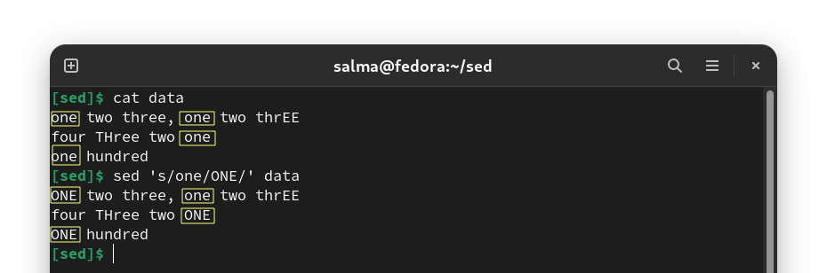

-----------------------------------------------------

# Sed Pattern Flags

## Find & Replace 

### `/g` - Replacing all the occurrence in a line

**Example:** `sed 's/unix/linux/g' file.txt`

### `/n` Replacing the nth occurrence in a line

**Syntax :** `sed 's/pattern/string/n' file.txt`

**Example:** `sed 's/unix/linux/2' file.txt`
 
### `/ng` Replacing from nth occurrence to all occurrences in a line

**Syntax :** `sed 's/pattern/string/ng' file.txt`

**Example:** `sed 's/unix/linux/3g' file.txt`

### `n s/` Replacing string on a specific line number 

**Syntax :** sed 'n s/pattern/string/' file.txt

**Example:** `sed '3 s/unix/linux/' file.txt`

### `1,3 s/` Replacing string on a range of lines 

**Syntax :** `sed 'n,m s/pattern/string/' file.txt`

**Examples:** 
    - `sed '1,3 s/unix/linux/' file.txt`
    - `sed '2,$ s/unix/linux/' file.txt` Here `$` indicates the last line in the file.

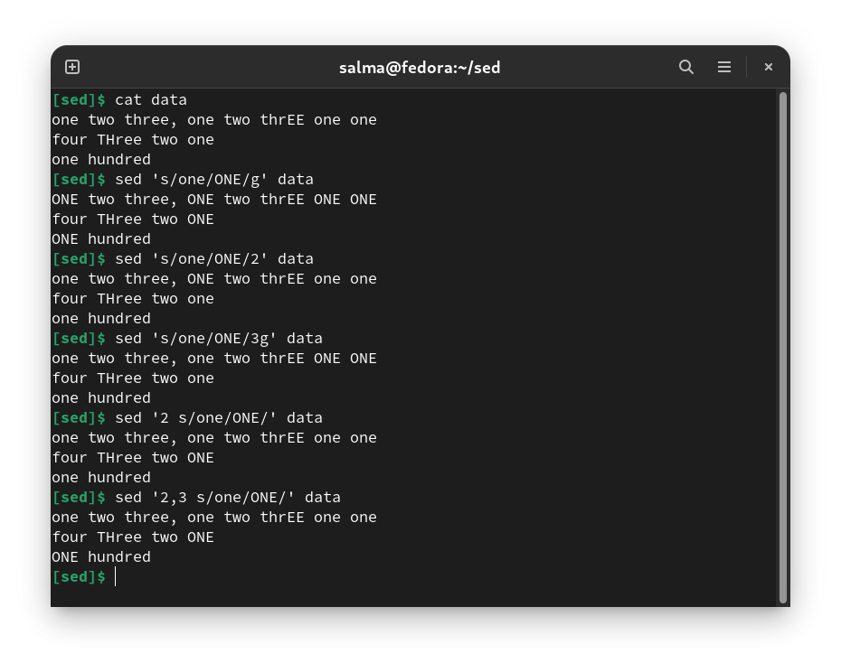

### `/p` Duplicating the replaced line 

**Syntax :** `sed 's/pattern/string/p' file.txt`

**Example:** `sed 's/unix/linux/p' file.txt`

The `/p` print flag prints the replaced line **twice** on the terminal. If a line does not have the search pattern and is not replaced, then the /p prints that line **only once**.

### `-n` `/p` Printing only the replaced lines 

**Syntax :** `sed -n 's/pattern/string/p' file.txt`

**Example:** `sed -n 's/unix/linux/p' file.txt`

Use the -n option along with the /p print flag to display only the replaced lines. If you use -n alone without /p, then the sed does not print anything.

### `/I` - Ignore case

To make the pattern match case-insensitive. This will match abc, aBc, ABC, AbC, etc.

**Syntax :** `sed 's/pattern/string/I' file.txt`

**Example:** `sed 's/unix/linux/i' file.txt`

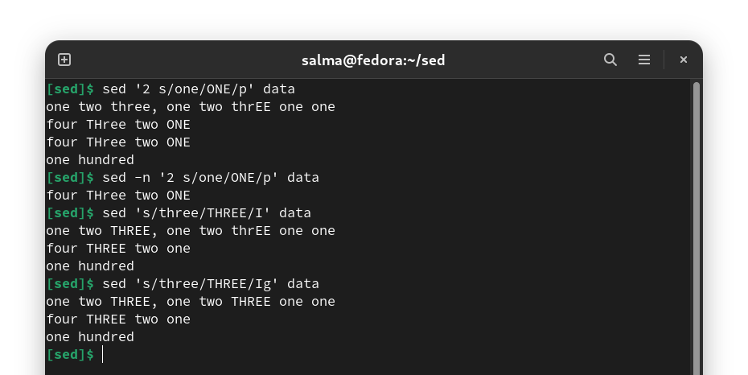

### Replace on a line which matches a pattern.

**Example :** `sed '/linux/ s/unix/centos/' file.txt`

Here the sed command first looks for the lines which has the pattern “linux” and then replaces the word “unix” with “centos”.

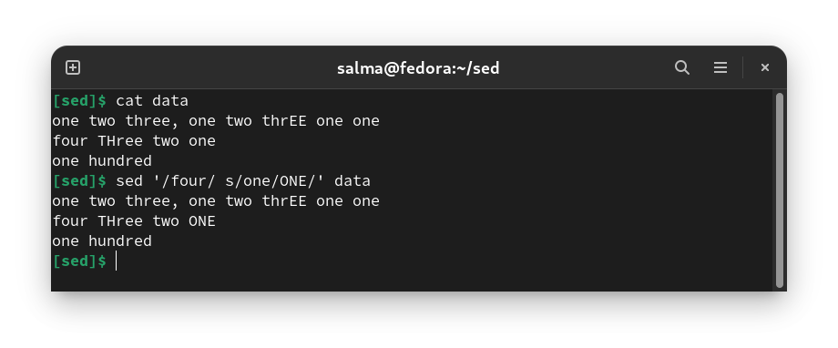

### `/c` Change a line

The “c” command to sed tells it to replace an entire line with a new line.

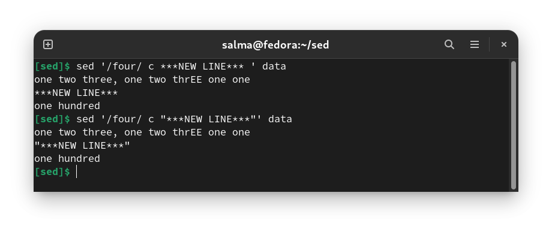

-----------------------------------------

## Deletion 

### To delete a particular line 

**Syntax :** `sed 'nd' filename.txt`

**Example:** `sed '5d' filename.txt`

### To delete the last line

**Syntax:** `sed '$d' filename.txt`

### To delete line from range x to y

**Syntax:** `sed 'x,yd' filename.txt`

**Example:** `sed '3,6d' filename.txt`

### To delete from nth to last line

**Syntax:** `sed 'nth,$d' filename.txt`

**Example:** `sed '12,$d' filename.txt`

### To delete pattern matching line

**Syntax:** `sed '/pattern/d' filename.txt`

**Example:** `sed '/abc/d' filename.txt`

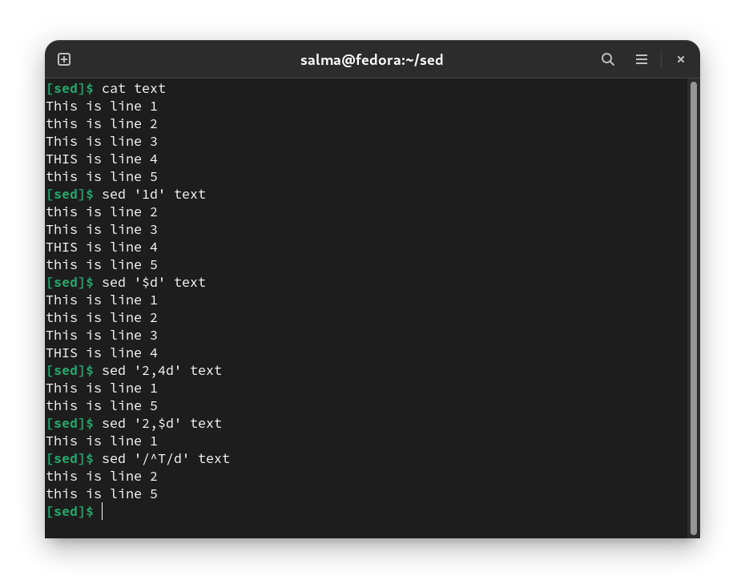

-----------------------------------------

## Insertion

### Using & as the matched string

There might be cases where you want to search for the pattern and replace that pattern by adding some extra characters to it. In such cases `&` comes in handy. The & represents the matched string.

**Example:** `sed 's/unix/{&}/' file.txt`

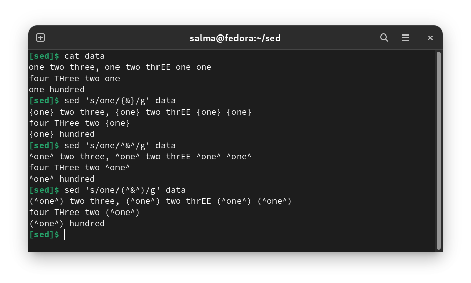

### `/a` Add a line after a match

The `a` command to sed tells it to add a new line after a match is found.

**Example :** `sed '/unix/ a "Add a new line"' file.txt`

### `/i` Add a line before a match

The “i” command to sed tells it to add a new line before a match is found.

**Example :** `sed '/unix/ i "Add a new line"' file.txt`

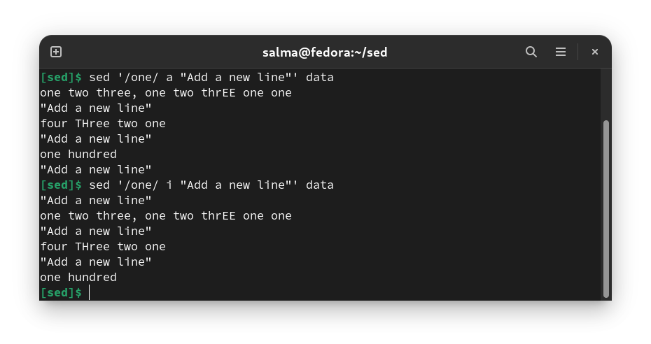

### Duplicating lines

You can make the sed command to print each line of a file two times.

**Syntax :** `sed 'p' file.txt`

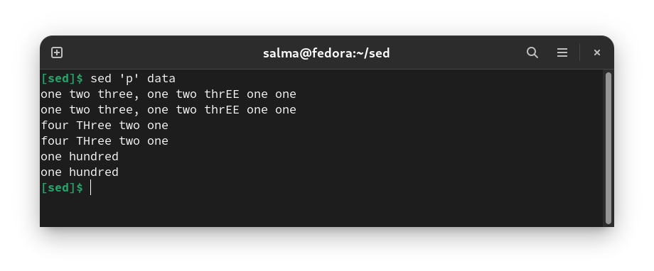

------------------------------------------

# The slash as a delimiter

The character after the s is the delimiter. It is conventionally a slash. **It can be anything you want**, however. If you want to change a pathname that contains a slash - say `/usr/local/bin` to `/common/bin` - you could use the backslash to quote the slash:

`sed 's/\/usr\/local\/bin/\/common\/bin/' file.txt`

Or you use an underline instead of a slash as a delimiter:

`sed 's_/usr/local/bin_/common/bin_' file.txt`

Or colons:

`sed 's:/usr/local/bin:/common/bin:' file.txt`

Or "|" :

`sed 's|/usr/local/bin|/common/bin|' file.txt`

Pick one you like. As long as it's not in the string you are looking for, anything goes. And remember that you need three delimiters. If you get a "Unterminated `s' command" it's because you are missing one of them.

---------------------------------------------------------------

# Running multiple sed commands.

- You can run multiple sed commands by :

    - Piping the output of one sed command as input to another sed command.
        - **Example :** `sed 's/unix/linux/' file.txt | sed 's/os/system/'`
    
    - Using `-e` option
        - **Example :** `sed -e 's/unix/linux/' -e 's/os/system/' file.txt`

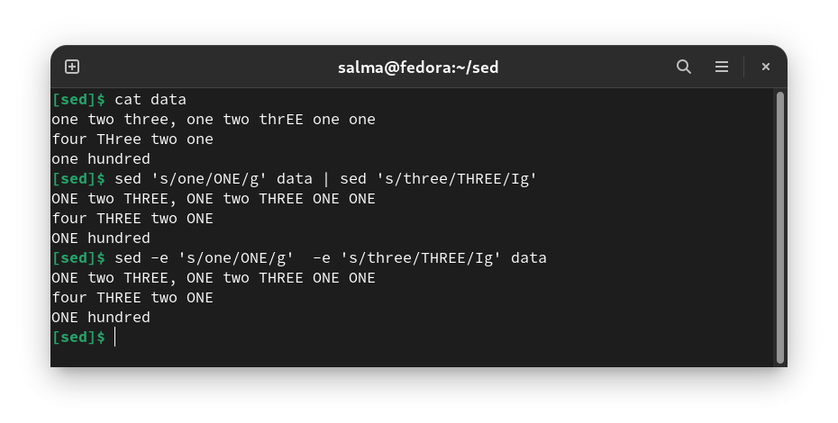

> Sed uses the -e option to specify that the following string is an instruction or set of instructions. If there is only a single instruction contained in the string, then this may be omitted.

----------------------------------------------------------------

# Sed as grep command

You can make sed command to work as similar to grep command :

  - `grep 'word' file.txt` == `sed -n '/word/ p' file.txt` 
      
  - `grep -v 'word' file.txt` == `sed -n '/word/ !p' file.txt`

     The `!` here inverts the pattern match.

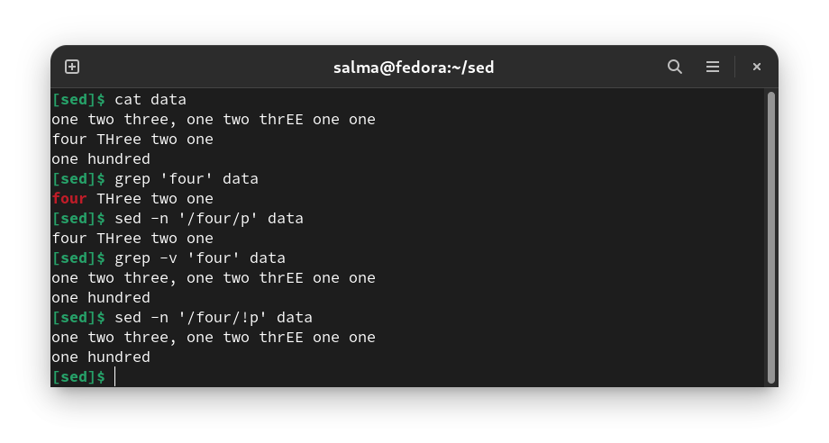

-------------------------------------------------------------------

# Sed as tr command

The sed command can be used to convert the lower case letters to upper case letters by using the transform `y` option.

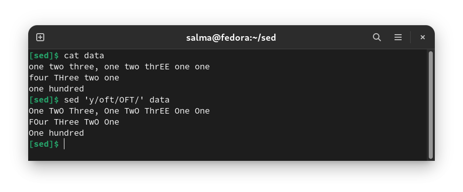

-----------------------------------------------------------------

# Examples of sed operators

| Notation                        | Effect |
|---------------------------------|--------|
| `/^$/d`                         | Delete all blank lines. |
| `s/ *$//`                       | Delete all spaces at the end of every line. |
| `5i 'Linux is great.' file.txt` | Inserts 'Linux is great.' at line 5 of the file file.txt. |

-----------------------------------------------------------------
-----------------------------------------------------------------

## Resources

- https://www.geeksforgeeks.org/sed-command-in-linux-unix-with-examples/
- https://www.folkstalk.com/2012/01/sed-command-in-unix-examples.html