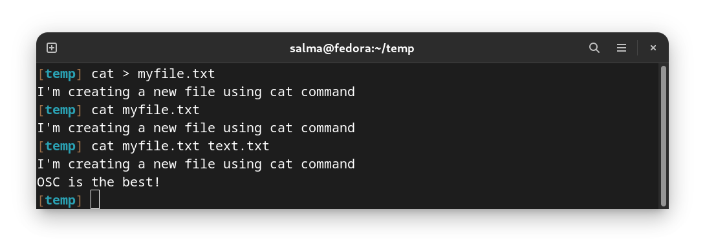
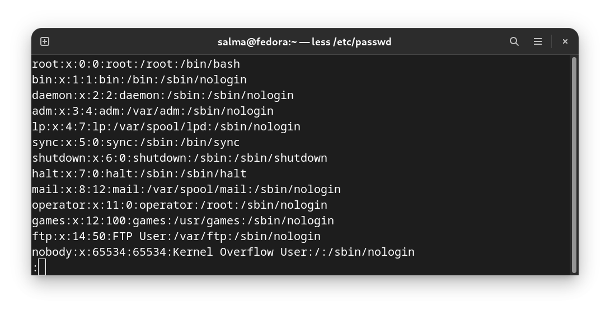
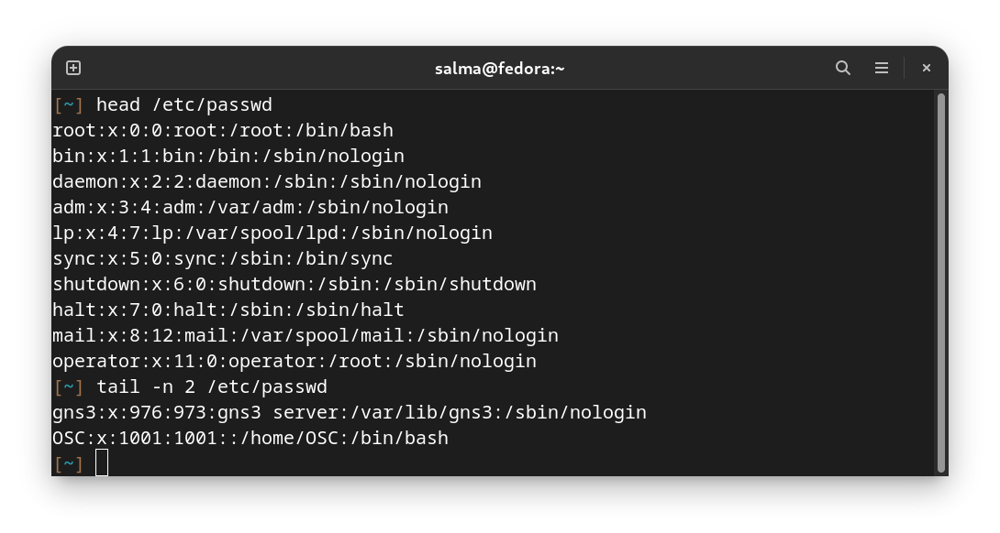
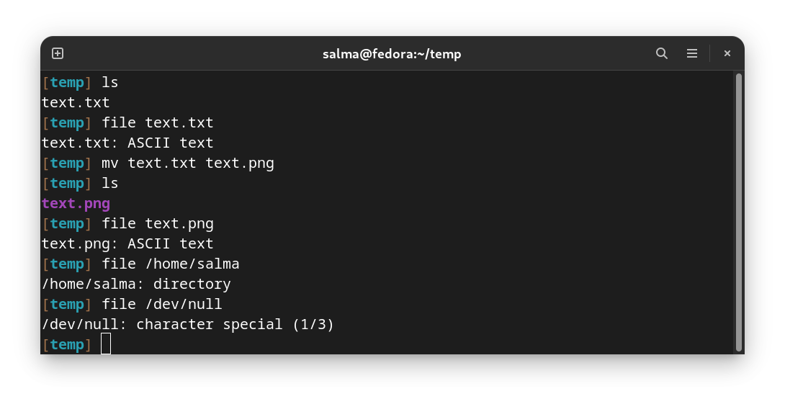

# VIEWING THE CONTENTS OF FILES

# cat Command

One of the most simple and frequently used commands in Linux is `cat`.

The cat command allows you to **create** single or multiple files, **view** the contents of files, **concatenate** the contents from multiple files, and redirect contents of the file to a terminal or files.

### Create a new file

**Steps:**

- `cat > filename`
- Add content
- Press `ctrl + d` to return to command prompt.

### View the contents of the file

`cat filename`

### Display the contents of multiple files

`cat file1 file2 file3`

You can also combine n files into one file : `cat file1 file2 > newfilename`

---------------------------------------------------------------

# less Command

Some files are very long and can take up more room to display than that provided by the terminal. The `cat` command does not display the contents of a file as pages. The `less` command displays one page of a file at a time and lets you scroll at your leisure.

The `less` command allows you to page forward and backward through files that are longer than can fit on one terminal window. Use the `UpArrow` key and the `DownArrow` key to scroll up and
down. Press `q` to exit the command.

---------------------------------------------------------------

# head & tail Commands

Another case might be wanting to view the first *n* lines of a file or the last *n* lines. Here, you can use `head` & `tail` commands to get your job done.

The head and tail commands display the beginning and end of a file, respectively. By default these commands display `10` lines of the file, but they both have a `-n` option that allows a different number of lines to be specified. The file to display is passed as an argument to these commands.

> You can also use `tail -2` instead of `tail -n 2`

---------------------------------------------------------------

# file Command

Linux does not require file name extensions to classify files by type. The Linux `file` command helps determine the type of file and its data by scanning the beginning of a file's contents and displays what type it is. 

---------------------------------------------------------------