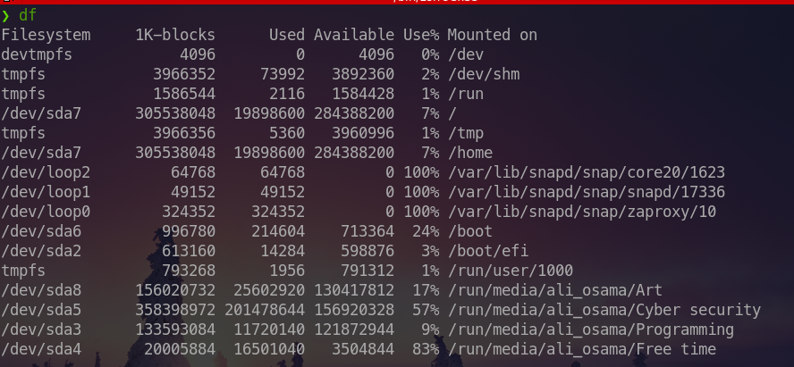
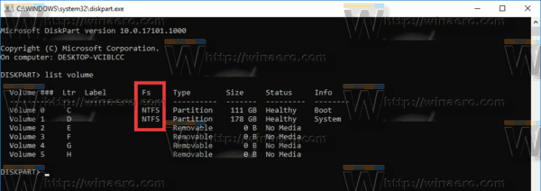
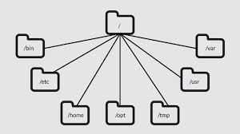

## Filesystem Types

There is many file system types but the most used file systems are : 

	EXT4 & BTRFS : Linux
	NTFS & FAT : Windows 

### Note : 

- Linux supports almost 100 filesystems including NTFS & FAT so you can read your Windows Partitions on Linux . 

- Windows doesn't support EXT4 & BTRFS so you can't read Linux partitions on windows unless you use a software that handles this issue like : [paragon](https://www.paragon-software.com/us/business/btrfs-for-windows/#:~:text=Btrfs%20for%20Windows%20by%20Paragon%20Software%20is%20a%20driver%20that,with%20Btrfs%20for%20Windows%20driver.) .

### To determine your current filesystems type 
- Linux 
```bash 
df
```



- Windows 
```
diskpart 

list volume
```



## Linux Filesystem Hierarchy 

In Linux `/` is the root of the file system that all the other direcotries (folders) branchs from .



`/`       also used as a directory separator 
Ex :
`/usr/share/`

## Important directories of the Filesystem

`/home` This is the folder that contains all the users that use the system except the root (super user)
`/root` Home Directory for the super user
`/bin` Include the essential commands of linux like : `cd` & `ls` 
`/sbin` Include administartive commands like : 
`ifconfig` &`arp`
`/lib` Hold the libraries of the files that the binaries can use
`/tmp` Contains tmporary files .
Files in this directory will be removed after reboot . 
`/var` Contains variable and dynameic data that may be modified by active processes 
Ex : cache files & databases & websites
`/usr` Contains installed software installed by the user 
`/proc` Information about currently running processes
`/boot` Contains the necessary files that is required for the boot process
`/dev` contains all the devices in your computer and is used to access the hardware
`/run` Is designed to allow applications to store the data they require in order to operate(Runtime data) 
`/opt` Optional application software packages

### `/dev` VS `/run/media`
`/dev` contains all the devices on your computer including partitions that are not mounted
`/run/media` contains the mounted partitions only 
