# Git

## A Short History

The Git project started with Linus Torvalds scratching the very serious itch of needing a fast, efficient and massively distributed source code management system for Linux kernel development.

The kernel team had moved from a patch emailing system to the proprietary BitKeeper SCM in 2002. That ended in April 2005 when BitMover stopped providing a free version of its tool to the open source community because they felt some developers had reverse engineered it in violation of the license.

Since Linus had (and still has) a passionate dislike of just about all existing source code management systems, he decided to write his own. Thus, in April of 2005, Git was born. A few months later, in July,maintenance was turned over to Junio Hamano, who has maintained the project ever since.

> “I’m an egotistical bastard, and I name all my projects after myself. First Linux, now git.” –Linus


The first commit message for the Git project was 
>‘initial version of
“git”, the information manager from hell’ – Linus, 4/7/05


## What's Git?
Git is a stupid content tracker, Git tracks content – files and directories.\
It is at its heart a collection of simple tools that implement a tree history storage and directory content management system.\
It is simply used as an **SCM (Software Configuration Management)**, not really
designed as one.

> “In many ways you can just see git as a filesystem — it’s content-
addressable, and it has a notion of versioning, but I really really
designed it coming at the problem from the viewpoint of a
filesystem person (hey, kernels is what I do), and I actually have
absolutely zero interest in creating a traditional SCM system.” –
Linus (http://marc.info/?l=linux-kernel&m=111314792424707)

When most SCMs store a new version of a project, they store the
code delta or diff. When Git stores a new version of a project, it stores
a new tree – a bunch of blobs of content and a collection of point-
ers that can be expanded back out into a full directory of files and
subdirectories. If you want a diff between two versions, it doesn’t add
up all the deltas, it simply looks at the two trees and runs a new diff
on them.

This is what fundamentally allows the system to be easily distributed
– it doesn’t have issues figuring out how to apply a complex series of
deltas, it simply transfers all the directories and content that one user
has and another does not have but is requesting.\
It is efficient about
it – it only stores identical files and directories once and it can com-
press and transfer its content using delta-compressed packfiles – but
in concept, it is a very simple beast. Git is at it’s heart very stupid-
simple.

## Pros of Git?

### Non-linear development:

Git is optimized for cheap and efficient branching and merging.\
It is built to be worked on simultaneously by many people, having mul-
tiple branches developed by individual developers, being merged,
branched and re-merged constantly.\
**Because of this**, branching is
incredibly cheap and merging is incredibly easy

### Distributed development:
Git is built to make distributed development simple.\
No repository is special or central in Git – each clone is basically equal and could
generally replace any other one at any time.\
It works completely offline or with hundreds of remote repositories that can push to and/
or fetch from each other over several simple and standard protocols.

### Efficiency:
Git is very efficient. Compared to many popular SCM systems, it
seems downright unbelievably fast. Most operations are local, which
reduces unnecessary network overhead. Repositories are generally
packed very efficiently, which often leads to surprisingly small repo
sizes.
>The Ruby on Rails Git repository download, which includes the
full history of the project – every version of every file, weighs in at
around **13M**, which is not even twice the size of a single checkout of
the project (**~9M**). The Subversion server repository for the same
project is about **115M.**

Git also is efficient in its network operations – the common Git transfer protocols transfer only packed versions of only the objects that have changed. It also won’t try to transfer content twice, so if you have the same file under two different names, it will only transfer the
content once.

## Overview

Each Git repository contains **4** components:
1. The working directory
2. The staging area
3. Commit history
4. Development branches

### Working Directory
where you actually edits files, compile code, and otherwise develop your project.
For all intents and purposes, you can treat the working directory as a normal folder. Except, you now have access to all sorts of commands that can record, alter, and transfer the contents of that folder.

<p align="center">
  
</p>


### Staging Area
An intermediary between the working directory and the
project history.\
Instead of forcing you to commit all of your changes at once, Git
lets you group them into related changesets. Staged changes are not yet part of
the project history.

<p align="center">
  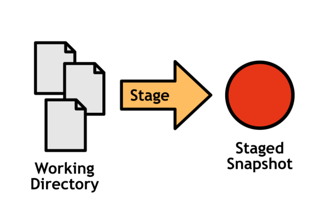
</p>

### Commit History

Once you’ve configured your changes in the staging area, you can commit it to
the project history where it will remain as a “safe” revision. Commits are “safe” in
the sense that Git will never change them on its own, although it is possible for
you to manually rewrite project history.

<p align="center">
  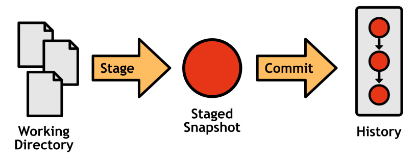
</p>

### Development Branches
So far, we’re still only able to create a linear project history, adding one commit
on top of another. Branches make it possible to develop multiple unrelated
features in parallel by forking the project history.

<p align="center">
  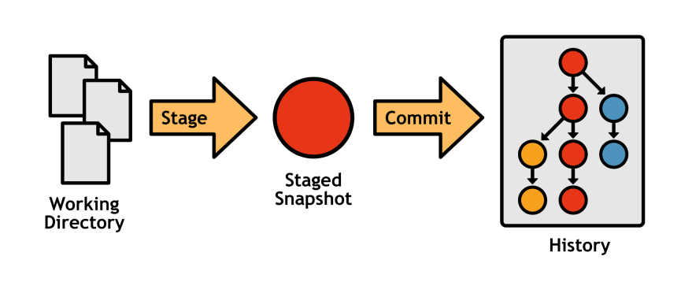
</p>

## Installation

### Windows

Download the installer from [git-scm.com](https://git-scm.com/downloads)

### Linux

#### Debian/Ubuntu

```bash
sudo apt install git
```

#### Fedora
```bash
sudo dnf install git 
```

#### Arch
```bash
sudo pacman -S git
```

## Configuration

you can set options with the `git config` command.\
or by manually editing the `~/.gitconfig` file, in your home directory.

### User Information
The first thing you want to do when you install git is to introduce yourself to it.\
git records this information with your commits, and third-party services like GitHub use this information to identify you.

```bash
git config --global user.name "John Doe"
git config --global user.email "John@example.com"
```

the `--global` flag records options in the `~/.gitconfig` file, which applies to all projects on your system.\

### Editor
By default, git will use your system’s default text editor.\
You can change this by setting the `core.editor` option.

```bash
git config --global core.editor "code"
```
### Aliases
By default, Git doesn’t come with any shortcuts, but you can add your own by
aliasing commands. If you’re coming from an SVN background, you’ll appreciate
the following bindings:
```bash
git config --global alias.st status
git config --global alias.ci commit
git config --global alias.co checkout
git config --global alias.br branch
```
Learn more by running the `git help config` in your Git Bash prompt.

### Credentials

Git will sometimes need credentials from the user in order to perform operations; for example, it may need to ask for a username and password in order to access a remote repository over HTTP. 

To avoid inputting these credentials repeatedly:
  - Make Git store the username and password, and it will never ask for them : `git config --global credential.helper store`
  - Save the username and password for a session (cache it) : `git config --global credential.helper cache`
  - You can also set a timeout for the above setting : `git config --global credential.helper 'cache --timeout=600'`

## Getting Started

### Creating a Repository

#### Existing Directory
If you have an existing project directory that you want to track with Git, you can go into the directory and type:
```bash
git init
```
This will create a new subdirectory named `.git` that contains all of your necessary repository files – a Git repository skeleton. At this point, nothing in your project is tracked yet.

#### Cloning an Existing Repository

If you want to get a copy of an existing Git repository – for example, a project you’d like to contribute to – the command you need is `git clone`.
```bash
git clone
```


### Recording Changes to the Repository

#### Staging
is the process of moving changes from the working directory to the staged snapshot.

<p align="center">
  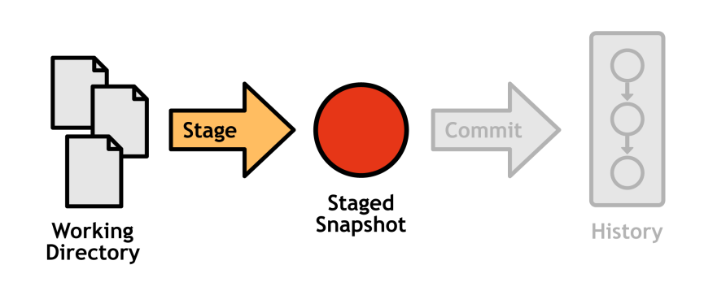
</p>

To add new or modified files from working directory to staging area, use
```bash
git add <file>
```
To add all new or modified files from working directory to staging area, use
```bash
git add .
git add -A
git add --all
```
To add files with a specific extension from working directory to staging area, use
```bash
git add *.<extension>
```

to remove files from staging area, use
```bash
git rm --cached <file>
```

Inspect the contents of the staging area with
```bash
git status
# or
git status -s
# or git status --short
```

output will look like this:
```bash
# on branch <branch-name>
# Changes to be committed:
#...
# Changes not staged for commit:
#...
# Untracked files:
#...
```
for more details, run
```bash
git diff --cached
```

#### Committing

Commits represent every saved version of a project, which makes them the atomic unit of Git-based version control. Each commit contains a snapshot of the project, your user information, the date, a commit message, and an SHA-1 checksum of its entire contents:

```properties
commit b650e3bd831aba05fa62d6f6d064e7ca02b5ee1b
Author: john <john@example.com>
Date:
Wed Jan 11 00:45:10 2012 -0600
Some commit message
```
 
To commit the staged snapshot and add it to the history of the current branch,
execute the following:
```bash
git commit -m "commit message"
```
**note**: the commit message should be short and descriptive.

Inspecting Commits
```bash
git log
```
##### Git Status vs Git Log

<p align="center">
  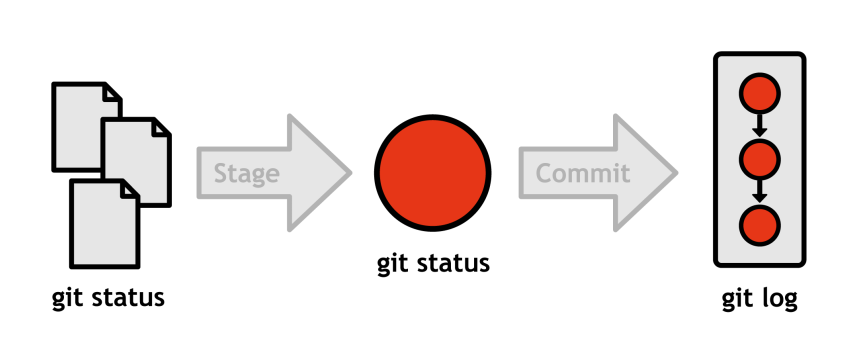
</p>

##### Tags
Tags are simple pointers to commits, and they are incredibly useful for bookmarking important revisions like public releases. The git tag command can be used to create a new tag:
```bash
git tag -a v1.0 -m "Stable release"
```
The -a option tells Git to create an annotated tag, which lets you record a
message along with it (specified with -m).\
Running the same command without arguments will list your existing tags:
git tag.

### Undoing Changes

You can undo changes in:
- Working directory
- staging area
- entire commit

#### Working Directory
To undo changes in working directory, use
```bash
git checkout reset --hard HEAD
git clean -f
```
This configuration of `git reset` makes the working directory and the stage match the files in the most recent commit (also called `HEAD`), effectively obliterating all uncommitted changes in tracked files. To get rid of untracked files, you have to use the `git clean` command. Git is very careful about removing code, so you must also supply the `-f` option to force the deletion of these files.


<p align="center">
  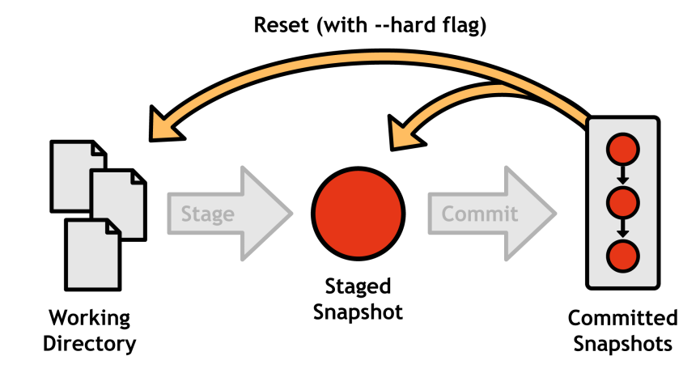
</p>

for individual files, use
```bash
git checkout HEAD <file>
```
This command doesn’t change the project history at all, so you can safely replace `HEAD` with a commit ID, branch,or tag to make the file match the version in that commit. But, do not try this with `git reset`, as it will change your history.

<p align="center">
  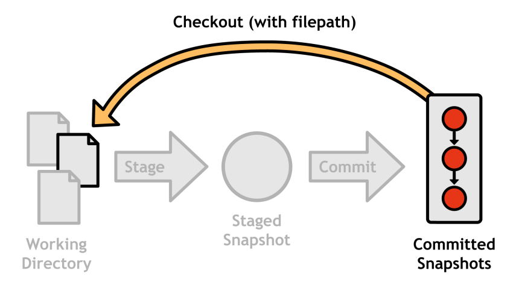
</p>


#### Staging Area
to undo changes in staging area, use
```bash
git reset HEAD <file>
```
Omitting the `--hard` flag tells Git to leave the working directory alone (opposed to git reset `--hard HEAD`, which resets every file in both the working directory and the stage). The staged version of the file matches HEAD, and the working directory retains the modified version.

<p align="center">
  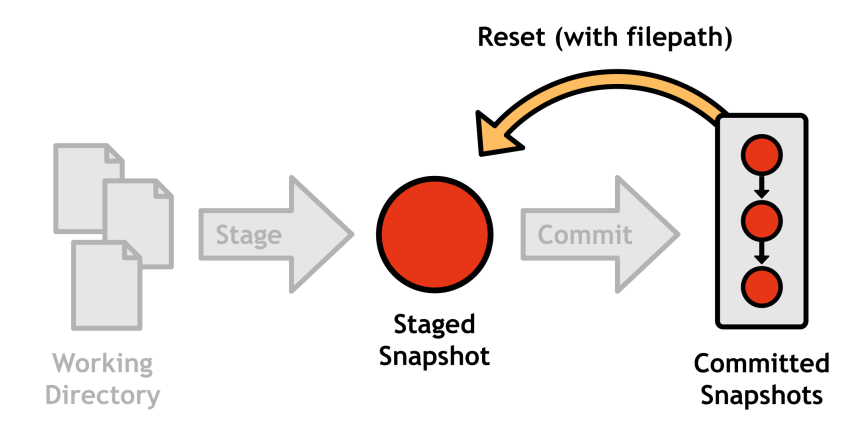
</p>

#### Undoing Commits

There are two ways to undo a commit using Git:
1. You can either reset it by simply removing it from the project history,
2. or you can revert it by generating a new commit that gets rid of the changes introduced in the original.
Undoing by introducing another commit may seem excessive, but rewriting history by completely removing commits can have dire consequences in multi-user workflows.

##### Resetting a Commit
```
git reset --hard HEAD~1
```
The `HEAD~1` syntax parameter specifies the commit that occurs immediately before HEAD.
you can replace `HEAD~1` with a commit ID.

<p align="center">
  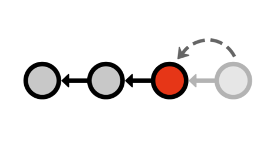
</p>

##### Reverting a Commit

```bash
git revert <commit-id>
```
This takes the changes in the specified commit, figures out how to undo them, and creates a new commit with the resulting changeset.

<p align="center">
  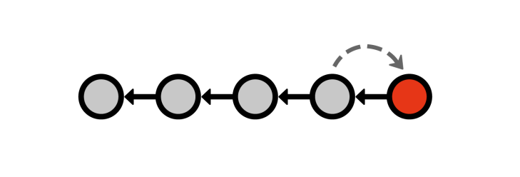
</p>
This is the ideal way of undoing changes that have already been committed to a
public repository.

##### Amending a Commit
In addition to completely undoing commits, you can also amend the most recent
commit by staging changes as usual, then running:
```bash
git commit –amend
```
This replaces the previous commit instead of creating a new one, which is very useful if you forgot to add a file or two. For your convenience, the commit editor is seeded with the old commit’s message. Again, you must be careful when using the `--amend flag`, since it rewrites history much like `git reset`.

<p align="center">
  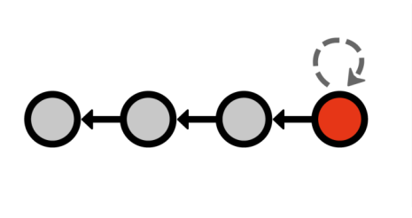
</p>

you can also use `git commit --amend --no-edit` to amend the most recent commit without changing the commit message.


### Holding Changes

Sometimes you need to temporarily put aside changes you’ve made to your project. This is especially useful when you’re working on a bug fix or a feature that depends on a change that you haven’t finished yet. You can do this by stashing your changes, which saves them away and reverts them from your working directory.

<p align="center" >
  
</p>

```bash
git stash
# or -m to add a message
git stash -m "message" # or git stash save "message"
```
to inspect the stash, use
```bash
git stash list
```
output will look like this:
```bash
stash@{0}: WIP on master: 2a2b3c4 message
stash@{1}: WIP on master: 1a2b3c4 message
...
stash@{n}: WIP on master: 1a2b3c4 message
```

you can do multiple things with the stashed changes:
- apply them `git stash apply` stash isn’t removed from the list
- pop them `git stash pop` stash is removed from the list and applied
- drop them `git stash drop` stash is removed from the list without applying
without adding any arguments, that would apply the most recent stash.
if you want to apply a specific stash, you can use `git stash apply stash@{<stash-number>}`

<p align="center" >
  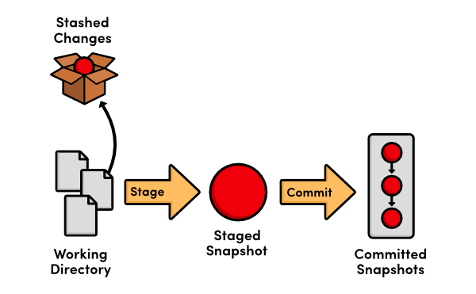
</p>

### Branches

Branches multiply the basic functionality offered by commits by allowing users to fork their history.\
Creating a new branch is akin to requesting a new development environment, complete with an isolated working directory, staging area, and project history.

<p align="center" >
  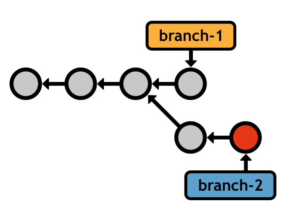
</p>

Branches enable a **non-linear** workflow—the ability to develop unrelated features in parallel.\
In contrast, Git branches are simply a pointer to a commit. Since they work on the commit level instead of directly on the file level, Git branches make it much easier to merge diverging histories. This has a dramatic impact on branching workflows.

#### Listing Branches
```bash
git branch
```
will output something like this:
```bash
* master
  feature-a
  quick-bug-fix
# asterisk indicates the current branch
```

#### Creating Branches
```bash
git branch <branch-name>
```
This creates a pointer to the current HEAD, but does not switch to the new branch (you’ll need git checkout for that). Immediately after requesting a new branch, your repository will look something like the following.

<p align="center" >
  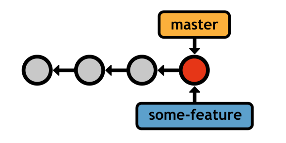
</p>

if we switched branch to be `some-feature`, your history would look like the following after committing a snapshot.

<p align="center" >
  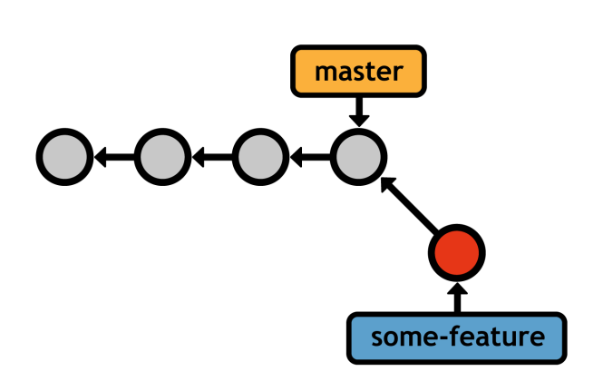
</p>
#### Deleting Branches
```bash
git branch -d <branch-name>
```
but if you want to delete a branch that hasn’t been merged yet, you’ll need to use the `-D` flag.
#### Switching Branches
```bash
git checkout <branch-name>
```
After checking out the specified branch, your working directory is updated to match the specified branch’s commit. In addition, the HEAD is updated to point to the new branch, and all new commits will be stored on the new branch. You can think of checking out a branch as switching to a new project folder — except it will be much easier to pull changes back into the project.

**note**: red commit is the current commit.
<p align="center" >
  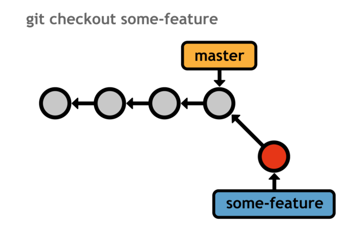
</p>

<p align="center" >
  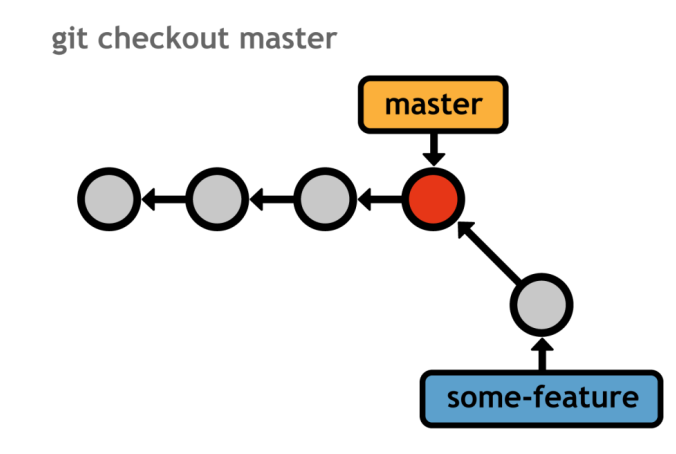
</p>

**note**: before switching branches, you should commit your changes or stash them or you will lose them.

#### Detached HEAD
When you checkout a commit, you are in a detached HEAD state. This means that you are not on any branch, and any commits you make will not be tied to any branch.\
You're just viewing the commit, and any changes you make will be lost when you move to another commit or branch.

<p align="center" >
  
</p>

if you want to work upon that commit without losing your changes, you can create a new branch from that commit and work on that branch.

```bash
git checkout -b <branch-name>
```
that would create a new branch from the commit you checked out and switch to that branch.

#### Merging Branches
Merging is the process of pulling commits from one branch into another.\
There're two common types of merges:
- fast-forward merge
- 3-way merge

they both use the same command:
```bash
git checkout <branch-to-merge-in>
git merge <target-branch-name>
```
but the method is automatically determined based on the structure of your history, but in each case the branch you want to merge in is the one you’re currently on.\
the target branch will remain unchanged, and the current branch will be updated to point to the new commit.

##### Fast-Forward Merge
We created a branch to develop some new feature, added two commits, and now
it’s ready to be integrated into the main code base. Instead of rewriting the two
commits missing from master, Git can “fast-forward” the master branch’s
pointer to match the location of some-feature.

<p align="center" >
  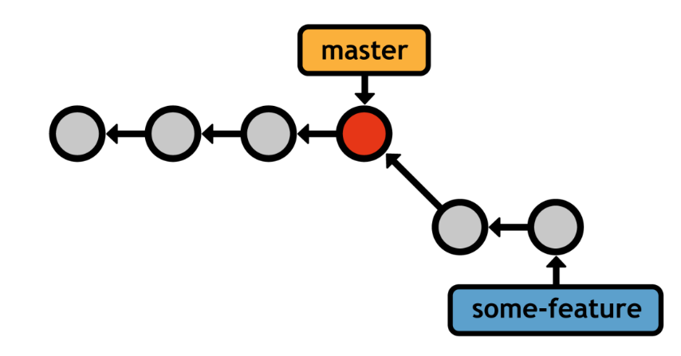
</p>

<p align="center" >
  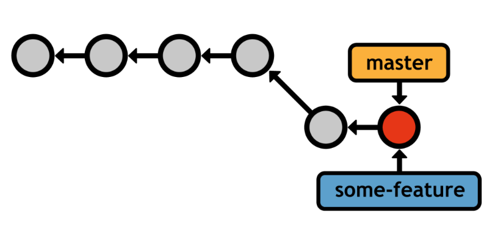
</p>

Of course, we could have made the two commits directly on the `master` branch; however, using a dedicated feature branch gave us a safe environment to experiment with new code. If it didn’t turn out quite right, we could have simply deleted the branch (opposed to resetting/reverting).

##### 3-Way Merge
But, not all situations are simple enough for a fast-forward commit. Remember,
the main advantage of branches is the ability to explore many independent lines
of development simultaneously. As a result, you’ll often encounter a scenario that
looks like the following:

<p align="center" >
  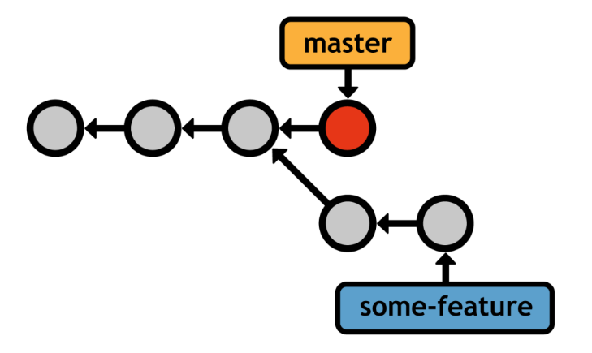
</p>

Git can’t fast-forward the master pointer to some-feature without
backtracking. Instead, it generates a new merge commit that represents the
combined snapshot of both branches. Note that this new commit has two parent
commits, giving it access to both histories

<p align="center" >
  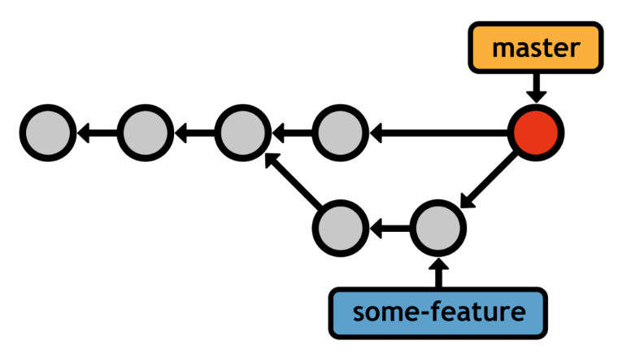
</p>

##### Merge Conflicts
If you try to combine two branches that make different changes to the same portion of code, Git won’t know which version to use. This is called a **merge conflict**. Obviously, this can never happen during a fast-forward merge. WhenGit encounters a merge conflict, you’ll see the following message:
```bash
Auto-merging index.html
CONFLICT (content): Merge conflict in <file>
Automatic merge failed; fix conflicts and then commit
the result.
```

if run `git status`, you’ll see the following:
```bash
# On branch master
# You have unmerged paths.
# (fix conflicts and run "git commit")
#     both modified: <file>
```

Every file with a conflict is stored under the “Unmerged paths” section. Git
annotates these files to show you the content from both versions:
```bash
 <<<<<<< HEAD
This content is from the current branch.
=======
This is a conflicting change from another branch.
 >>>>>>> some-feature
```

To resolve the conflict, get rid of the `<<<<<<`, `=======`, and `>>>>>>>` notation,
and change the code to whatever you want to keep. Then, tell Git you’re done
resolving the conflict with the git add command:
```bash
git add <file>
```
That’s right; all you have to do is stage the conflicted file to mark it as resolved.
Finally, complete the 3-way merge by generating the merge commit:
```bash
git commit -m "Merged some-feature into master"
```

#### Rebasing

is the process of moving a branch to a new base. Git’s rebasing
capabilities make branches even more flexible by allowing users to manually
organize their branches. Like merging, `git rebase` requires the branch to be
checked out and takes the new base as an argument:
```bash
git checkout some-feature
git rebase master
```
This moves the entire some-feature branch onto the tip of master:

<p align="center" >
  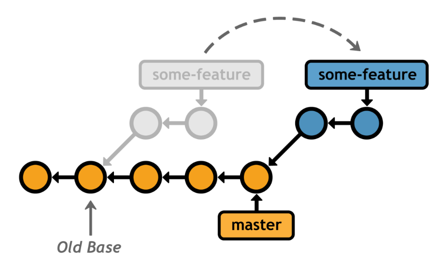
</p>

Compare
this linear history with a merge of master into some-feature, which results in
the exact same code base in the final snapshot:

<p align="center" >
  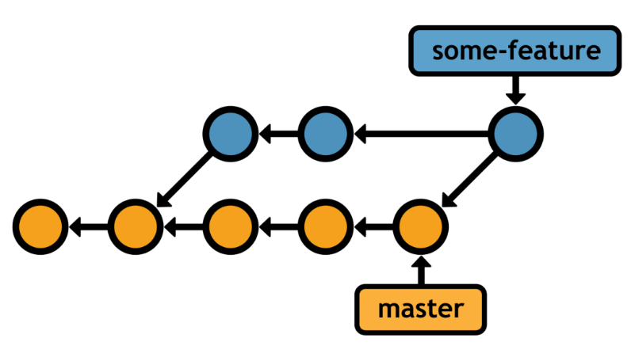
</p>

**golden rule of rebasing**: never rebase a branch that
has been pushed to a public repository.

### Remotes
Simply put, a remote repository is one that is not your own. It could be on a
central server, another developer’s personal computer, or even your file system.
As long as you can access it from some kind of network protocol, Git makes it
incredibly easy to share contributions with other repositories.

#### Listing Remotes

You can view your existing remotes by calling the git remote command with
no arguments:
```bash
git remote
```

#### Adding Remotes
To add a new remote, you can use the git remote add command. This command
takes two arguments: a name for the remote and the URL of the remote repository:
```bash
git remote add <remote-name> <remote-url>
```

#### Removing Remotes
To remove a remote, you can use the git remote rm command. This command
takes a single argument: the name of the remote you want to remove:
```bash
git remote rm <remote-name>
```

#### Fetching
The act of downloading branches from another repository is called fetching.\
To fetch a remote, you can use the git fetch command. This command takes a
single argument: the name of the remote you want to fetch from:
```bash
git fetch <remote-name>
```

#### Pulling
Since the fetch/merge sequence is such a common occurrence in distributed
development, Git provides a `pull` command as a convenient shortcut:
```bash
git pull origin/master
```
This fetches the origin’s master branch, and then merges it into the current
branch in one step. You can also pass the `--rebase` option to use `git rebase`
instead of `git merge`.

#### Pushing
To complement the `git fetch` command, Git also provides a `push` command.
Pushing is almost the opposite of fetching, in that fetching imports branches,
while pushing exports branches to another repository.
```bash
git push <remote> <branch>
```
The above command sends the local `<branch>` to the specified remote
repository. Except, instead of a remote branch, `git push` creates a local
branch.

### Bare Repositories
Every collaboration model involves at least one public repository that serves as a
point-of-entry for multiple developers. Public repositories have the unique
constraint of being bare—they must not have a working directory. This prevents
developers from accidentally overwriting each others’ work with git push. You
can create a bare repository by passing the --bare option to git init:
```bash
git init --bare <path>
```
Public repositories should only function as storage facilities—not development
environments

### Possible Workflows

#### central repository model
There is a single repository that all developers push to and pull from.

<p align="center" >
  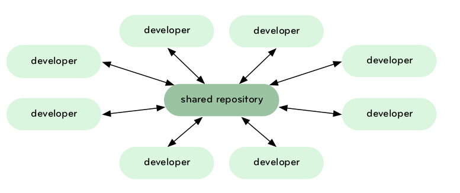
</p>
This may be common on small teams with
non-public projects where you don’t want to worry about a hierarchy
– the strength of this model is that it forces everyone to stay up to
date with each other and it doesn’t depend on a single role.

#### dictator and lieutenant model
This is a highly hierarchical model where one individual has com-
mit rights to a blessed repository that everyone else fetches from.
Changes are fetched from developers by lieutenants responsible for
specific subsystems and merged and tested. Lieutenant branches
are then fetched by the dictator and merged and pushed into the
blessed repository, where the cycle starts over again.
<p align="center" >
  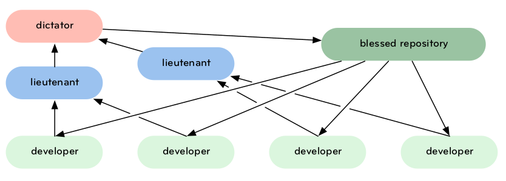
</p>
This is a model something like the Linux kernel uses, Linus being the
benevolent dictator. This model is much better for large teams, and
can be implemented with multiple and varied levels of lieutenants
and sub-lieutenants in charge of various subsystems. At any stage
in this process, patches or commits can be rejected – not merged in
and sent up the chain.

#### integration manager model
This is where each developer has a public repository, but one is
considered the ‘official’ repository – it is used to create the packages and binaries. A person or core team has commit rights to it, but
many other developers have public forks of that repository. When
they have changes, they issue a pull request to an integration man-
ager, who adds them as a remote if they haven’t already – then
merges, tests, accepts and pushes.

<p align="center" >
  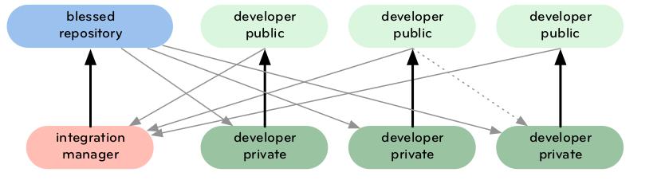
</p>

This is largely how community-based git repositories like GitHub
were built to work and how many smaller open source projects operate.

**conclusion**:
In the end, there is really no single right way to do it – being a decentralized system, you can have a model with all of these aspects to it, or any combination you can think of.\
In the end, you and your team will have to think about what will work best for you.
