# The History of Git

Linus Torvalds created the Linux operating system, and he made it publicly available after a while. His initial purpose was to get comments and feedback about Linux from other people. People started contributing to and getting involved with Linux. The contributions were not only in the form of code but also ideas and comments. The community working together on Linux made it an **open source project**. **Linux is in millions of computers and powering billions of devices.**  

**Git was also created by Linus Torvalds in the process of developing Linux.** Many people were involved in the development of Linux by making small or large contributions. After some time, it became really hard to manage and maintain all the changes and updates.  **Linus Torvalds** urgently needed a new version control system to maintain the development of the Linux Kernel. So he went offline for a week, wrote a revolutionary new system from scratch, and called it **Git**. That is the reason why Git was created.

------------------------------------------------------------------

# What's git?

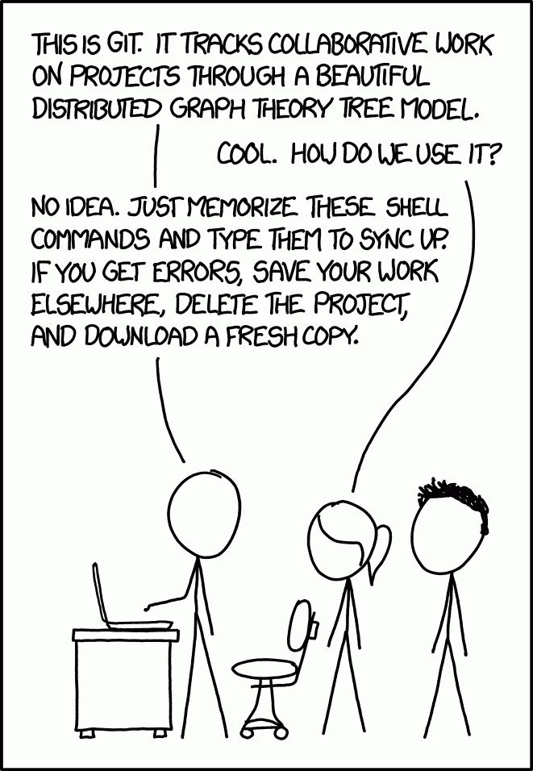

Git is a **distributed version control system**, although it's spelled with three letters it actually doesn't stand for something specific.

According to [initial commit of git](https://github.com/git/git/blob/e83c5163316f89bfbde7d9ab23ca2e25604af290/README), it can stands for multiple things:

```
	GIT - the stupid content tracker

"git" can mean anything, depending on your mood.

 - random three-letter combination that is pronounceable, and not
   actually used by any common UNIX command.  The fact that it is a
   mispronounciation of "get" may or may not be relevant.
 - stupid. contemptible and despicable. simple. Take your pick from the
   dictionary of slang.
 - "global information tracker": you're in a good mood, and it actually
   works for you. Angels sing, and a light suddenly fills the room. 
 - "goddamn idiotic truckload of sh*t": when it breaks
```

Git is open-sourced — Feel free to explore its code [here](https://github.com/git/git).

> It was created by Linus Torvalds in 2005, and has been maintained by Junio Hamano since then.

----------------------------------------------------

# What's version control system (VCS)?

It is a software that helps software developers to work together and maintain a complete history of their work.

> This is a stupid (but extremely fast) directory content manager.

> It doesn't do a lot, but what it **does** do is track directory contents efficiently.

### The functions of a VCS :

- Allows developers to work simultaneously.
- Does not allow overwriting each other’s changes.
- Maintains a history of every version.

## VCS Types

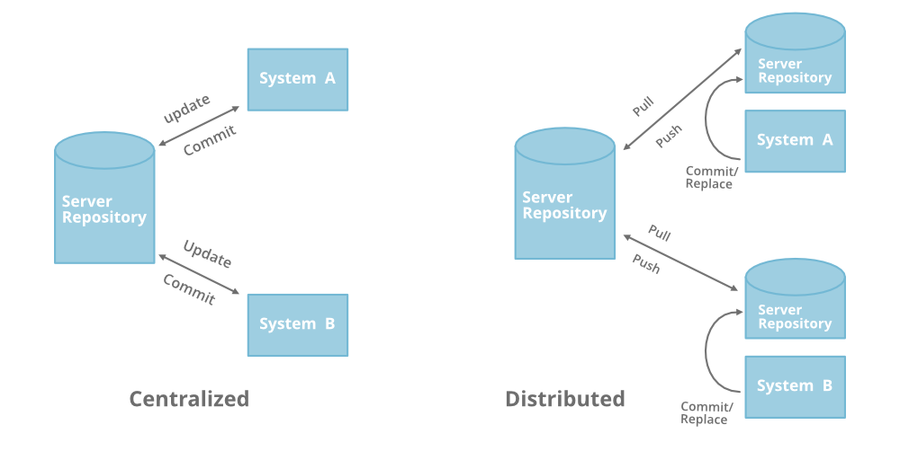

### Centralized Version Control System (CVCS)

**There is a server and a client.** The **server** is the **master repository** that contains all the versions of the code. 

To work on any project, firstly user or client needs to get the code (update) from the master repository or server to their local machine. You start making your own changes in the code and after that, you simply commit those changes straight forward into the master repository. So there will be **just one repository** that will contain all the history or version of the code and different branches of the code. 

But the major drawback of CVCS is its **single point of failure**, i.e., failure of the central server. Unfortunately, if the central server goes down for an hour, then during that hour, no one can collaborate at all. And even in the worst case, if the disk of the central server gets corrupted and proper backup has not been taken, then you will lose the entire history of the project. 

**Here, DVCS comes into picture.**

### Distributed/Decentralized version control system (DVCS).

In DVCS most of the mechanism applies the same as centralized. The only major difference is, instead of one single repository which is the server, here **every single developer has their own server**, and they will have a **copy of the entire history** or **version of the code** and **all of its branches** in **their local server or machine**. So every user can work locally and that’s why it is called **distributed**.

**If the server goes down, then the repository from any client can be copied back to the server to restore it.** You don’t need to rely on the central server, you can **clone** the entire history or copy of the code to your hard drive. You require network connection only to publish your changes and take the latest changes.

So when you start working on a project, you clone the code from the master repository in your own hard drive, then you get the code from your own repository to make changes and after doing changes, you commit your changes to your local repository, and at this point, your local repository will have ‘change sets‘ but it is still disconnected with the master repository (master repository will have different ‘sets of changes‘ from each and every individual developer’s repository), so to communicate with it, you issue a request to the master repository and push your local repository code to the master repository. Getting the new change from a repository is called **“pulling”** and merging your local repository’s ‘set of changes’ is called **“pushing“**. 

-------------------------------------------------------------------------------------------

# I don't work on a big Project Like Linux Kernel.
# Where's the problem in doing it by hand, why learn to use git?

If we want to avoid failure in the system, we would create a backup of the project, and if the project fails we would restore it from the backup.\
like this:
- 📁 Project
- 📁 Project_backup

but the process of creating a project doesn't happen in one day, so it makes sense we keep track of changes in case a failure happens, it would look like this:
- 📁 Version 1
- 📁 Version 2
- 📁 Version 3
- 📁 Version 4
- ...
- 📁 Version 219

and that if we were working alone, but if we were working with a team, we must create a folder for each change we made, and for each team member, like this:
- 📁 Version 1
  - 📁 Team member 1
  - 📁 Team member 2
  - 📁 Team member 3
  - 📁 Team member 4
  - 📁 Final version
-  📁 Version 2
   - 📁 Team member 1
   - 📁 Team member 2
   - 📁 Team member 3
   - 📁 Team member 4
   - 📁 Final version
- 📁 Version 3
  - 📁 Team member 1
  - 📁 Team member 2
  - 📁 Team member 3
  - 📁 Team member 4
  - 📁 Final version
- and so on... you got the idea

that if we accesed the project from one device, but in real life we work on multiple devices, so we must create a centerlized folder for that all of the team members can access it, and in order to avoid conflicts, we must create a folder for each team member again, then we combain all their work, like this:
- 📁 Version 1
  - 📁 Team member 1
  - 📁 Team member 2
  - 📁 Team member 3
  - 📁 Team member 4
  - 📁 Final version

but what if two team members worked on the same file at the same time?\
then we should review their work and merge them together, and if the project was big enough, it would be impossible to do that manually, counting for human errors.

all of that and more shift the focus from the actual project to managing the project files.

that's why we use git, It is used for:
  - Tracking code changes
  - Tracking who made changes
  - Coding collaboration

and **it's not limited to just that, it can do more**.


**Professional teams use version control and your team should too.**

----------------------------------------------------

# Git Project Main Components

There are three main components of a Git project:

- **Working tree (working directory)** :

   - It consists of files that you are currently working on. 
   - You can think of a working tree as a file system where you can view and modify files.

- **Staging Area (Index)** :

  - It is where commits are prepared. 
  - The index compares the files in the working tree to the files in the repo. 
  - When you make a change in the working tree, the index marks the file as modified **before it is committed**.

- **Repository (repo)** :

  - It is the “container” that tracks the changes to your project files. 
  - It holds all the commits — a snapshot of all your files at a point in time — that have been made. 
  - You can access the commit history with the `git log` command.

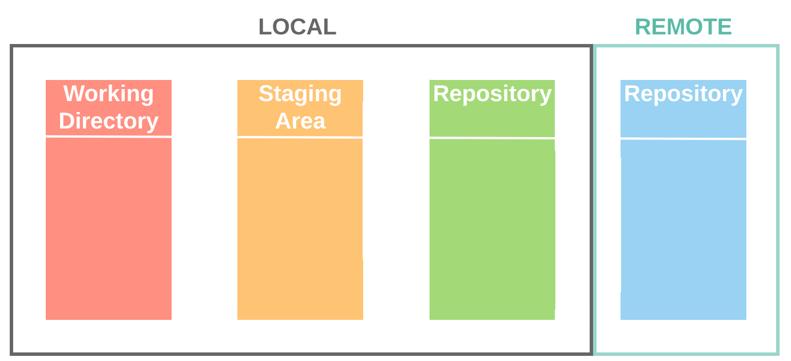

----------------------------------------------------------

# The Basic Workflow of Git

When you wanna to start a project with Git, you execute `git init` which will create a new `.git` subdirectory in your current working directory to keep track of changes. **If you remove `.git` directory, Git will no longer track your project.**
 
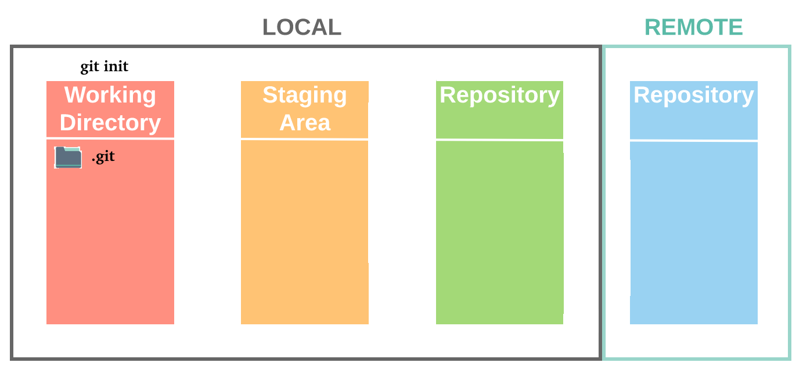

When you work on your project making changes you are dealing with your project’s **working directory**. This is the project directory on your computer’s filesystem. All the changes you make will remain in the working directory until you add them to the staging area (via `git add` command). 

When you add new files to your working directory, git will mark them as "Untracked files". That basically means Git is aware the file exists, but still hasn't saved it in its internal database. Once you `git add` untracked files to the staging area, they become tracked files.

> Once the untracked files are deleted, they cannot be restored.

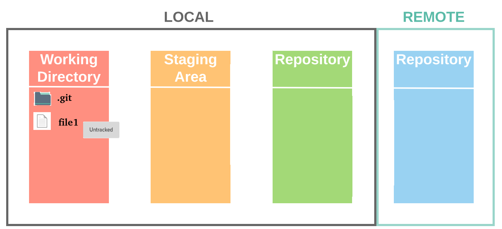

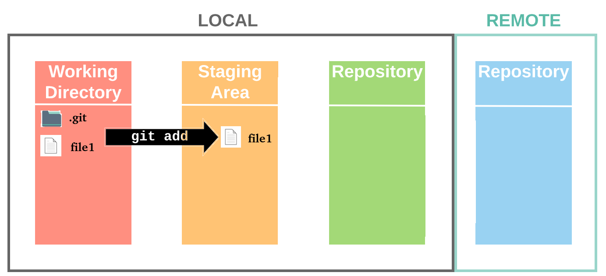

> What the `git add` command actually does is **copy** that version of your file from your working directory to the staging area.

The staging area is best described as a preview of your next commit. Meaning, when you do a `git commit`, git will take the changes that are in the staging area and make the new commit out of those changes. One practical use of the staging area is that it allows you to fine-tune your commits. You can add and remove changes from staging area until you are satisfied with how your next commit will look like, at which point you can do `git commit`.

> You can modify and stage several times before committing.

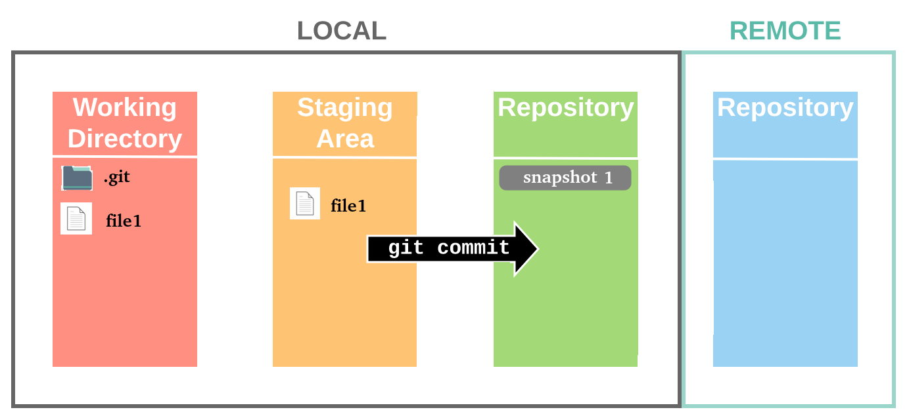

The `git commit` command captures a snapshot of the project's currently staged changes. Committed snapshots can be thought of as “safe” versions of a project—Git will never change them unless you explicitly ask it to.

> The staging area is still contain the files after a commit.

If you add a new file again it will be the same process as the above 

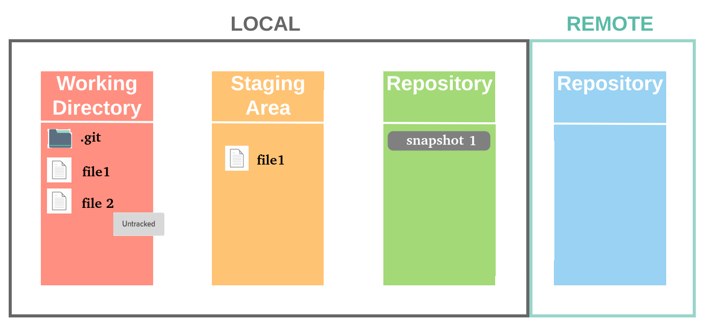

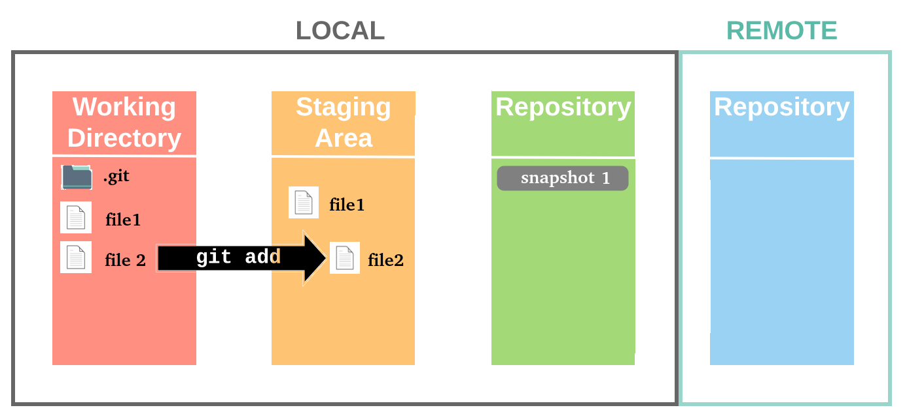

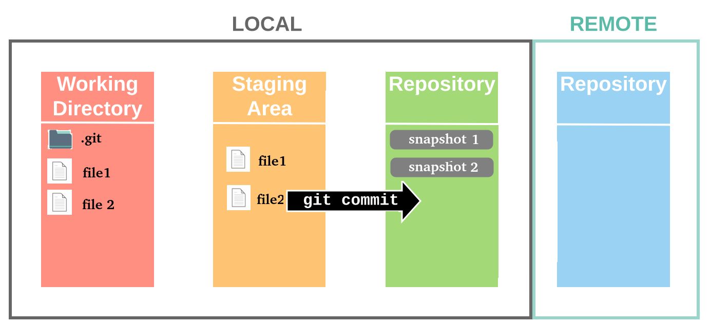

When you upload the local repository content to a remote repository (via `git push`), you transfer commits from your local repository to the remote repo.

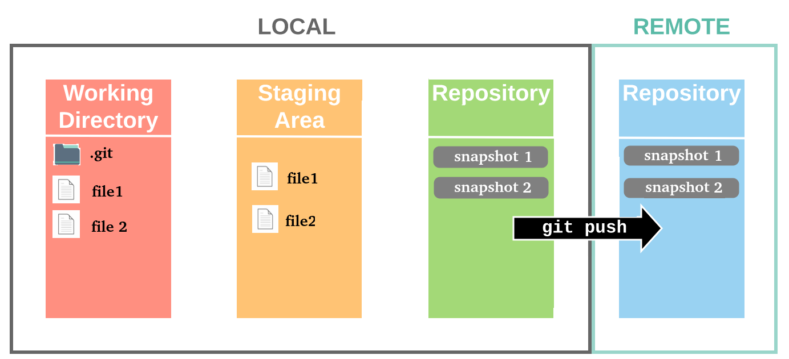

### What if you modify a tracked file?

As you edit files, Git sees them as modified, because you’ve changed them since your last commit. As you work, you selectively stage these modified files and then commit all those staged changes, and the cycle repeats.

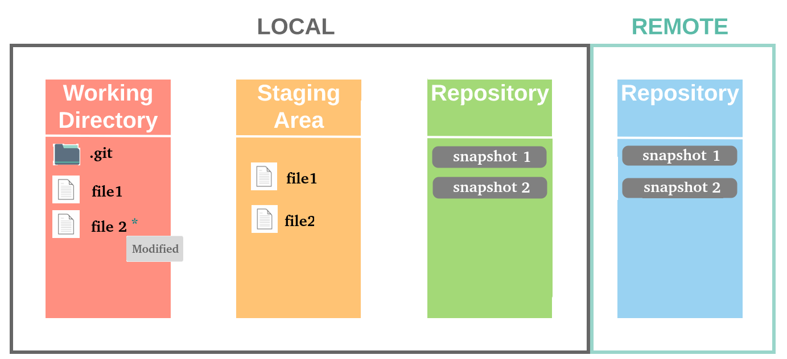

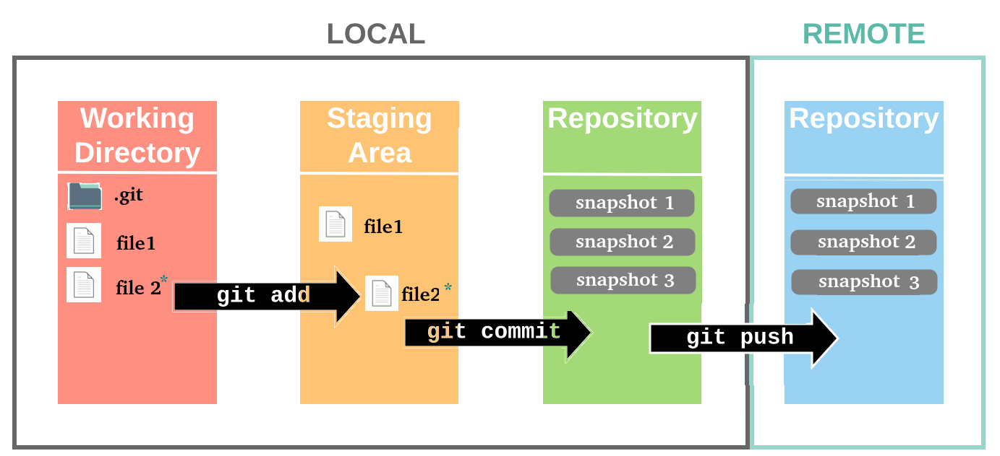

### What if your repo is not up-to-date?

If you work with a team, and one of them added some files, your local repository will differ from the remote

**Your Firend :**

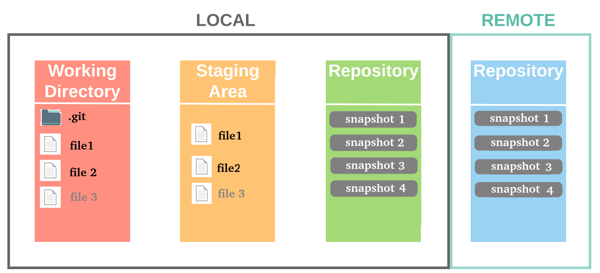

When you download the remote repository content to your local repository (via `git pull`), you transfer commits from the remote repository to the local repo.

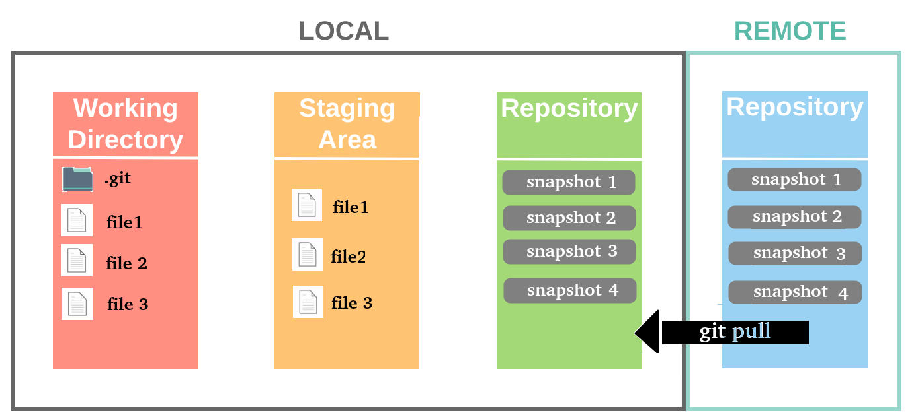

-----------------------------------------------------------
-----------------------------------------------------------

# Tracked vs Untracked Files

In short, **tracked files** are files that Git knows about (staged or committed). **Untracked files** are everything else.

# Git Files States

Git has three main states that your files can reside in: committed, modified, and staged. 

### Committed Files

Committed means that the data is safely stored in your local database.

### Modified Files

Modified means that you have changed the file but have not committed it to your database yet. 

### Staged Files

Staged means that you have marked a modified file in its current version to go into your next commit snapshot.

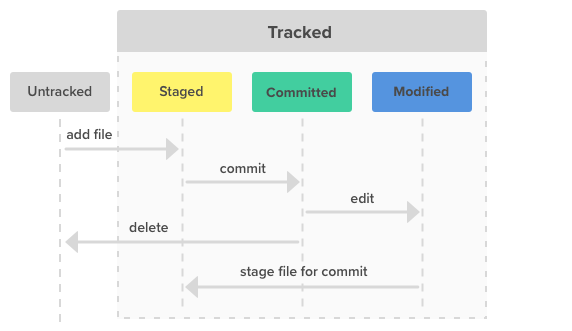

-----------------------------------------------------------

# Git Commit

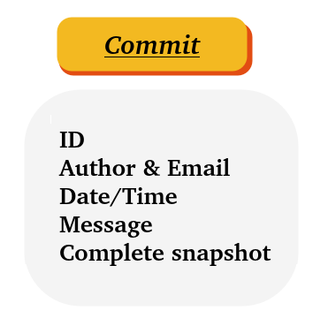

If you want to see what’s happened recently in your project, you can use `git log`. This command will output a list of the latest commits in chronological order, with the latest commit first.

Every commit in the list will look a little something like this:

```
commit 90110711b36c344ddbaf320a5e439d441c982184
Author: Salma Ayman <salma.alassal1@gmail.com>
Date:   Fri Sep 16 14:42:11 2022 +0200

    Initial commit
```
You’ll be able to see the commit ID(or hash), the name of who made the commit, their e-mail address, what time the commit was made, and the message they entered when they committed.

-----------------------------------------------------------

## Does git make a copy of all my files each time I make a commit? No
## Is storing the full content in every snapshot waste a lot of space ? No
## How does git store duplicate files?


# Efficiency Relative to Storage

Git is very efficient in data storage; **it compresses file contents and doesn't store duplicate content.** 

Git thinks of its data more like a set of snapshots of a miniature filesystem. Every time you commit, or save the state of your project in Git, it basically takes a picture of what all your files look like at that moment and stores a reference to that snapshot. **To be efficient**, if files have not changed, Git doesn’t store the file again, just a link to the previous identical file it has already stored. Git thinks about its data more like a stream of snapshots.

**So?**

**Every time you create a new file** that the file system already has a copy of, the file system automatically checks and just creates a new file entry that **links** to the old file contents.

**Every time you change one of these duplicate files**, the file system automatically notices and **creates a real new file** containing the changed version, and **replaces** the file entry linking to the old file with a file entry linking to the new file.

That’s git, in a nutshell. Every file whose contents are the same has one copy of the contents on disk, and every snapshot that uses that version of the file contents uses a link to that one copy instead of making a duplicate.

--------------------------------------------

# What is a Branch in Git?

Branch in Git is similar to the branch of a tree. Analogically, a tree branch is attached to the central part of the tree called the trunk. While branches can generate and fall off, the trunk remains compact and is the only part by which we can say the tree is alive and standing. Similarly, a branch in Git is a way to keep developing and coding a new feature or modification to the software and still not affecting the main part of the project. We can also say that branches create another line of development in the project. The primary or default branch in Git is the **master branch** (similar to a trunk of the tree). As soon as the repository creates, so does the main branch (or the default branch).

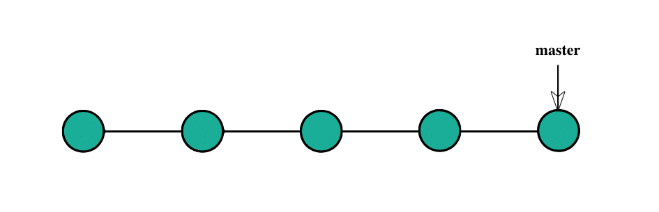

## Why do we need a Branch in Git and Why Branches Are Important?

Git branches come to the rescue at many different places during the development of a project. As mentioned above, **branches create another line of development** that is entirely different or isolated from the main stable master branch. There are many advantages to doing so.

## Project Development through linear development

You have been working on a project with the client being happy until this point.

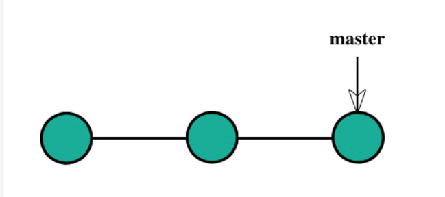

Now, you decide to develop a feature and start developing it on the same code (denoted by blue commits).

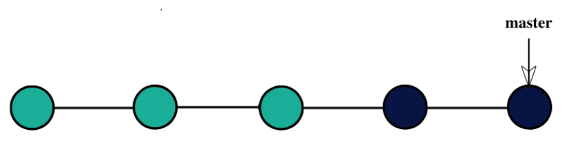

You show this to your client.

In the meantime, you decide to develop another feature (let say xyz) and wait for the client's approval (xyz denoted by brown commits).

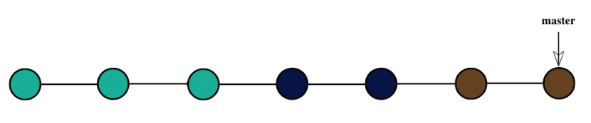

The client disapproves of the feature (blue commits) and requests to delete it (denoted by grey color depicting deletion).

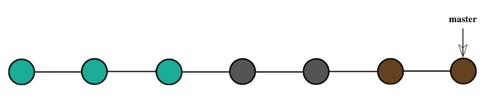

Now, since you were following the linear development method, you need to delete the complete code and go through the hectic process of adjustments and removing glitches repeatedly to achieve the following:

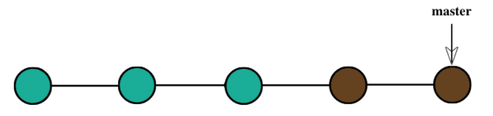

## Developing the project through branching

Let see the same scenario by using the Git branching technique.

You have been working on a project with the client being happy until this point.


After that, you decide to develop a feature and create a new branch called feature for the same purpose and start working on it.

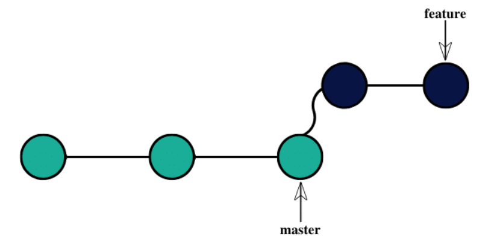

You show this to your client.

In the meantime, you decide to develop another feature and wait for the client's approval.

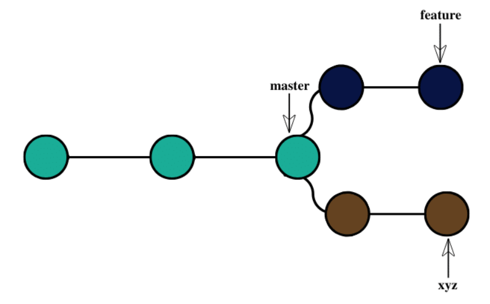

The client disapproves of the feature and requests to delete it.

Now, since you were following the branched strategy, you need to remove the branch, and all the remaining code remains as it is. The new feature can be easily added to the master branch to achieve the following.

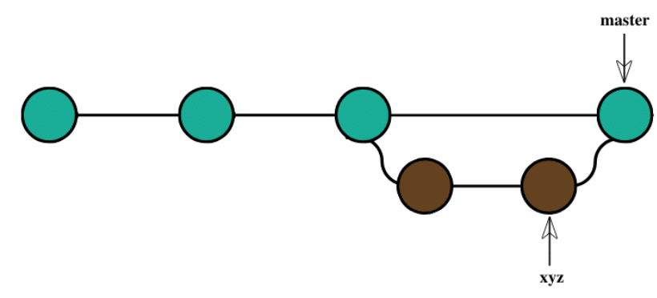

Branches give you the freedom to independently work on different modules (not necessarily though) and merge the modules when you finish developing them. It might sound a cumbersome process, but git branches are swift to be created and destroyed. Just a simple command can perform these processes, and they are very cheap, considering the size they take. Branches in Git help the team, which are in different parts of the world, work independently on independent features that would ultimately combine to produce a great project. Moreover, the branches are very flexible. Using branches does not mean you are using them for different features.

We can use the branch in git for any reason we want. We create different branches for different teams working on the project (or the same module). Additionally, one can create them for any other feature you are creating in the project. **The creation of a branch can happen for different lines of development**, and there are numerous other reasons. It is totally up to you as to why you want to create the branches. 

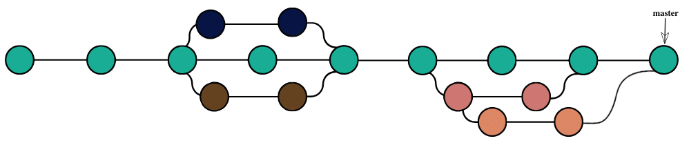

## Different Operations On Branches

**Create a Branch:** This is the first step in the process, you can start on a default branch or create a new branch for the development.

**Merge A Branch:** An already running branch can merge with any other branch in your Git repository. Merging a branch can help when you are done with the branch and want the code to integrate into another branch code.

**Delete A Branch:** An already running branch can delete from your Git repository. Deleting a branch can help when the branch has done its job, i.e., it's already merged, or you no longer need it in your repository for any reason.

**Checkout A Branch:** An already running branch can pull or checkout to make a clone of the branch so that the user can work on any of them. Pulling a branch can help when you don't want to disturb the older branch and experiment on the new one.

## Git Local Branch

A local branch in Git means the branch, which is available only on your local machine. The team members can not see and access this branch.

## The Default Branch

By default, when you create a repository, the main branch is named the **master** branch. It is the base branch or the default branch in Git. As you start making commits, you're given a master branch that points to the last commit you made. Every time you commit, the master branch pointer(called `head`) moves forward automatically.

Although **you can rename it**, many people stick with the default, so you’ll see lots of projects using master as their default branch.

> On October 1, 2020, GitHub renamed its master branch to main.

It's not necessary to name the main branch as a master or main branch. The main branch can be any branch you want.

### Git branch name examples
- Salma-Branch
- issue-426
- topic/feature-name

**Most branches are essentially temporary names attached to commits. Don’t fear renaming them.**

------------------------------------------------------------
------------------------------------------------------------
