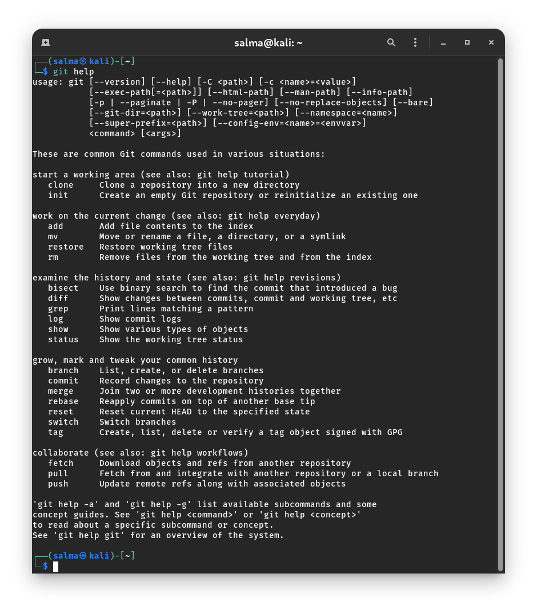
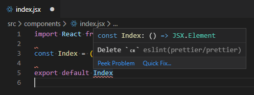

# Git Installation

### Windows

Download the installer from [git-scm.com](https://git-scm.com/downloads)

### Linux

**Debian/Ubuntu**

```bash
sudo apt install git
```

**Fedora**
```bash
sudo dnf install git 
```

**Arch**
```bash
sudo pacman -S git
```

### Git Version

To check your current version of Git : `git --version`

If Git is installed, it should show something like `git version X.Y.Z`

----------------------------------------------------------------

# Getting Help

Git Help can be accessed from your Git Bash just by typing the command `git help` 

This command will display all the information about Git. These are brief information to get any beginner started. 



These commands as shown above are the most common commands used in Git. 

### There are a couple of different ways you can use the `help` command in command line:

- To see all the available commands in Git : `git help -a` or `git help --all`

- To get help on one particular command : `git help <command name>`
  - E.g, `git help clone`

- To see all the available options for the specific command : `git command -help`
  - E.g, `git clone -help`

- To open any specific guide : `git help <guide_name>`
  - E.g, `git help attributes`
  
> Note: If you find yourself stuck in the list view, type `q` to exit the view.

------------------------------------------------------------------

# Git Configuration Levels

- **Local** → The current repository.
- **Global** → All repositories of the current user.
- **System** → All users.

**The order of priority of the Git config is local, global, and system, respectively.** It means when looking for a configuration value, Git will start at the local level and bubble up to the system level.

## First-Time Git Setup

Now that you have Git on your system, you’ll want to do a few things to customize your Git environment. You should have to do these things only once on any given computer; they’ll stick around between upgrades. You can also change them at any time by running through the commands again.

### `--local`

- It is the default level in Git. Git config will write to a local level if no configuration option is given.

- Local configuration values are stored in **.git/config** directory as a file.

### `--global`

- The global level configuration is user-specific configuration. User-specific means, it is applied to an individual operating system user. 

- Global configuration values are stored in a user's home directory. **~ /.gitconfig** on UNIX systems and **C:\Users\username\.gitconfig** on Windows.

### `--system`

- The system-level configuration is applied across an entire system. The entire system means all users on an operating system and all repositories. 

- The system-level configuration file stores in a gitconfig file off the system directory. `/etc/gitconfig` on UNIX systems and `C:\ProgramData\Git\config` on Windows.

## `git config` Command

Git comes with a tool called `git config` that lets you get and set configuration variables that control all aspects of how Git looks and operates. 

### Setting username
  
`git config --global user.name "Salma"`

### Setting email ID
 
`git config --global user.email "salma@example.com"`
  
**⬆ This information is used by Git for each commit.**
  
### Setting default editor

`git config --global core.editor "code --wait"`
  
Here we specified VS Code as our default editor

The `wait` flag to tell the terminal window to wait until we close the **new** vs code instance.

**If you have not selected any of the editors, Git will use your default system's editor.**

### Setting default branch

To configure the initial branch name to use in all of your new repositories: `git config --global init.defaultBranch <name>`

E.g,`git config --global init.defaultBranch "main"` 
   
- To see local branch names : `git branch`
- To see all remote branch names : `git branch -r`
- To see all local and remote branches : `git branch -a`
 
### Configuring git Credentials

Git will sometimes need credentials from the user in order to perform operations; for example, it may need to ask for a username and password in order to access a remote repository over HTTP. 

To avoid inputting these credentials repeatedly:
  - Make Git store the username and password, and it will never ask for them : `git config --global credential.helper store`
  - Save the username and password for a session (cache it) : `git config --global credential.helper cache`
  - You can also set a timeout for the above setting : `git config --global credential.helper 'cache --timeout=600'`
 
### Listing Git settings

Git settings of the local repository : `git config --list`

### To edit Global Settings

To edit all the global settings using our default editor : `git config --global -e`

------------------------------------------------
------------------------------------------------

# LF vs CRLF

- On Windows end of lines are marked with two special characters, carriage return `\r` and line feed `\n`

- On Mac or Linux systems end of lines are indicated with line feed `\n`

### LF: Line Feed

LF stands for "line feed," but you're probably more familiar with the term newline (the escape sequence `\n`). Simply put, this character represents the end of a line of text. On Linux and Mac, this is equivalent to the start of a new line of text. That distinction is important because Windows does not follow this convention. 

### CR: Carriage Return

CR (the escape sequence `\r`) stands for carriage return, which moves the cursor to the start of the current line. For example, if you've ever seen a download progress bar on your terminal, this is how it works its magic. By using the carriage return, your terminal can animate text in place by returning the cursor to the start of the current line and overwriting any existing text.

# Normalizing Line Endings in Git

If one developer uses Windows and another uses Mac or Linux, and they each save and commit the same files, they may see line ending changes in their `git diff`— a conversion from CRLF to LF or vice versa. This leads to unnecessary noise due to single-character changes and can be quite annoying. 

### Some Examples

- `git status` showing all your files as modified because of the automatic EOL conversion done when cloning a Unix-based EOL Git repo to a Windows one.

- If you have **prettier** (code formatter) enabled and the `endOfLine` property is set to `lf`. On the Windows machine the developer will encounter linting issues from prettier, like those below :



**For this reason, Git allows you to configure line endings in one of two ways:** 
  - by changing your local Git settings 
  - or by adding a `.gitattributes` file to modified your project. 

So you can collaborate effectively with people who use different operating systems.

### Changing your local Git settings

The below command is used to change how Git handles line endings. It takes a single argument :

**Syntax :** `git config --global core.autocrlf [true|false|input]`

```
         core.autocrlf=true                     core.autocrlf=input                        core.autocrlf=false

           repository                                repository                                 repository        
            ^       V                                 ^       V                                 ^        V          
           /         \                               /         \                               /          \         
      CRLF->LF     LF->CRLF                     CRLF->LF        LF                            /            \
         /              \                          /              \                          /              \ 
        /                \                        /                \                        /                \   
       /                  \                      /                  \                      /                  \   
      /                    \                    /                    \                    /                    \    
     /                      \                  /                      \                  /                      \      
file to commit      checked out file      file to commit      checked out file      file to commit      checked out file  

Or we can say :
→ true :            x -> LF -> CRLF
→ input:            x -> LF -> LF
→ false:            x -> x -> x

where x is either CRLF (windows-style) or LF (unix-style).
```
**Let's sum up :**

- If you're using Linux/MAC, use :  `git config --global core.autocrlf input`
- If you're using Windows, use : `git config --global core.autocrlf true`

## Gitattributes

The `.gitattributes` file allows you to specify the attributes that should be used by git when performing git actions, such as `git commit`, etc. In other words git automatically saves the file according to the attributes specified, every time a file is created or saved. One of these attributes is the **eol** (end of line) and is used to configure the line endings for a file.

### Why to use `.gitattributes` ?

You shouldn't rely on people having correctly configured Git installations. If someone with an incorrect configuration checked in a file, it would not be easily visible in a pull request, and you'd end up with a repository with inconsistent line endings.

The solution to this is to add a `.gitattributes` file on your repository and set the line endings to be automatically normalized like so:

```
# Auto detect text files and perform LF normalization
* text=auto

*.bat	        text eol=crlf
*.cmd           text eol=crlf
```

Now when anyone gets the code from the repo the default correct line ending will be used automatically via git, when creating and modifying the files.

**Remember to add the `.gitattributes` to the remote repo.**

[A Collection of Useful `.gitattributes` Templates](https://github.com/alexkaratarakis/gitattributes)

[Create `.gitattributes` file for your project.](https://gitattributes.io/)

--------------------------------------
--------------------------------------

# `git init` Command

Initializing a local repository : `git init Demo`  

Git now knows that it should watch the folder you initiated it on. 

Executing this command will create a new `.git` subdirectory in your current working directory to keep track of changes. 

# `git add` Command (Staging Files)

This command is used to add one or more files in your **working directory** to **staging (Index) area.**

It is an important command without it, no git commit would ever do anything.

**Syntax :** `git add <path>` → Stage a specific directory or file
  
### Examples 

- Stages a single file : `git add README.md`   
- Stages multiple files :`git add file1.js` `file2.js`
- Stages a directory : `git add folder1`
- Stages multiple directories : `git add folder1 folder 2`
- Stages multiple files & directories : `git add folder1 folder2 file.txt`
- Stages with a pattern : `git add *.js` → Adds all files that ends with `.js`
- Stages the current directory and all its content that are not listed in the **.gitignore** : `git add .`  

### `.` vs `*`

- `git add *` means add all files in the current directory, **except** for files whose name begin with a dot **.** This is your shell functionality and Git only ever receives a list of files.

- `git add .` has no special meaning in your shell, and thus Git adds the entire directory recursively, which is almost the same, but including files whose **names begin with a dot**.

# Removing files/directories
 
### Files

- Removes from working directory only: `rm file.txt` → Not a git command 
- Removes from staging area only : `git rm --cached file1.txt` 
- Removes from working directory and staging area : `git rm file1.txt`

### Directories

- Removes from working directory only: `rm -r  dir` → Not a git command 
- Removes from staging area only : `git rm -r --cached dir` 
- Removes from working directory and staging area : `git rm -rf dir`


# Renaming or moving files 

- Rename a file on working directory only : ` mv oldName newName`

- Rename a file on working directory and staging area : `git mv oldName newName`


# Listing the staging area files

`git ls-files`

# Viewing the status 

- Full status : `git status`  

- Short status : - `git status -s`  

# Committing the staged files 

- Commits with a one-line message : `git commit -m “Message”` 

- Opens the default editor to type a long message : `git commit` 

# Skipping the staging area 

 `git commit -am “Message” `

- Say you have 10 files. You made changes to 5 of them and created 5 more. You have two choices.

  1. You can do `git add file1`, `git add file2` ...etc. This will take my changes and add them to a "staging" area. From there you can do a git commit, which will commit the changes to my local repository. If you wanted to push those changes to a remote repository, you would do `git push`

  2. You could use a shortcut. `git commit -a` Will automatically add any files that were changed to the "Staging" area as well as commit them.

# Adding a remote repository

To add a new remote, use the `git remote add` command on the terminal, in the directory your repository is stored at.

The git remote add command takes two arguments:

  - A remote name, for example, `origin`
    - In Git, "origin" is a shorthand name for the remote repository that a project was originally cloned from. More precisely, it is used instead of that original repository's URL - and thereby makes referencing much easier.
  - A remote URL, for example, `https://github.com/SalmaAlassal/BeRoot.git`

For example: `git remote add origin https://github.com/SalmaAlassal/BeRoot.git` → Set a new remote for the current working dir.

### Verify new remote

`git remote -v`

# `git push` Command

The git push command is used to upload local repository content to a remote repository. Pushing is how you transfer commits from your local repository to a remote repo.

**Syntax :** `git push <repo name> <branch name>`

**Example :** `git push origin master`

### Push to a Specific Remote Repository and All Branches in it

If you want to push all your changes to the remote repository and all branches in it, you can use: `git push --all <repo name>`

- `--all` is the flag that signals that you want to push all branches to the remote repository

# `git pull` Command

The git pull command is used to fetch and download content from a remote repository and immediately update the local repository to match that content.

When you are on the dev branch, `git pull` will update your local dev to the same point as the remote dev branch. Note that it will fetch all branches, but only pull the one you are on to the top of the tree.

# `git fetch` Command

`git fetch` gathers any commits from the target branch that do not exist in the current branch and stores them in your local repository. However, it does not merge them with your current branch. This is particularly useful if you need to keep your repository up to date, but are working on something that might break if you update your files. To integrate the commits into your current branch, you must use `git merge` afterwards.

# Pull vs Fetch

- `git pull` : Fetches and merges changes on the remote server to your working directory. **(Fetch + Merge)**
  > `git pull` says "bring the changes in the remote repository to where I keep my own code."

- `git fetch` : Fetches changes on the remote server to your local repository. This command downloads all new branches from the remote repository and all commits from these branches. It will not merge these changes with your local branches. **(Update local repo)**
  > `git fetch` is the command that says "bring my local copy of the remote repository up to date."

# `git clone` Command

`git clone URL` : This command allows creating a local copy of that repository on your local directory from the repository URL.

Internally, git clone first calls `git init` to create a new repository. It then copies the data from the existing repository, and checks out a new set of working files. 

Also, when you clone a repository, the command automatically adds that remote repository under the name **origin**.

> You can use `git clone URL` instead of `git init` & `git remote add origin URL` 

-----------------------------------------


