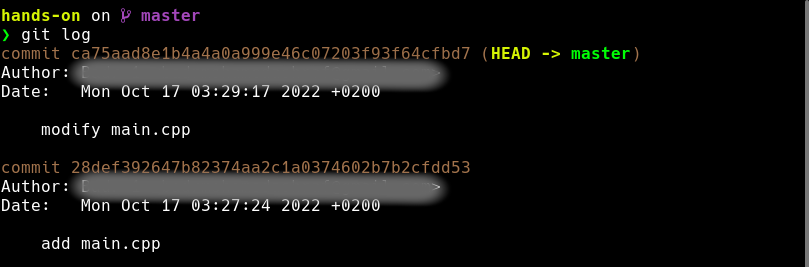
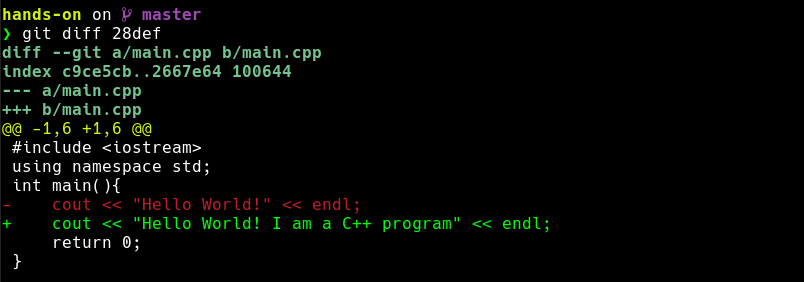
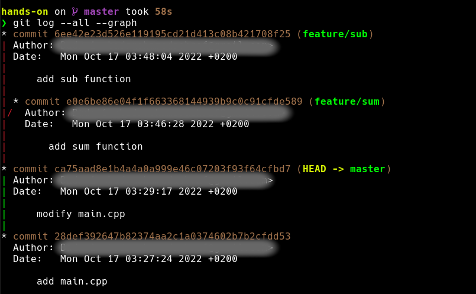
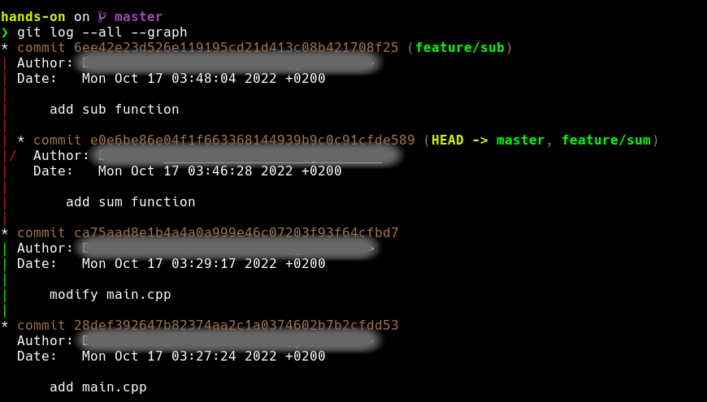
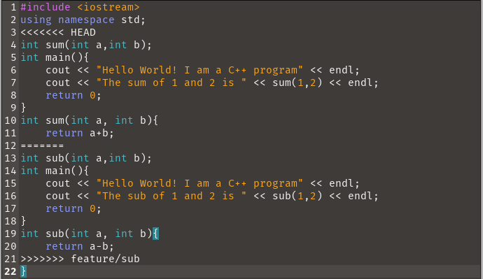

# Hands-on

## init repo
1. create a new directory using `mkdir hands-on`
2. navigate to the new directory using `cd`
3. initialize a new git repository using `git init`
4. check the .git directory using `ls -a`


## create a program

1. create a new file using `touch main.cpp` and add the following code:
```cpp
#include <iostream>
using namespace std;
int main(){
    cout << "Hello World!" << endl;
    return 0;
}
```
2. check the the status of the repository using `git status`
3. add the file to the staging area using `git add main.cpp`
4. check the the status of the repository using `git status` to see that the file is now staged
5. (optional) if you want to unstage the file, use `git rm --cached main.cpp`
6. commit the file using `git commit -m "add main.cpp"`
7. check the the status of the repository using `git status` to see that the file is now committed.

## modify the program
1. modify the program to print "Hello World! I am a C++ program" instead of "Hello World!"
following code:
```cpp
#include <iostream>
using namespace std;
int main(){
    cout << "Hello World! I am a C++ program" << endl;
    return 0;
}
```
2. (Optional) to go back to the previous version of the file, use `git restore main.cpp`
3. commit the file using `git commit -m "modify main.cpp"`
4. display the commit history using `git log`

5. use `git diff commitcode` to see the difference between the current version and the previous version of the file


## branching

1. create a new branch using `git branch new-branch`
2. move to the new branch using `git checkout new-branch`
3. shortcut: `git checkout -b new-branch`
4. display all branches using `git branch`


ex:\
1. git branch feature/sum
2. git checkout feature/sum
3. add sum function to main.cpp
```cpp
#include <iostream>
using namespace std;
int sum(int a,int b);
int main(){
    cout << "Hello World! I am a C++ program" << endl;
    cout << "The sum of 1 and 2 is " << sum(1,2) << endl;
    return 0;
}
int sum(int a, int b){
    return a+b;
}
```
4. git add main.cpp
5. git commit -m "add sum function"
6. git checkout master
7. git branch feature/sub
8. git checkout feature/sub
9. add sub function to main.cpp
```cpp
#include <iostream>
using namespace std;
int sub(int a,int b);
int main(){
    cout << "Hello World! I am a C++ program" << endl;
    cout << "The sub of 1 and 2 is " << sub(1,2) << endl;
    return 0;
}
int sub(int a, int b){
    return a-b;
}
```
10. git add main.cpp
11. git commit -m "add sub function"
12. git checkout master
13. git --all --graph


## merging

1. merge the sum_function branch into the master branch using `git merge feature/sum`
2. the merge will be done automatically if there are no conflicts
3. use git log to see the commit history

4. merge the sub_function branch into the master branch using `git merge feature/sub`
5. display the conflict

6. resolve the conflict
```cpp
#include <iostream>
using namespace std;
int sum(int a,int b);
int sub(int a,int b);
int main(){
    cout << "Hello World! I am a C++ program" << endl;
    cout << "The sum of 1 and 2 is " << sum(1,2) << endl;
    cout << "The sub of 1 and 2 is " << sub(1,2) << endl;
    return 0;
}
int sum(int a, int b){
    return a+b;
}
int sub(int a, int b){
    return a-b;
}
```
6. add the file to the staging area using `git add main.cpp`
7. commit the file using `git commit -m "resolve merge conflict"` or any other message
8. use `git log --graph --all` to see the commit history as a graph
