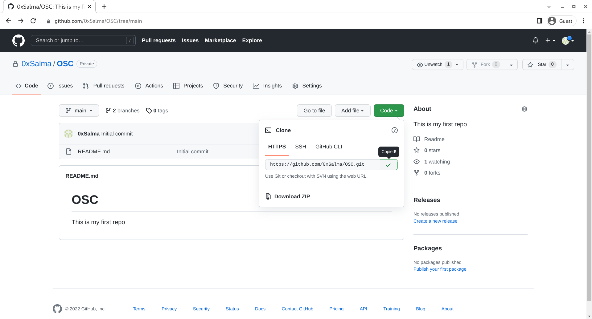
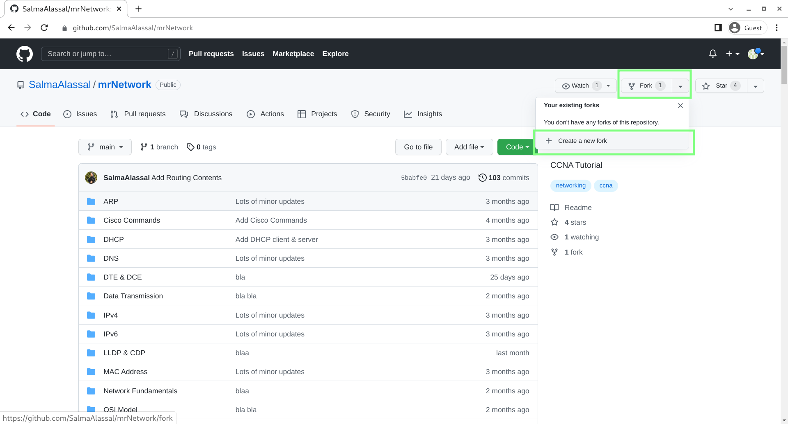

# Hosting Platform

There are tons of services for hosting your Git repositories.

### Examples 

- GitHub
- GitLab
- Bitbucket
- SourceForge

**We will use GitHub**

# What is GitHub

GitHub is a cloud-based hosting service that lets you manage Git repositories.

GitHub is the largest host of source code in the world, and has been owned by Microsoft since 2018.

---------------------------------------

# Creating a Repository

1. In the upper-right corner of any page, use the drop-down menu, and select New repository.

    

2. In the Repository name box, enter `OSC`.

3. In the Description box, write a short description (optional).

4. Select Add a README file (optional).

5. Select whether your repository will be Public or Private.

6. Click Create repository.

### Git Repository URL

To clone your repo you can find its URL here :

------------------------------------------------

# Fork a repo

Any public Git repository can be forked. A fork creates a completely independent copy of Git repository.

Forking a repository allows you to freely experiment with changes without affecting the original project.

### Propose changes to someone else's project

For example, you can use forks to propose changes related to fixing a bug. Rather than logging an issue for a bug you have found, you can:

  - Fork the repository.
  - Make the fix.
  - Submit a pull request to the project owner.

### How to fork?

----------------------------------------------

# Pull Requests

Pull requests let you tell others about changes you've pushed to a branch in a repository on GitHub. Once a pull request is opened, you can discuss and review the potential changes with collaborators and add follow-up commits before your changes are merged into the base branch.

**Pull requests can only be opened between two branches that are different.**

### How to make a pull request?

1. Fork Main Repository and Create a Local Clone.

2. Make Needed Changes Locally (resolve an issue or make new feature)

3. Push Local Changes to Forked Repository.

4. Make a Pull Request. This is where the actual pull request takes place! After requesting a pull request, the main repository maintainer is alerted for review. The maintainer will then review the work done in the developer’s forked repository, and then make any comments or request any edits that need to be made for approval.

5. Any edits are then sent back to the developer for additional commits (changes to code) that may be needed. If no edits are needed, the pull request is approved by the maintainer.

6. Merge with Main Project. Once the repository maintainer has approved a pull request, the developer’s new updates in the forked repository are merged with the main project repository. The product is then updated with the new feature or bug fix, and can now be viewed by end users.

[Creating a pull request](https://docs.github.com/en/pull-requests/collaborating-with-pull-requests/proposing-changes-to-your-work-with-pull-requests/creating-a-pull-request)