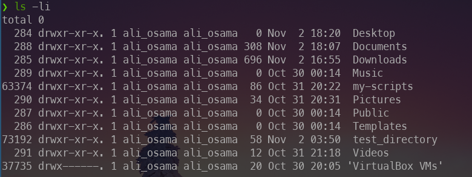
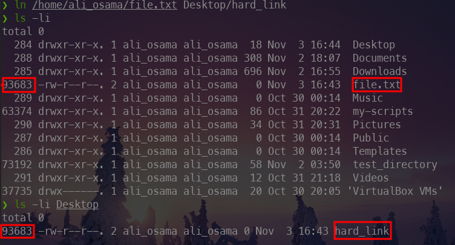
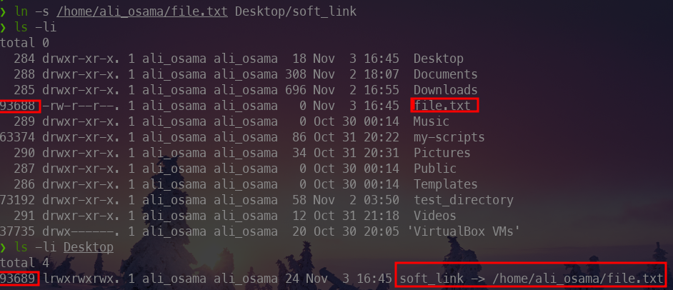

## Inodes

There is a **DataBase** that manage and store data about all the files on your system called **inode table**.

**Inode**

inode is an entry in this table and describe every thing about the file like : file type , owner , group , access permissions , timestamps ... etc
but it doesn't store filename and the file itself .

To view the inodes of the files use `ls -li`

 

## Types of links

### Hard links

`ln file_path link_path`

### Symbolic links or Soft links

It's the equvilant of shortcuts in **windows**

`ln -s file_path link_path`

***Note:***
- you should specify the absolute path to the file that you want to make a ***soft link*** to it 
- Note that in **soft links** the inode value **changed** but in **hard links** the inodes are the **same** .
