## Making Directories

**`mkdir`**
Used to make a directory 
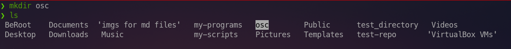
**`mkdir -p`**
Used to make a directory with it's subdirectories at one step 
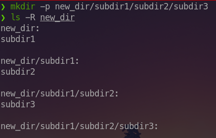

## Making Files 

 `touch` we use it to create an empty file 	
 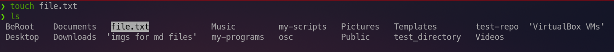
## Copying Files and Directories

### Copying Files
`cp file_to_be_copied destination/new_file_name`

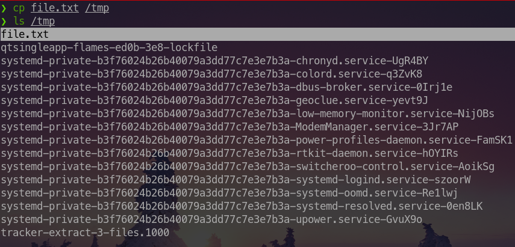
To copy multiple files we use the following syntax :
`cp file1 file2 file3 file4 destination`

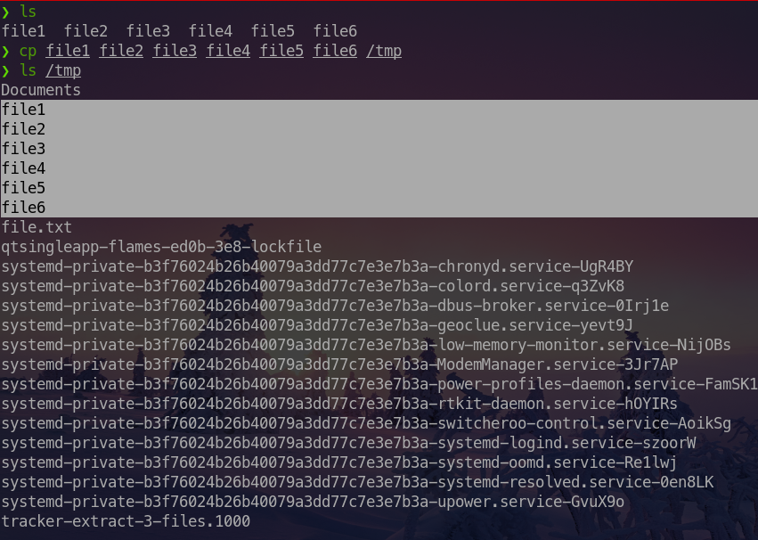
## Copying directories 

If you used `cp` to copy a directory then it will be ignored .

To copy directories we use `cp -r direcotry_to_be_copied destination`
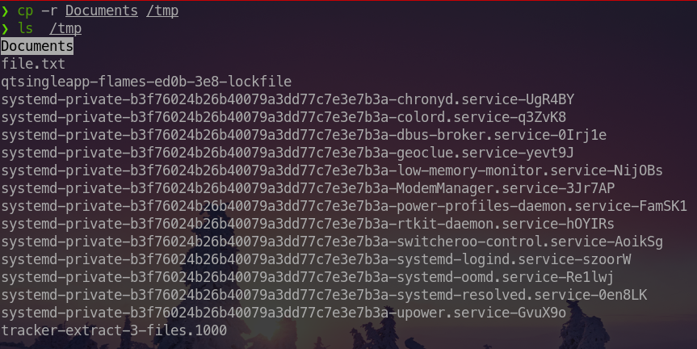
## Moving Files and Directories
To move  **a file or a directory** we use the following syntax 
`mv file_or_directory_to_be_moved destination`

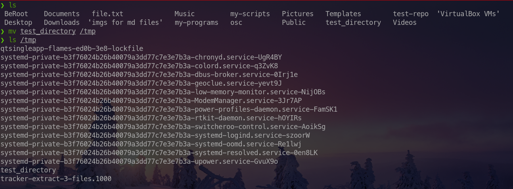

***Note :***
we use to rename a file or a directory as follow 

`mv old_name new_name`

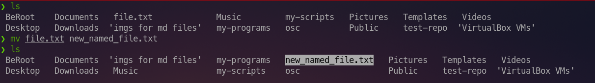
## Removing Files and Directories

### Removing Files
`rm file_name`
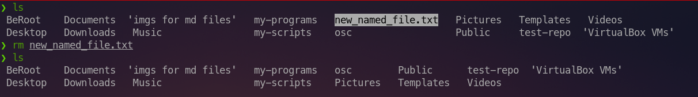

### Removing Directories
The `rm` command removes files. 
By default, rm will not remove directories that contain files, unless
you add the `-r` or -`-recursive` option.

`rm -r directory_name`
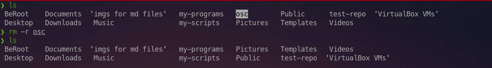

***Important Note:***
- here is no command-line undelete feature, nor a "trash bin" from which you can
   restore files staged for deletion.
- If you want to be prompt before deleting files or directories then use `-i` option
   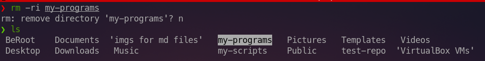
- use `-f` to force deletion but If you specify both the `-i` and `-f` options, the `-f` option takes priority and you will
   not be prompted for confirmation before `rm` deletes files.
- the `rmdir` command only removes the directory that is empty. You must use the `rm -r` command to remove a directory that contains content.
   
## Hands-on :
1. make a directory in the `~/Desktop` called "hands-on" 
2. inside this folder create a direcotry called "test" **&** a file called "README.md" 
3. take a copy of the "hands-on" directory and put it in the `~/Documents` 
4. remove the hands-on directory that we created in the `~/Desktop`
