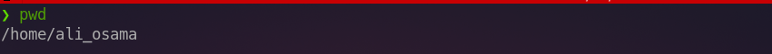
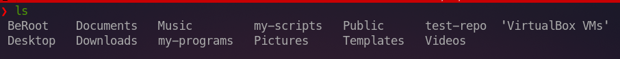
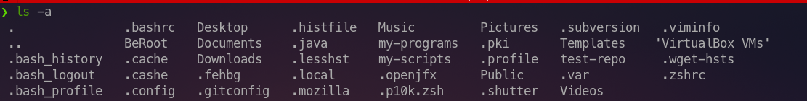
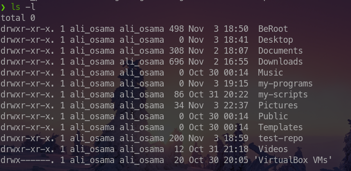
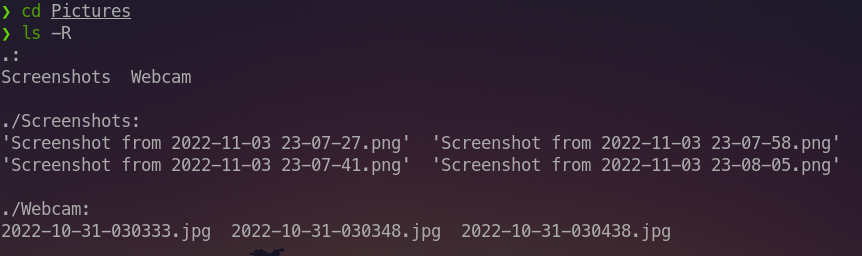
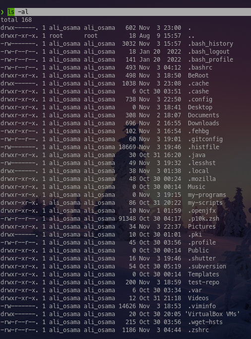
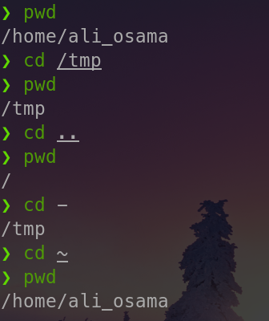

## Specifying Files By Name

### Absolute paths : 

Specify the file exact location in the file system hierarchy .

Example : 
If I want to go to the Desktop of my current user then I should type `cd /home/user_name/Desktop`

**Note** :
`cd` is a command that is used to change the directory we are in .. we will touch it in more details through the next sections .

It's recognized with a simple rule: A path name with a forward slash (/) as the first character is an absolute path name .

Absolute path names can be long to type, so files may also be located relative to the
current working directory

### Relative pahts : 

In Relative paths our current working directory specify the path that we will type 

Example 1 : 
If I want to go to the desktop of my current user and **I'm in the `/home/user_name` directory** then I should type `cd Desktop` .

Example  2 : 
If I want to go to the **etc** directory and **I'm currently in the `/` directory** then I should type `cd etc`

**Note** :

`.` refers to the current directory 
`..` refers to the parent directory 
Example : 
If I'm currently in `/root/Documents`
then `.` refers to `Documents` directory and `..` refers to the `root` directory 

`~` refers to the home directory of the **current** user which can be represented also as `/home/user_name`

In summary `~` == `/home/current_user_name`

`-` refers to the previous directory that we were in .
Example : 
If we were in the `/home/user/Documents` directory and I changed my location to `/var/www` then `-` refers to `/home/user/Documents`

### `pwd`

Used to know your current location in the file system 

### `ls`

Used to list the content of a specified directory , if not directory is specified then it will list the content of the current directory .

**Useful options of  `ls` :**

`-a`  show all the files in a directory even the hidden ones (hidden files start with`.`)

`-l` use a long list format (we mostly use it to show the permissions of files and directories )

`-R` we use it to recursively list the directory content 

**We can combine multiple options like this : 

### `cd`

To change the working directory , if I didn't specify any destination then it will change to the directory 

## Hands-on : 
- See your current working directory 
- go to the `/boot` directory
- take a look at its content .