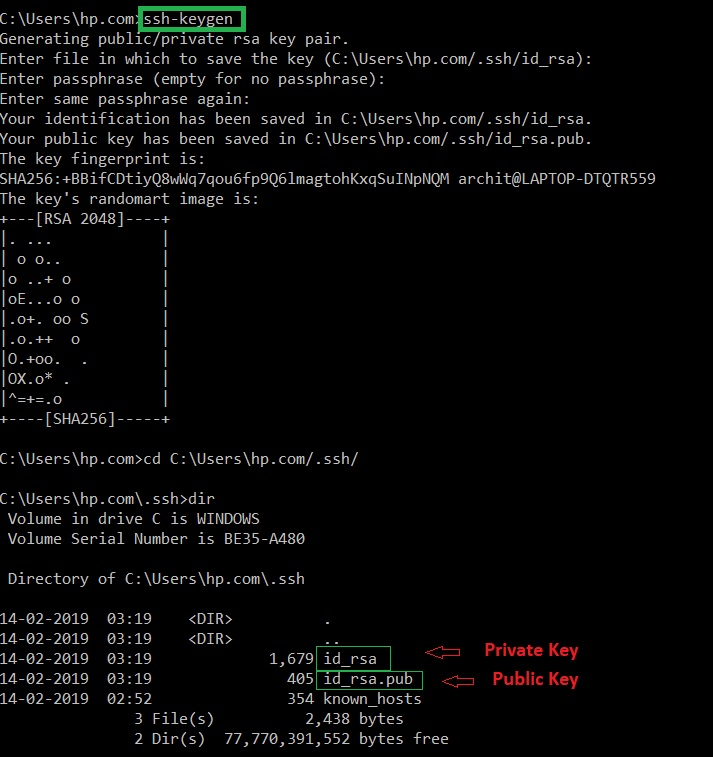
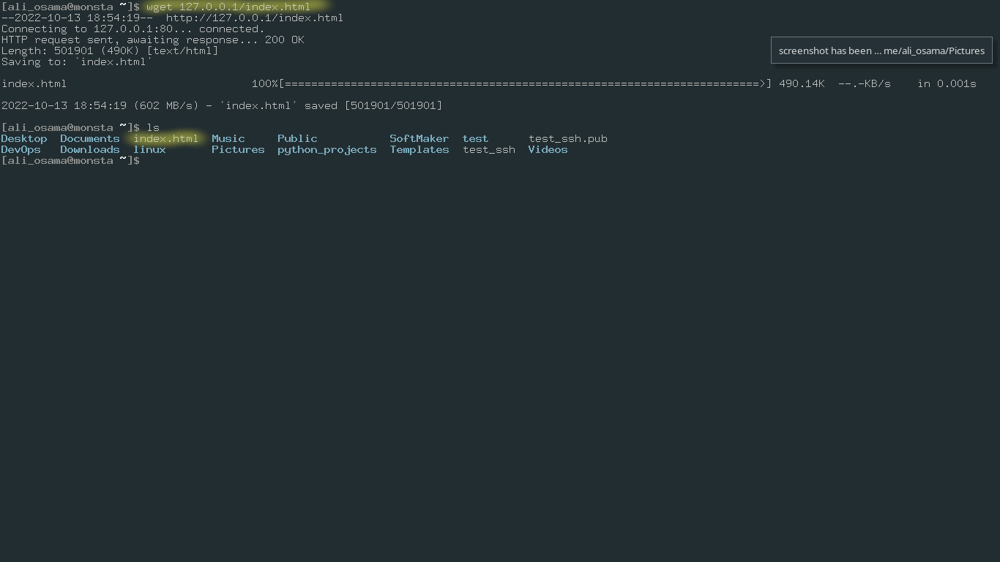

# Network Commands 
----
## ssh (Secure Shell)
It is a cryptographic network protocol that is used for transferring encrypted data over network.

ssh was a very good replacement to a protocol called telnet that was transmitting data as plain text.

### It's using Asymmetrical encryption :
This encryption generates two different keys : 
    Public key – Everyone can see it, no need to protect it. (for encryption function)
    Private key – Stays in computer, must be protected. (for decryption function)

### There is another type of encryption called symmetric : 
This encryption works on the principle of the generation of a single key for encrypting as well as decrypting the data. The secret key generated is distributed among the clients and the hosts for a secure connection. Symmetrical encryption is the most basic encryption and performs best when data is encrypted and decrypted on a single machine.

`ssh user_name@host(IP/Domain_name)`

### ssh command consists of 3 different parts:

`ssh` : command instructs the system to establish an encrypted secure connection with the host machine.

`user_name` : represents the account that is being accessed on the host.

`host` : refers to the machine which can be a computer or a router that is being accessed. It can be an IP address (e.g. 192.168.1.24) or domain name(e.g. www.domainname.com).

References : https://www.geeksforgeeks.org/ssh-command-in-linux-with-examples/

---
## ping 

ping is a command used to check the connectivity between two devices. 
It uses ICMP protocol which stands for Internet Control Message Protocol.

`ping 8.8.8.8`

### Note: 
If there is no response from the target , it's not necessary mean that the device is offline maybe there is a firewall that blocking your request.

---
## nmap
nmap stands for network mapper and it's used to detect the open ports of a target and much more .

When a computer runs a network service, it opens a networking construct called a “port” to receive the connection.  Ports are necessary for making multiple network requests or having multiple services available. 

For example, when you load several webpages at once in a web browser, the program must have some way of determining which tab is loading which web page. This is done by establishing connections to the remote webservers using different ports on your local machine.

Every computer have 65,536 .

In penetration testing, the first step we do before actually attacking the machine is gathering information . 

nmap is one of the best tools you can use to gather inforamtion about a specific machine in the internet or in your local network.

nmap has a very powerful scripting engine called NSE and you can write scripts using the Lua scripting language .

`nmap {ip}`

### useful switches: 
-sT : make a complete handshake with the target within the scan

-sS : stealth scan doesn't complete the 3 way handshake with the target 

-A :  perform a service detection, operating system detection, a traceroute and common script scanning

-p- : to scan all the ports (65536 port)

-p : to scan a specific port 

### References : 

https://nmap.org

https://tryhackme.com/room/furthernmap

---
## curl && wget 
both of them are utilities that are used to download files through the terminal
The main difference is : 
The curl command transfers data from any server over to your computer. Whereas the wget command downloads the data as a file.

wget

curl

`curl -o [file name] [url ]` == `wget [url]`

---
## ifconfig (interface configuration)

ifconfig(interface configuration) command is used to configure the kernel-resident network interfaces. It is used at the boot time to set up the interfaces as necessary. After that, it is usually used when needed during debugging or when you need system tuning. Also, this command is used to assign the IP address and netmask to an interface or to enable or disable a given interface.

"`-a`" to view all the available interfaces

"`-s`" display a short list, instead of details

"`-v`" verbose mode

"`up`" activate the interface

ex : `ifconfig interface_name up` 

`down`  deactivate the interface

ex : `ifconfig interface_name down` 
 
 
Resource : https://www.geeksforgeeks.org/ifconfig-command-in-linux-with-examples/
